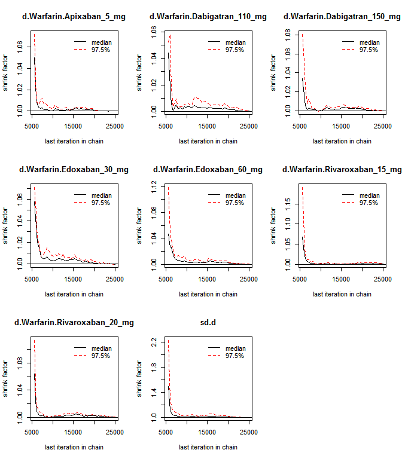
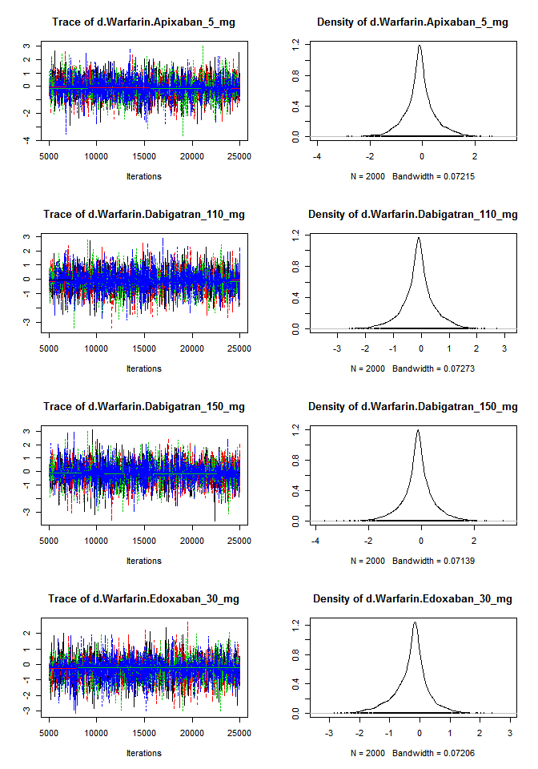
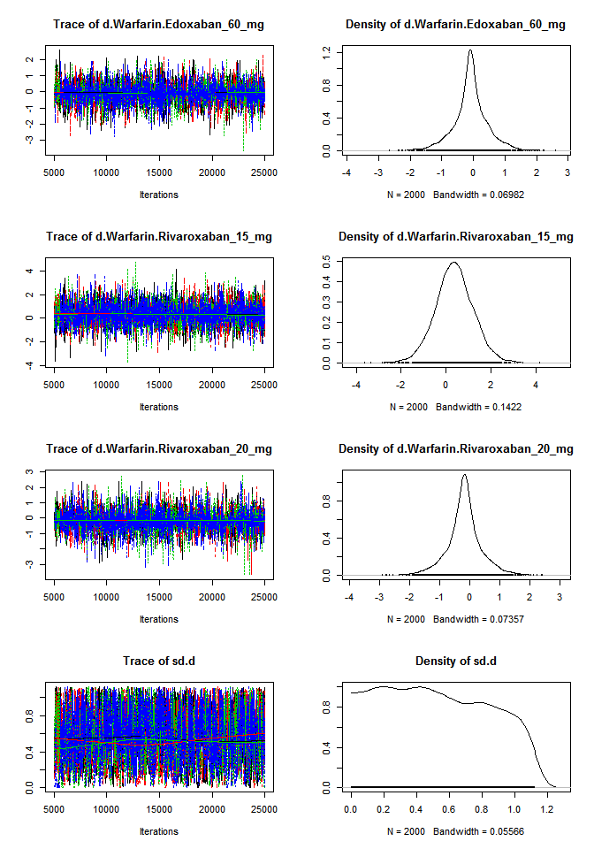
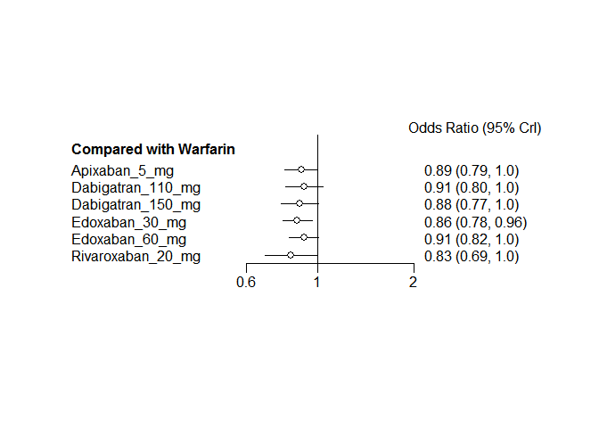

# Novel oral anticoagulants network meta-analysis
Benjamin Chan  
`r Sys.time()`  


# Read data

> From: Marian McDonagh  
> Sent: Friday, January 29, 2016 4:19 PM  
> To: Benjamin Chan  
> Subject: Re: Network Meta-analysis  
> 
> OK, last email for today!
> I put it all into an excel spreadsheet --- all the outcomes.
> Looks like it might not add up to much since several outcome cells are 0's.
> Let me know what you think.


```r
library(openxlsx)
library(data.table)
list.files(getwd())
```

```
## [1] "MASTER.md"          "MASTER.Rmd"         "NOAC NMA Data.xlsx"
## [4] "noac.R"
```

```r
readSheet <- function (sheet) {
  D <- data.table(read.xlsx("NOAC NMA Data.xlsx", sheet=sheet, startRow=3, cols=1:5))
  names(D) <- c("label", "nNOAC", "yNOAC", "nWarfarin", "yWarfarin")
  D
}
D1 <- readSheet("Mortality")
D2 <- readSheet("Stroke")
D3 <- readSheet("MI")
D4 <- readSheet("Bleeding")
```


# Mortality

Clean up the data (do not the code).


```
## Warning in `[.data.table`(D, , `:=`(study = NA_character_, noac =
## NA_character_)): Invalid .internal.selfref detected and fixed by taking
## a (shallow) copy of the data.table so that := can add this new column by
## reference. At an earlier point, this data.table has been copied by R (or
## been created manually using structure() or similar). Avoid key<-, names<-
## and attr<- which in R currently (and oddly) may copy the whole data.table.
## Use set* syntax instead to avoid copying: ?set, ?setnames and ?setattr.
## Also, in R<=v3.0.2, list(DT1,DT2) copied the entire DT1 and DT2 (R's list()
## used to copy named objects); please upgrade to R>v3.0.2 if that is biting.
## If this message doesn't help, please report to datatable-help so the root
## cause can be fixed.
```

```
##               study         treatment responders sampleSize
##  1:       ARISTOTLE     Apixaban_5_mg        603       9120
##  2:       ARISTOTLE          Warfarin        669       9081
##  3:     ARISTOTLE-J     Apixaban_5_mg          0         72
##  4:     ARISTOTLE-J          Warfarin          0         75
##  5:  ENGAGE AF-TIMI    Edoxaban_30_mg        737       7034
##  6:  ENGAGE AF-TIMI    Edoxaban_60_mg        773       7035
##  7:  ENGAGE AF-TIMI          Warfarin        839       7036
##  8:        J-ROCKET Rivaroxaban_15_mg          7        639
##  9:        J-ROCKET          Warfarin          5        639
## 10:           RE-LY Dabigatran_110_mg        446       6015
## 11:           RE-LY Dabigatran_150_mg        438       6076
## 12:           RE-LY          Warfarin        487       6022
## 13:       ROCKET-AF Rivaroxaban_20_mg        208       7131
## 14:       ROCKET-AF          Warfarin        250       7133
## 15: Yamashita, 2012    Edoxaban_30_mg          0        131
## 16: Yamashita, 2012    Edoxaban_60_mg          1        131
## 17: Yamashita, 2012          Warfarin          1        129
```

Plot the network.


```r
library(gemtc)
```

```
## Warning: package 'gemtc' was built under R version 3.2.3
```

```
## Loading required package: coda
```

```r
network <- mtc.network(D)
plot(network)
```

 

Run the model.


```r
M <- mtc.model(network, type="consistency")
system.time(results <- mtc.run(M, thin=10))
```

```
## Compiling model graph
##    Resolving undeclared variables
##    Allocating nodes
## Graph information:
##    Observed stochastic nodes: 17
##    Unobserved stochastic nodes: 25
##    Total graph size: 703
## 
## Initializing model
```

```
##    user  system elapsed 
##    11.0     0.0    11.3
```

Sampler diagnostics.


```r
gelman.plot(results)
```

 

Sampler diagnostics.


```r
plot(results)
```

  

Summary.


```r
summary(results)
```

```
## $measure
## [1] "Log Odds Ratio"
## 
## $summaries
## 
## Iterations = 5010:25000
## Thinning interval = 10 
## Number of chains = 4 
## Sample size per chain = 2000 
## 
## 1. Empirical mean and standard deviation for each variable,
##    plus standard error of the mean:
## 
##                                  Mean     SD Naive SE Time-series SE
## d.Warfarin.Apixaban_5_mg     -0.10163 0.6068 0.006785       0.006605
## d.Warfarin.Dabigatran_110_mg -0.09805 0.6080 0.006798       0.006613
## d.Warfarin.Dabigatran_150_mg -0.12620 0.6177 0.006906       0.006953
## d.Warfarin.Edoxaban_30_mg    -0.27208 0.5880 0.006574       0.007303
## d.Warfarin.Edoxaban_60_mg    -0.08450 0.5716 0.006390       0.006389
## d.Warfarin.Rivaroxaban_15_mg  0.37635 0.8719 0.009748       0.011711
## d.Warfarin.Rivaroxaban_20_mg -0.18995 0.6146 0.006872       0.006872
## sd.d                          0.52879 0.3169 0.003543       0.008404
## 
## 2. Quantiles for each variable:
## 
##                                  2.5%     25%      50%     75% 97.5%
## d.Warfarin.Apixaban_5_mg     -1.37110 -0.3776 -0.10614 0.17273 1.234
## d.Warfarin.Dabigatran_110_mg -1.45301 -0.3736 -0.09431 0.18122 1.184
## d.Warfarin.Dabigatran_150_mg -1.48148 -0.3913 -0.12395 0.15322 1.217
## d.Warfarin.Edoxaban_30_mg    -1.66695 -0.5368 -0.20259 0.01281 0.903
## d.Warfarin.Edoxaban_60_mg    -1.31472 -0.3411 -0.08390 0.19145 1.127
## d.Warfarin.Rivaroxaban_15_mg -1.34006 -0.1653  0.36806 0.91930 2.119
## d.Warfarin.Rivaroxaban_20_mg -1.50932 -0.4728 -0.18773 0.08840 1.128
## sd.d                          0.02587  0.2575  0.50832 0.79583 1.088
## 
## 
## $DIC
##     Dbar       pD      DIC 
## 14.82810 13.44061 28.26870 
## 
## attr(,"class")
## [1] "summary.mtc.result"
```

```r
forest(results)
```

 
