# Novel oral anticoagulants network meta-analysis
Benjamin Chan  
`r Sys.time()`  


This network meta-analysis is an update to
[Fu *et al*, 2014](http://www.ncbi.nlm.nih.gov/pmc/articles/PMC4244213/),
*J Cardiovasc Med (Hagerstown).* 2014 Dec; 15(12): 873-879.


# Read data

> From: Marian McDonagh  
> Sent: Friday, January 29, 2016 4:19 PM  
> To: Benjamin Chan  
> Subject: Re: Network Meta-analysis  
> 
> OK, last email for today!
> I put it all into an excel spreadsheet --- all the outcomes.
> Looks like it might not add up to much since several outcome cells are 0's.
> Let me know what you think.


```r
library(openxlsx)
library(data.table)
list.files(getwd())
```

```
## [1] "MASTER.html"        "MASTER.md"          "MASTER.Rmd"        
## [4] "MASTER_files"       "NOAC NMA Data.xlsx" "noac.R"
```

```r
readSheet <- function (sheet) {
  D <- data.table(read.xlsx("NOAC NMA Data.xlsx", sheet=sheet, startRow=3, cols=1:5))
  names(D) <- c("label", "nNOAC", "yNOAC", "nWarfarin", "yWarfarin")
  D
}
```

Clean up the data (do not show the code).


# Mortality

Clean up the data (do not show the code).


```
## Warning in `[.data.table`(D, , `:=`(study = NA_character_, noac =
## NA_character_)): Invalid .internal.selfref detected and fixed by taking
## a (shallow) copy of the data.table so that := can add this new column by
## reference. At an earlier point, this data.table has been copied by R (or
## been created manually using structure() or similar). Avoid key<-, names<-
## and attr<- which in R currently (and oddly) may copy the whole data.table.
## Use set* syntax instead to avoid copying: ?set, ?setnames and ?setattr.
## Also, in R<=v3.0.2, list(DT1,DT2) copied the entire DT1 and DT2 (R's list()
## used to copy named objects); please upgrade to R>v3.0.2 if that is biting.
## If this message doesn't help, please report to datatable-help so the root
## cause can be fixed.
```

```
##              study         treatment responders sampleSize
##  1:          RE-LY Dabigatran_110_mg        446       6015
##  2:          RE-LY Dabigatran_150_mg        438       6076
##  3:          RE-LY          Warfarin        487       6022
##  4:      ARISTOTLE     Apixaban_5_mg        603       9120
##  5:      ARISTOTLE          Warfarin        669       9081
##  6:      ROCKET-AF Rivaroxaban_20_mg        208       7131
##  7:      ROCKET-AF          Warfarin        250       7133
##  8: ENGAGE AF-TIMI    Edoxaban_30_mg        737       7034
##  9: ENGAGE AF-TIMI    Edoxaban_60_mg        773       7035
## 10: ENGAGE AF-TIMI          Warfarin        839       7036
```

Plot the network.


```r
library(gemtc)
```

```
## Warning: package 'gemtc' was built under R version 3.2.3
```

```
## Loading required package: coda
```

```r
network <- mtc.network(D1)
plot(network)
```

 

Run the model.


```r
M <- mtc.model(network, type="consistency", linearModel="fixed")
system.time(results <- mtc.run(M, thin=20))
```

```
## Compiling model graph
##    Resolving undeclared variables
##    Allocating nodes
## Graph information:
##    Observed stochastic nodes: 10
##    Unobserved stochastic nodes: 10
##    Total graph size: 324
## 
## Initializing model
```

```
##    user  system elapsed 
##    7.40    0.01    8.78
```

Sampler diagnostics.


```r
gelman.plot(results)
```

 

Sampler diagnostics.


```r
plot(results)
```

  

Summary.


```r
summary(results)
```

```
## $measure
## [1] "Log Odds Ratio"
## 
## $summaries
## 
## Iterations = 5020:25000
## Thinning interval = 20 
## Number of chains = 4 
## Sample size per chain = 1000 
## 
## 1. Empirical mean and standard deviation for each variable,
##    plus standard error of the mean:
## 
##                                  Mean      SD  Naive SE Time-series SE
## d.Warfarin.Apixaban_5_mg     -0.11575 0.05819 0.0009200      0.0008955
## d.Warfarin.Dabigatran_110_mg -0.09428 0.06654 0.0010521      0.0010519
## d.Warfarin.Dabigatran_150_mg -0.12467 0.06899 0.0010908      0.0010824
## d.Warfarin.Edoxaban_30_mg    -0.14518 0.05318 0.0008408      0.0008546
## d.Warfarin.Edoxaban_60_mg    -0.09201 0.05309 0.0008395      0.0008397
## d.Warfarin.Rivaroxaban_20_mg -0.18955 0.09562 0.0015119      0.0015117
## 
## 2. Quantiles for each variable:
## 
##                                 2.5%     25%      50%      75%      97.5%
## d.Warfarin.Apixaban_5_mg     -0.2320 -0.1553 -0.11586 -0.07689 -0.0029381
## d.Warfarin.Dabigatran_110_mg -0.2255 -0.1381 -0.09469 -0.05044  0.0389298
## d.Warfarin.Dabigatran_150_mg -0.2611 -0.1710 -0.12504 -0.07858  0.0088690
## d.Warfarin.Edoxaban_30_mg    -0.2470 -0.1803 -0.14549 -0.10997 -0.0387970
## d.Warfarin.Edoxaban_60_mg    -0.1989 -0.1269 -0.09089 -0.05536  0.0106693
## d.Warfarin.Rivaroxaban_20_mg -0.3725 -0.2541 -0.19115 -0.12731 -0.0004064
## 
## 
## $DIC
##      Dbar        pD       DIC 
##  9.919311  9.917141 19.836452 
## 
## attr(,"class")
## [1] "summary.mtc.result"
```

```r
forest(results)
```

 


# Stroke

Clean up the data (do not show the code).


```
## Warning in `[.data.table`(D, , `:=`(study = NA_character_, noac =
## NA_character_)): Invalid .internal.selfref detected and fixed by taking
## a (shallow) copy of the data.table so that := can add this new column by
## reference. At an earlier point, this data.table has been copied by R (or
## been created manually using structure() or similar). Avoid key<-, names<-
## and attr<- which in R currently (and oddly) may copy the whole data.table.
## Use set* syntax instead to avoid copying: ?set, ?setnames and ?setattr.
## Also, in R<=v3.0.2, list(DT1,DT2) copied the entire DT1 and DT2 (R's list()
## used to copy named objects); please upgrade to R>v3.0.2 if that is biting.
## If this message doesn't help, please report to datatable-help so the root
## cause can be fixed.
```

```
##              study         treatment responders sampleSize
##  1:          RE-LY Dabigatran_110_mg        182       6015
##  2:          RE-LY Dabigatran_150_mg        134       6076
##  3:          RE-LY          Warfarin        199       6022
##  4:      ARISTOTLE     Apixaban_5_mg        212       9120
##  5:      ARISTOTLE          Warfarin        265       9081
##  6:      ROCKET-AF Rivaroxaban_20_mg        188       7131
##  7:      ROCKET-AF          Warfarin        241       7133
##  8: ENGAGE AF-TIMI    Edoxaban_30_mg        182       7034
##  9: ENGAGE AF-TIMI    Edoxaban_60_mg        253       7035
## 10: ENGAGE AF-TIMI          Warfarin        232       7036
```


Plot the network.


```r
library(gemtc)
network <- mtc.network(D2)
plot(network)
```

 

Run the model.


```r
M <- mtc.model(network, type="consistency", linearModel="fixed")
system.time(results <- mtc.run(M, thin=20))
```

```
## Compiling model graph
##    Resolving undeclared variables
##    Allocating nodes
## Graph information:
##    Observed stochastic nodes: 10
##    Unobserved stochastic nodes: 10
##    Total graph size: 323
## 
## Initializing model
```

```
##    user  system elapsed 
##    7.61    0.02    7.78
```

Sampler diagnostics.


```r
gelman.plot(results)
```

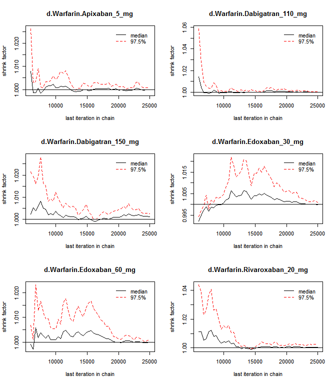 

Sampler diagnostics.


```r
plot(results)
```

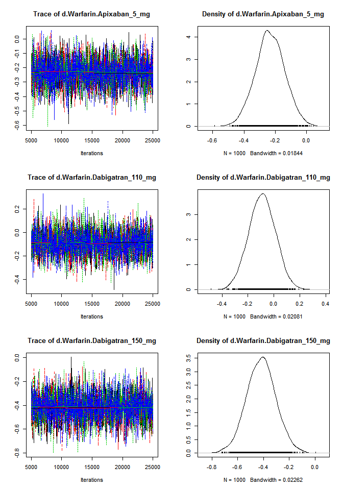 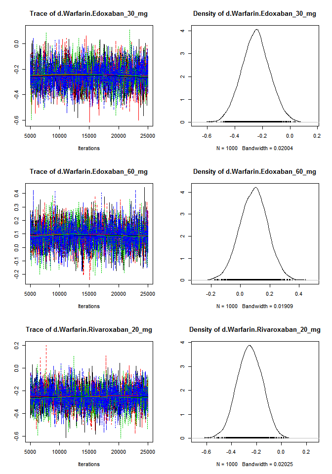 

Summary.


```r
summary(results)
```

```
## $measure
## [1] "Log Odds Ratio"
## 
## $summaries
## 
## Iterations = 5020:25000
## Thinning interval = 20 
## Number of chains = 4 
## Sample size per chain = 1000 
## 
## 1. Empirical mean and standard deviation for each variable,
##    plus standard error of the mean:
## 
##                                  Mean      SD Naive SE Time-series SE
## d.Warfarin.Apixaban_5_mg     -0.23327 0.09356 0.001479       0.001366
## d.Warfarin.Dabigatran_110_mg -0.09041 0.10313 0.001631       0.001641
## d.Warfarin.Dabigatran_150_mg -0.41682 0.11293 0.001786       0.001785
## d.Warfarin.Edoxaban_30_mg    -0.24810 0.10117 0.001600       0.001566
## d.Warfarin.Edoxaban_60_mg     0.09094 0.09462 0.001496       0.001516
## d.Warfarin.Rivaroxaban_20_mg -0.25370 0.10036 0.001587       0.001566
## 
## 2. Quantiles for each variable:
## 
##                                  2.5%      25%      50%      75%    97.5%
## d.Warfarin.Apixaban_5_mg     -0.41645 -0.29379 -0.23475 -0.17133 -0.04914
## d.Warfarin.Dabigatran_110_mg -0.29420 -0.15970 -0.09005 -0.02081  0.11069
## d.Warfarin.Dabigatran_150_mg -0.64057 -0.49259 -0.41633 -0.34241 -0.19342
## d.Warfarin.Edoxaban_30_mg    -0.44581 -0.31472 -0.24748 -0.18166 -0.04910
## d.Warfarin.Edoxaban_60_mg    -0.09811  0.02746  0.09280  0.15482  0.27472
## d.Warfarin.Rivaroxaban_20_mg -0.44809 -0.32129 -0.25364 -0.18334 -0.06304
## 
## 
## $DIC
##     Dbar       pD      DIC 
## 10.08943 10.08706 20.17649 
## 
## attr(,"class")
## [1] "summary.mtc.result"
```

```r
forest(results)
```

 


# MI

Clean up the data (do not show the code).


```
## Warning in `[.data.table`(D, , `:=`(study = NA_character_, noac =
## NA_character_)): Invalid .internal.selfref detected and fixed by taking
## a (shallow) copy of the data.table so that := can add this new column by
## reference. At an earlier point, this data.table has been copied by R (or
## been created manually using structure() or similar). Avoid key<-, names<-
## and attr<- which in R currently (and oddly) may copy the whole data.table.
## Use set* syntax instead to avoid copying: ?set, ?setnames and ?setattr.
## Also, in R<=v3.0.2, list(DT1,DT2) copied the entire DT1 and DT2 (R's list()
## used to copy named objects); please upgrade to R>v3.0.2 if that is biting.
## If this message doesn't help, please report to datatable-help so the root
## cause can be fixed.
```

```
##              study         treatment responders sampleSize
##  1:          RE-LY Dabigatran_110_mg         86       6015
##  2:          RE-LY Dabigatran_150_mg         89       6076
##  3:          RE-LY          Warfarin         63       6022
##  4:      ARISTOTLE     Apixaban_5_mg         90       9120
##  5:      ARISTOTLE          Warfarin        102       9081
##  6:      ROCKET-AF Rivaroxaban_20_mg        101       7131
##  7:      ROCKET-AF          Warfarin        126       7133
##  8: ENGAGE AF-TIMI    Edoxaban_30_mg        133       7034
##  9: ENGAGE AF-TIMI    Edoxaban_60_mg        169       7035
## 10: ENGAGE AF-TIMI          Warfarin        141       7036
```


Plot the network.


```r
library(gemtc)
network <- mtc.network(D3)
plot(network)
```

 

Run the model.


```r
M <- mtc.model(network, type="consistency", linearModel="fixed")
system.time(results <- mtc.run(M, thin=20))
```

```
## Compiling model graph
##    Resolving undeclared variables
##    Allocating nodes
## Graph information:
##    Observed stochastic nodes: 10
##    Unobserved stochastic nodes: 10
##    Total graph size: 324
## 
## Initializing model
```

```
##    user  system elapsed 
##    7.79    0.00    8.82
```

Sampler diagnostics.


```r
gelman.plot(results)
```

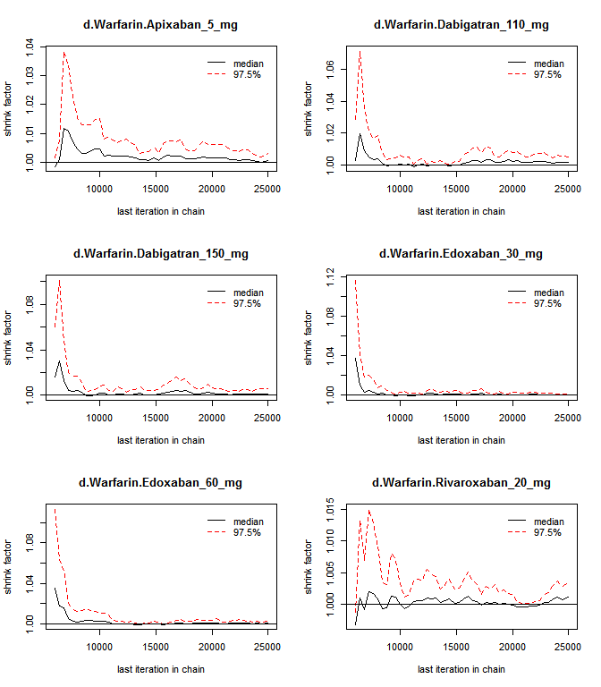 

Sampler diagnostics.


```r
plot(results)
```

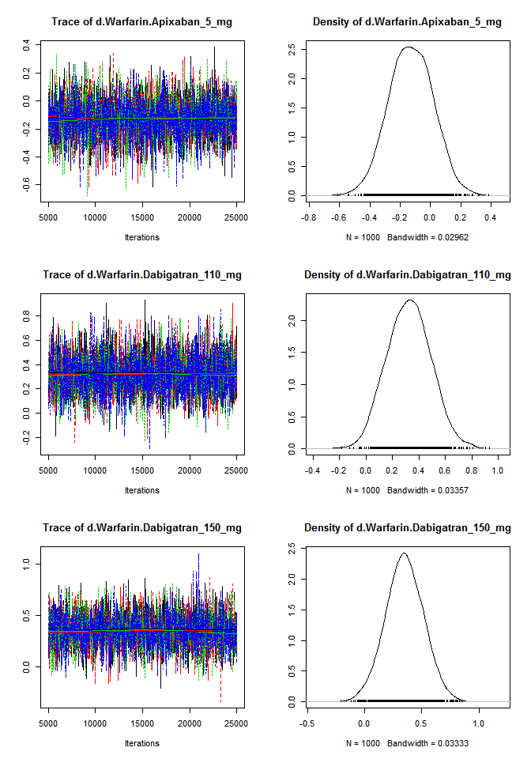 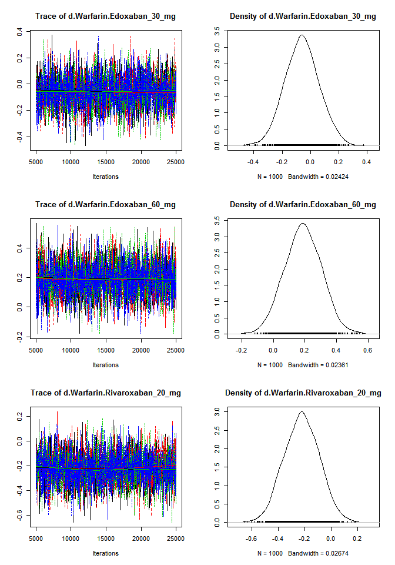 

Summary.


```r
summary(results)
```

```
## $measure
## [1] "Log Odds Ratio"
## 
## $summaries
## 
## Iterations = 5020:25000
## Thinning interval = 20 
## Number of chains = 4 
## Sample size per chain = 1000 
## 
## 1. Empirical mean and standard deviation for each variable,
##    plus standard error of the mean:
## 
##                                  Mean     SD Naive SE Time-series SE
## d.Warfarin.Apixaban_5_mg     -0.12844 0.1468 0.002321       0.002293
## d.Warfarin.Dabigatran_110_mg  0.32481 0.1664 0.002630       0.002741
## d.Warfarin.Dabigatran_150_mg  0.34942 0.1662 0.002627       0.002703
## d.Warfarin.Edoxaban_30_mg    -0.05939 0.1214 0.001920       0.001976
## d.Warfarin.Edoxaban_60_mg     0.18765 0.1170 0.001850       0.001875
## d.Warfarin.Rivaroxaban_20_mg -0.22351 0.1325 0.002095       0.002126
## 
## 2. Quantiles for each variable:
## 
##                                  2.5%     25%      50%      75%   97.5%
## d.Warfarin.Apixaban_5_mg     -0.41398 -0.2277 -0.12920 -0.02689 0.15266
## d.Warfarin.Dabigatran_110_mg  0.01416  0.2120  0.32489  0.43702 0.65093
## d.Warfarin.Dabigatran_150_mg  0.02526  0.2412  0.34819  0.46252 0.66942
## d.Warfarin.Edoxaban_30_mg    -0.29339 -0.1417 -0.06116  0.01927 0.18152
## d.Warfarin.Edoxaban_60_mg    -0.03983  0.1095  0.18775  0.26789 0.41544
## d.Warfarin.Rivaroxaban_20_mg -0.47820 -0.3152 -0.22325 -0.13197 0.03449
## 
## 
## $DIC
##     Dbar       pD      DIC 
## 10.01564 10.01165 20.02730 
## 
## attr(,"class")
## [1] "summary.mtc.result"
```

```r
forest(results)
```

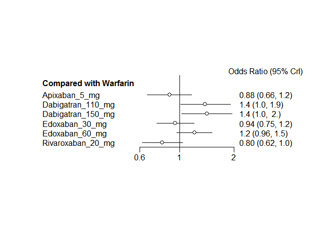 


# Bleeding

Clean up the data (do not show the code).


```
## Warning in `[.data.table`(D, , `:=`(study = NA_character_, noac =
## NA_character_)): Invalid .internal.selfref detected and fixed by taking
## a (shallow) copy of the data.table so that := can add this new column by
## reference. At an earlier point, this data.table has been copied by R (or
## been created manually using structure() or similar). Avoid key<-, names<-
## and attr<- which in R currently (and oddly) may copy the whole data.table.
## Use set* syntax instead to avoid copying: ?set, ?setnames and ?setattr.
## Also, in R<=v3.0.2, list(DT1,DT2) copied the entire DT1 and DT2 (R's list()
## used to copy named objects); please upgrade to R>v3.0.2 if that is biting.
## If this message doesn't help, please report to datatable-help so the root
## cause can be fixed.
```

```
##              study         treatment responders sampleSize
##  1:          RE-LY Dabigatran_110_mg        322       6015
##  2:          RE-LY Dabigatran_150_mg        375       6076
##  3:          RE-LY          Warfarin        397       6022
##  4:      ARISTOTLE     Apixaban_5_mg        148       9120
##  5:      ARISTOTLE          Warfarin        256       9081
##  6:      ROCKET-AF Rivaroxaban_20_mg        395       7131
##  7:      ROCKET-AF          Warfarin        386       7133
##  8: ENGAGE AF-TIMI    Edoxaban_30_mg        418       7034
##  9: ENGAGE AF-TIMI    Edoxaban_60_mg        254       7035
## 10: ENGAGE AF-TIMI          Warfarin        524       7036
```


Plot the network.


```r
library(gemtc)
network <- mtc.network(D4[!is.na(responders)])
plot(network)
```

 

Run the model.


```r
M <- mtc.model(network, type="consistency", linearModel="fixed")
system.time(results <- mtc.run(M, thin=20))
```

```
## Compiling model graph
##    Resolving undeclared variables
##    Allocating nodes
## Graph information:
##    Observed stochastic nodes: 10
##    Unobserved stochastic nodes: 10
##    Total graph size: 324
## 
## Initializing model
```

```
##    user  system elapsed 
##    7.51    0.02    8.08
```

Sampler diagnostics.


```r
gelman.plot(results)
```

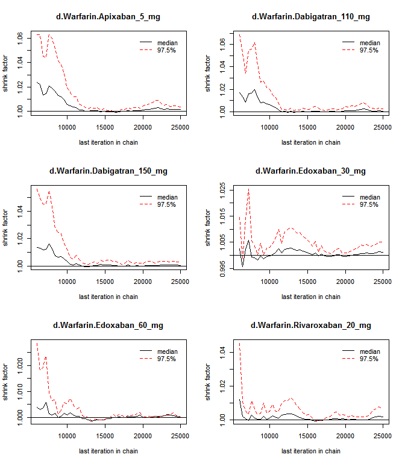 

Sampler diagnostics.


```r
plot(results)
```

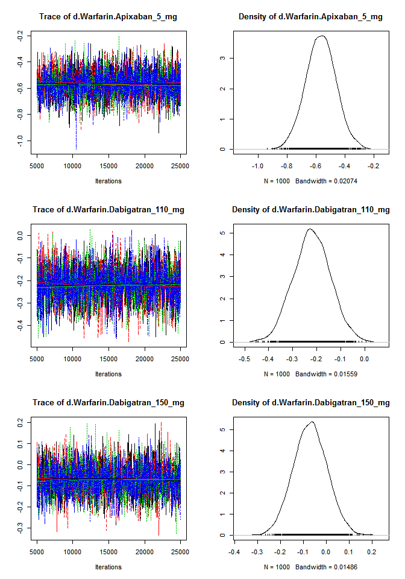 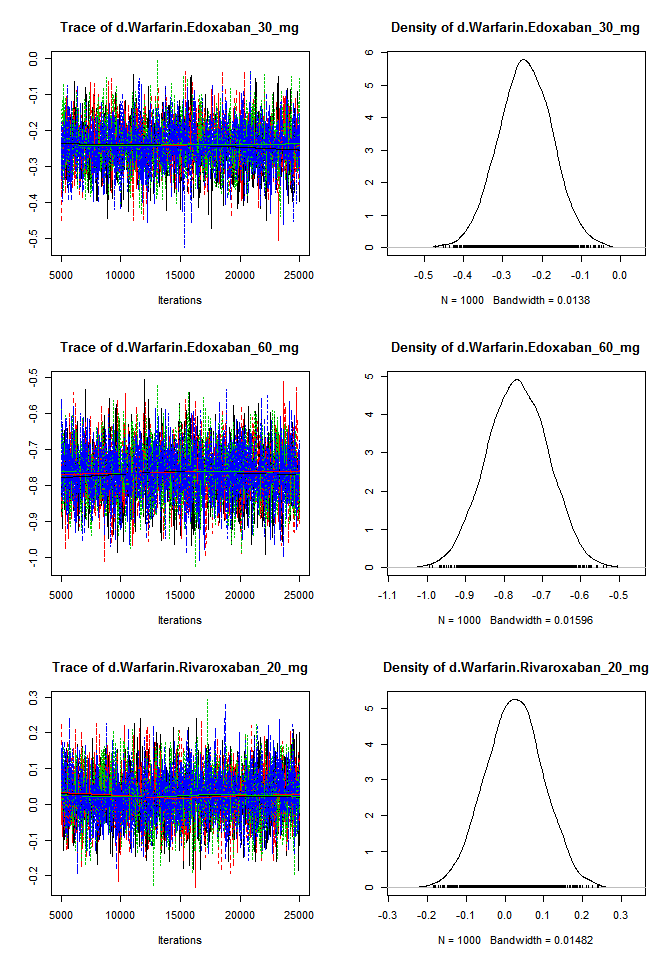 

Summary.


```r
summary(results)
```

```
## $measure
## [1] "Log Odds Ratio"
## 
## $summaries
## 
## Iterations = 5020:25000
## Thinning interval = 20 
## Number of chains = 4 
## Sample size per chain = 1000 
## 
## 1. Empirical mean and standard deviation for each variable,
##    plus standard error of the mean:
## 
##                                  Mean      SD Naive SE Time-series SE
## d.Warfarin.Apixaban_5_mg     -0.56749 0.10385 0.001642       0.001642
## d.Warfarin.Dabigatran_110_mg -0.21997 0.07747 0.001225       0.001225
## d.Warfarin.Dabigatran_150_mg -0.07042 0.07362 0.001164       0.001135
## d.Warfarin.Edoxaban_30_mg    -0.24190 0.06840 0.001082       0.001164
## d.Warfarin.Edoxaban_60_mg    -0.76510 0.07908 0.001250       0.001237
## d.Warfarin.Rivaroxaban_20_mg  0.02421 0.07405 0.001171       0.001166
## 
## 2. Quantiles for each variable:
## 
##                                 2.5%      25%      50%      75%    97.5%
## d.Warfarin.Apixaban_5_mg     -0.7720 -0.63631 -0.56691 -0.49861 -0.36025
## d.Warfarin.Dabigatran_110_mg -0.3700 -0.27157 -0.22062 -0.16802 -0.06553
## d.Warfarin.Dabigatran_150_mg -0.2121 -0.11943 -0.07091 -0.01984  0.07565
## d.Warfarin.Edoxaban_30_mg    -0.3745 -0.28744 -0.24230 -0.19472 -0.10701
## d.Warfarin.Edoxaban_60_mg    -0.9194 -0.81978 -0.76474 -0.71008 -0.61364
## d.Warfarin.Rivaroxaban_20_mg -0.1219 -0.02524  0.02400  0.07320  0.16711
## 
## 
## $DIC
##      Dbar        pD       DIC 
##  9.969200  9.967889 19.937088 
## 
## attr(,"class")
## [1] "summary.mtc.result"
```

```r
forest(results)
```

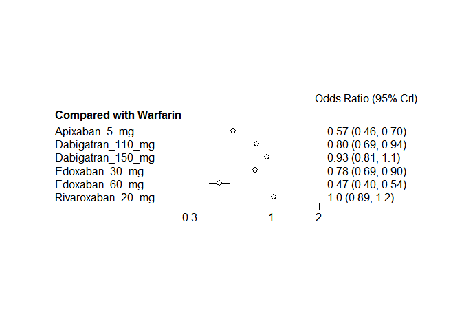 
