# Novel oral anticoagulants network meta-analysis
Benjamin Chan  
`r Sys.time()`  


This network meta-analysis is an update to
[Fu *et al*, 2014](http://www.ncbi.nlm.nih.gov/pmc/articles/PMC4244213/),
*J Cardiovasc Med (Hagerstown).* 2014 Dec; 15(12): 873-879.

> From: Marian McDonagh  
> Sent: Friday, January 29, 2016 4:19 PM  
> To: Benjamin Chan  
> Subject: Re: Network Meta-analysis  
> 
> OK, last email for today!
> I put it all into an excel spreadsheet --- all the outcomes.
> Looks like it might not add up to much since several outcome cells are 0's.
> Let me know what you think.

Use the [`gemtc`](https://drugis.org/software/r-packages/gemtc) package.
Check the link for references.


```r
library(openxlsx)
library(data.table)
library(gemtc)
```


```
##                                  mtime  size
## NOAC NMA Data.xlsx 2016-01-30 06:00:03 48838
```


# Mortality

Clean up the data (do not show the code).


```
## Warning in `[.data.table`(D, , `:=`(study = NA_character_, noac =
## NA_character_)): Invalid .internal.selfref detected and fixed by taking
## a (shallow) copy of the data.table so that := can add this new column by
## reference. At an earlier point, this data.table has been copied by R (or
## been created manually using structure() or similar). Avoid key<-, names<-
## and attr<- which in R currently (and oddly) may copy the whole data.table.
## Use set* syntax instead to avoid copying: ?set, ?setnames and ?setattr.
## Also, in R<=v3.0.2, list(DT1,DT2) copied the entire DT1 and DT2 (R's list()
## used to copy named objects); please upgrade to R>v3.0.2 if that is biting.
## If this message doesn't help, please report to datatable-help so the root
## cause can be fixed.
```

```
##               study         treatment responders sampleSize
##  1:       ARISTOTLE     Apixaban_5_mg        603       9120
##  2:       ARISTOTLE          Warfarin        669       9081
##  3:     ARISTOTLE-J     Apixaban_5_mg          0         72
##  4:     ARISTOTLE-J          Warfarin          0         75
##  5:  ENGAGE AF-TIMI    Edoxaban_30_mg        737       7034
##  6:  ENGAGE AF-TIMI    Edoxaban_60_mg        773       7035
##  7:  ENGAGE AF-TIMI          Warfarin        839       7036
##  8:        J-ROCKET Rivaroxaban_15_mg          7        639
##  9:        J-ROCKET          Warfarin          5        639
## 10:           RE-LY Dabigatran_110_mg        446       6015
## 11:           RE-LY Dabigatran_150_mg        438       6076
## 12:           RE-LY          Warfarin        487       6022
## 13:       ROCKET-AF Rivaroxaban_20_mg        208       7131
## 14:       ROCKET-AF          Warfarin        250       7133
## 15: Yamashita, 2012    Edoxaban_30_mg          0        131
## 16: Yamashita, 2012    Edoxaban_60_mg          1        131
## 17: Yamashita, 2012          Warfarin          1        129
```

Plot the network.


```r
plot(network)
```

 

Run the model.


```r
M <- mtc.model(network, type="consistency", linearModel="random")
runtime <- system.time(results <- mtc.run(M, n.adapt=5000, n.iter=20000, thin=10))
```


```r
runtime
```

```
##    user  system elapsed 
##   10.81    0.00   10.98
```

Sampler diagnostics.


```r
gelman.plot(results)
```

 

```r
gelman.diag(results)
```

```
## Potential scale reduction factors:
## 
##                              Point est. Upper C.I.
## d.Warfarin.Apixaban_5_mg              1       1.00
## d.Warfarin.Dabigatran_110_mg          1       1.00
## d.Warfarin.Dabigatran_150_mg          1       1.00
## d.Warfarin.Edoxaban_30_mg             1       1.00
## d.Warfarin.Edoxaban_60_mg             1       1.00
## d.Warfarin.Rivaroxaban_15_mg          1       1.00
## d.Warfarin.Rivaroxaban_20_mg          1       1.00
## sd.d                                  1       1.01
## 
## Multivariate psrf
## 
## 1
```


```r
plot(results)
```

  

Summary.


```r
summary(results)
```

```
## $measure
## [1] "Log Odds Ratio"
## 
## $summaries
## 
## Iterations = 5010:25000
## Thinning interval = 10 
## Number of chains = 4 
## Sample size per chain = 2000 
## 
## 1. Empirical mean and standard deviation for each variable,
##    plus standard error of the mean:
## 
##                                  Mean     SD Naive SE Time-series SE
## d.Warfarin.Apixaban_5_mg     -0.10081 0.6139 0.006863       0.007244
## d.Warfarin.Dabigatran_110_mg -0.08539 0.6289 0.007031       0.006866
## d.Warfarin.Dabigatran_150_mg -0.11708 0.6013 0.006723       0.006848
## d.Warfarin.Edoxaban_30_mg    -0.26733 0.5823 0.006511       0.007340
## d.Warfarin.Edoxaban_60_mg    -0.09684 0.5673 0.006343       0.006248
## d.Warfarin.Rivaroxaban_15_mg  0.37877 0.8641 0.009661       0.011718
## d.Warfarin.Rivaroxaban_20_mg -0.19561 0.6163 0.006890       0.006854
## sd.d                          0.52359 0.3178 0.003553       0.007931
## 
## 2. Quantiles for each variable:
## 
##                                  2.5%     25%      50%     75%  97.5%
## d.Warfarin.Apixaban_5_mg     -1.43752 -0.3709 -0.10923 0.16595 1.2444
## d.Warfarin.Dabigatran_110_mg -1.43765 -0.3574 -0.09570 0.19496 1.2965
## d.Warfarin.Dabigatran_150_mg -1.39453 -0.3867 -0.12375 0.15454 1.2378
## d.Warfarin.Edoxaban_30_mg    -1.64135 -0.5330 -0.19380 0.02045 0.8526
## d.Warfarin.Edoxaban_60_mg    -1.35855 -0.3482 -0.09431 0.17133 1.1229
## d.Warfarin.Rivaroxaban_15_mg -1.33802 -0.1575  0.37629 0.90303 2.1526
## d.Warfarin.Rivaroxaban_20_mg -1.52506 -0.4710 -0.19364 0.06867 1.1739
## sd.d                          0.03242  0.2484  0.49947 0.78806 1.0910
## 
## 
## $DIC
##     Dbar       pD      DIC 
## 14.82589 13.43100 28.25689 
## 
## attr(,"class")
## [1] "summary.mtc.result"
```

```r
forest(results)
```

 

Assess the degree of heterogeneity and inconsistency.


```r
anohe <- mtc.anohe(network, n.adapt=5000, n.iter=20000, thin=10)
```


```r
summary(anohe)
```

```
## Analysis of heterogeneity
## =========================
## 
## Per-comparison I-squared:
## -------------------------
## 
##                  t1                t2  i2.pair  i2.cons incons.p
## 1     Apixaban_5_mg          Warfarin  0.00000  0.00000       NA
## 2 Dabigatran_110_mg Dabigatran_150_mg       NA       NA       NA
## 3 Dabigatran_110_mg          Warfarin       NA       NA       NA
## 4 Dabigatran_150_mg          Warfarin       NA       NA       NA
## 5    Edoxaban_30_mg    Edoxaban_60_mg 73.07315 25.16035       NA
## 6    Edoxaban_30_mg          Warfarin 63.11958 30.14373       NA
## 7    Edoxaban_60_mg          Warfarin  0.00000  0.00000       NA
## 8 Rivaroxaban_15_mg          Warfarin       NA       NA       NA
## 9 Rivaroxaban_20_mg          Warfarin       NA       NA       NA
## 
## Global I-squared:
## -------------------------
## 
##   i2.pair i2.cons
## 1       0       0
```

```r
plot(anohe)
```

```
## Analysis of heterogeneity -- convergence plots
## Unrelated Study Effects (USE) model:
```

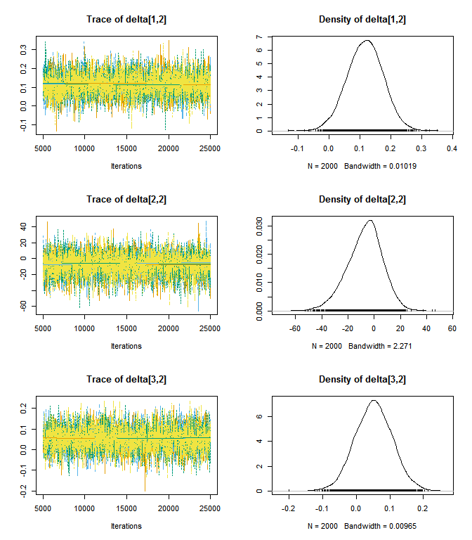 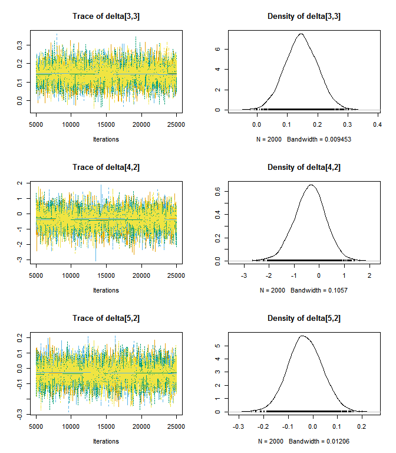 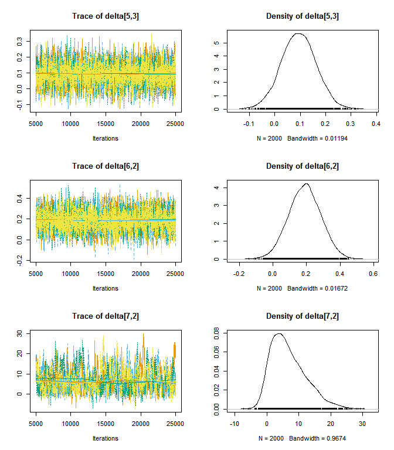 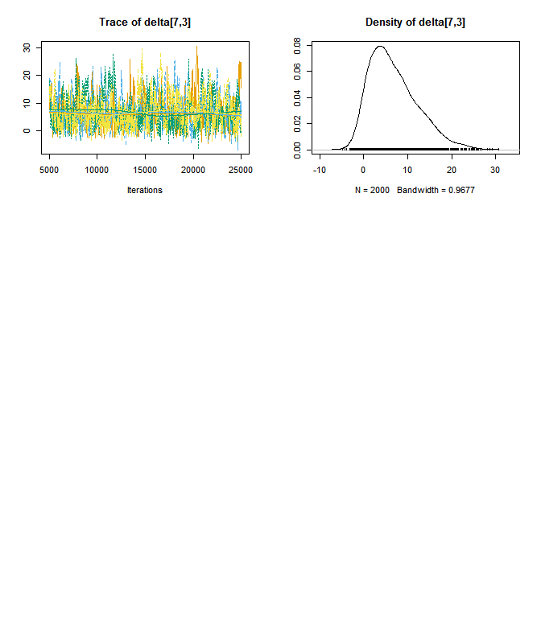 

```
## Unrelated Mean Effects (UME) model:
```

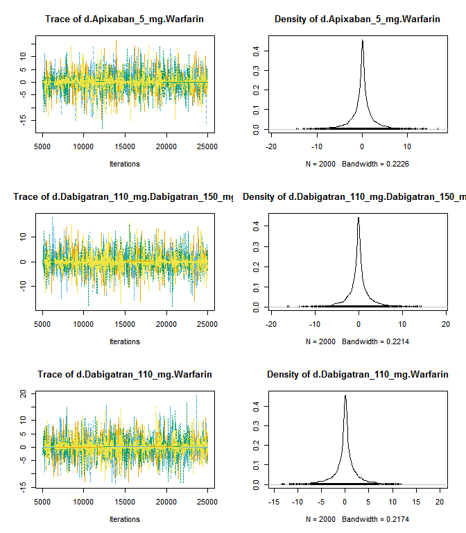 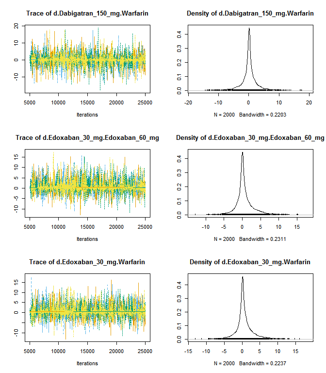 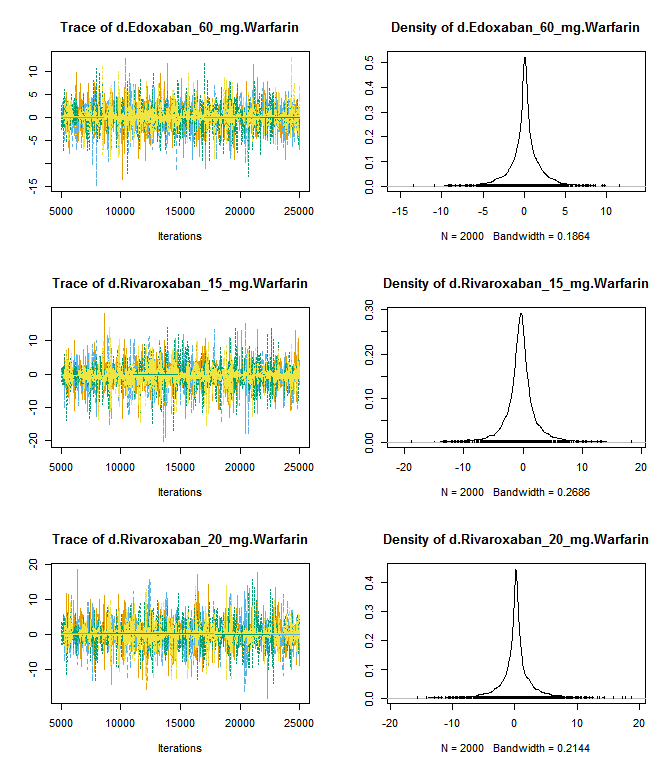  

```
## Consistency model:
```

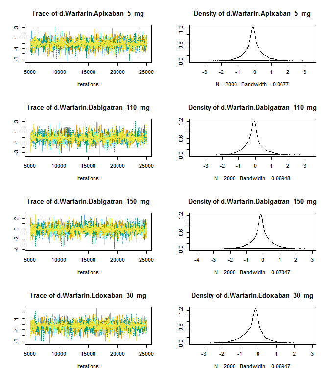 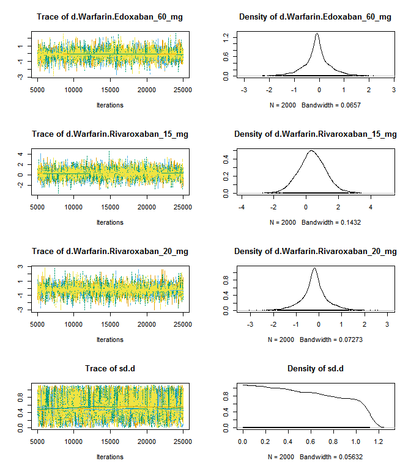 


# Stroke

Clean up the data (do not show the code).


```
## Warning in `[.data.table`(D, , `:=`(study = NA_character_, noac =
## NA_character_)): Invalid .internal.selfref detected and fixed by taking
## a (shallow) copy of the data.table so that := can add this new column by
## reference. At an earlier point, this data.table has been copied by R (or
## been created manually using structure() or similar). Avoid key<-, names<-
## and attr<- which in R currently (and oddly) may copy the whole data.table.
## Use set* syntax instead to avoid copying: ?set, ?setnames and ?setattr.
## Also, in R<=v3.0.2, list(DT1,DT2) copied the entire DT1 and DT2 (R's list()
## used to copy named objects); please upgrade to R>v3.0.2 if that is biting.
## If this message doesn't help, please report to datatable-help so the root
## cause can be fixed.
```

```
##               study         treatment responders sampleSize
##  1:       ARISTOTLE     Apixaban_5_mg        212       9120
##  2:       ARISTOTLE          Warfarin        265       9081
##  3:     ARISTOTLE-J     Apixaban_5_mg          0         72
##  4:     ARISTOTLE-J          Warfarin          3         75
##  5:  ENGAGE AF-TIMI    Edoxaban_30_mg        182       7034
##  6:  ENGAGE AF-TIMI    Edoxaban_60_mg        253       7035
##  7:  ENGAGE AF-TIMI          Warfarin        232       7036
##  8:        J-ROCKET Rivaroxaban_15_mg         11        639
##  9:        J-ROCKET          Warfarin         22        639
## 10:       Mao, 2014 Rivaroxaban_20_mg          5        177
## 11:       Mao, 2014          Warfarin          7        176
## 12:           PETRO Dabigatran_150_mg          0        166
## 13:           PETRO          Warfarin          0         70
## 14:           RE-LY Dabigatran_110_mg        182       6015
## 15:           RE-LY Dabigatran_150_mg        134       6076
## 16:           RE-LY          Warfarin        199       6022
## 17:       ROCKET-AF Rivaroxaban_20_mg        188       7131
## 18:       ROCKET-AF          Warfarin        241       7133
## 19: Yamashita, 2012    Edoxaban_30_mg          0        131
## 20: Yamashita, 2012    Edoxaban_60_mg          0        131
## 21: Yamashita, 2012          Warfarin          0        129
##               study         treatment responders sampleSize
```


Plot the network.


```r
plot(network)
```

 

Run the model.


```r
M <- mtc.model(network, type="consistency", linearModel="random")
runtime <- system.time(results <- mtc.run(M, n.adapt=5000, n.iter=20000, thin=10))
```


```r
runtime
```

```
##    user  system elapsed 
##   13.25    0.01   15.35
```

Sampler diagnostics.


```r
gelman.plot(results)
```

 

```r
gelman.diag(results)
```

```
## Potential scale reduction factors:
## 
##                              Point est. Upper C.I.
## d.Warfarin.Apixaban_5_mg           1.01       1.02
## d.Warfarin.Dabigatran_110_mg       1.00       1.00
## d.Warfarin.Dabigatran_150_mg       1.00       1.00
## d.Warfarin.Edoxaban_30_mg          1.00       1.00
## d.Warfarin.Edoxaban_60_mg          1.00       1.00
## d.Warfarin.Rivaroxaban_15_mg       1.00       1.00
## d.Warfarin.Rivaroxaban_20_mg       1.00       1.01
## sd.d                               1.01       1.04
## 
## Multivariate psrf
## 
## 1.01
```


```r
plot(results)
```

  

Summary.


```r
summary(results)
```

```
## $measure
## [1] "Log Odds Ratio"
## 
## $summaries
## 
## Iterations = 5010:25000
## Thinning interval = 10 
## Number of chains = 4 
## Sample size per chain = 2000 
## 
## 1. Empirical mean and standard deviation for each variable,
##    plus standard error of the mean:
## 
##                                  Mean     SD Naive SE Time-series SE
## d.Warfarin.Apixaban_5_mg     -0.74149 0.9367 0.010472       0.017741
## d.Warfarin.Dabigatran_110_mg -0.07968 0.9507 0.010629       0.010664
## d.Warfarin.Dabigatran_150_mg -0.39000 0.9533 0.010658       0.010769
## d.Warfarin.Edoxaban_30_mg    -0.25232 0.9583 0.010714       0.012691
## d.Warfarin.Edoxaban_60_mg     0.08590 0.9568 0.010697       0.010984
## d.Warfarin.Rivaroxaban_15_mg -0.72866 1.0515 0.011756       0.012167
## d.Warfarin.Rivaroxaban_20_mg -0.30076 0.7333 0.008198       0.008354
## sd.d                          0.80038 0.5445 0.006088       0.017303
## 
## 2. Quantiles for each variable:
## 
##                                  2.5%     25%      50%       75%  97.5%
## d.Warfarin.Apixaban_5_mg     -3.12918 -1.1447 -0.50280 -0.198772 0.7224
## d.Warfarin.Dabigatran_110_mg -2.14680 -0.4682 -0.09112  0.301834 2.1042
## d.Warfarin.Dabigatran_150_mg -2.44072 -0.7718 -0.40337 -0.008533 1.7505
## d.Warfarin.Edoxaban_30_mg    -2.37129 -0.6309 -0.23590  0.156663 1.8299
## d.Warfarin.Edoxaban_60_mg    -2.02215 -0.2880  0.08700  0.460999 2.2482
## d.Warfarin.Rivaroxaban_15_mg -3.02022 -1.2364 -0.71512 -0.196852 1.4765
## d.Warfarin.Rivaroxaban_20_mg -1.91623 -0.6299 -0.28812  0.013225 1.3292
## sd.d                          0.03475  0.3191  0.72540  1.228975 1.8616
## 
## 
## $DIC
##     Dbar       pD      DIC 
## 16.94495 14.84995 31.79490 
## 
## attr(,"class")
## [1] "summary.mtc.result"
```

```r
forest(results)
```

 

Assess the degree of heterogeneity and inconsistency.


```r
anohe <- mtc.anohe(network, n.adapt=5000, n.iter=20000, thin=10)
```


```r
summary(anohe)
```

```
## Analysis of heterogeneity
## =========================
## 
## Per-comparison I-squared:
## -------------------------
## 
##                  t1                t2  i2.pair  i2.cons incons.p
## 1     Apixaban_5_mg          Warfarin 98.85012 92.37425       NA
## 2 Dabigatran_110_mg Dabigatran_150_mg       NA       NA       NA
## 3 Dabigatran_110_mg          Warfarin       NA       NA       NA
## 4 Dabigatran_150_mg          Warfarin  0.00000  0.00000       NA
## 5    Edoxaban_30_mg    Edoxaban_60_mg  0.00000  0.00000       NA
## 6    Edoxaban_30_mg          Warfarin  0.00000  0.00000       NA
## 7    Edoxaban_60_mg          Warfarin  0.00000  0.00000       NA
## 8 Rivaroxaban_15_mg          Warfarin       NA       NA       NA
## 9 Rivaroxaban_20_mg          Warfarin  0.00000  0.00000       NA
## 
## Global I-squared:
## -------------------------
## 
##    i2.pair i2.cons
## 1 84.08612       0
```

```r
plot(anohe)
```

```
## Analysis of heterogeneity -- convergence plots
## Unrelated Study Effects (USE) model:
```

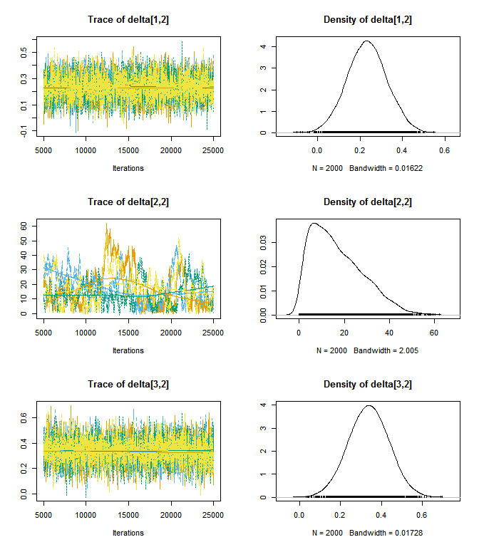 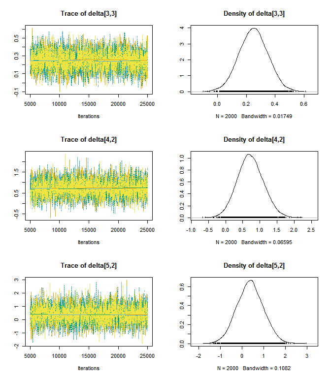 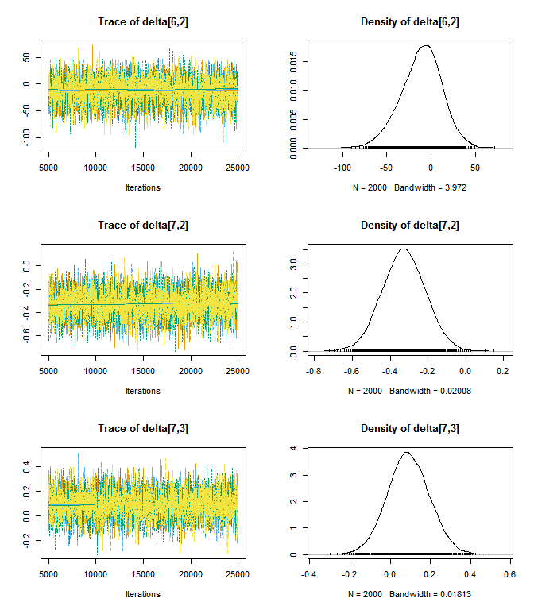 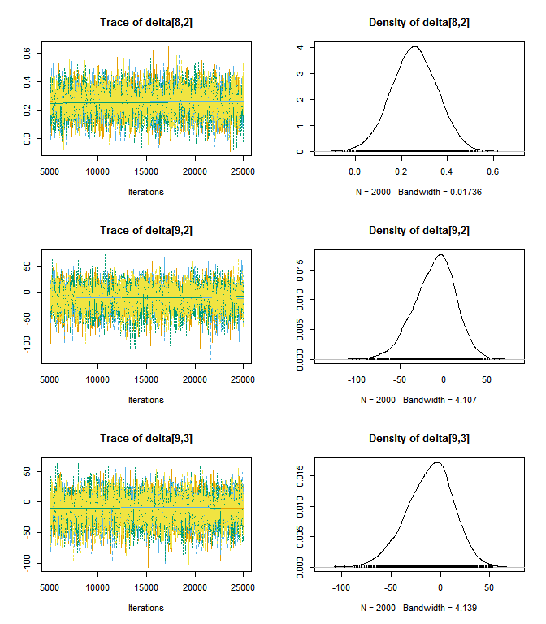 

```
## Unrelated Mean Effects (UME) model:
```

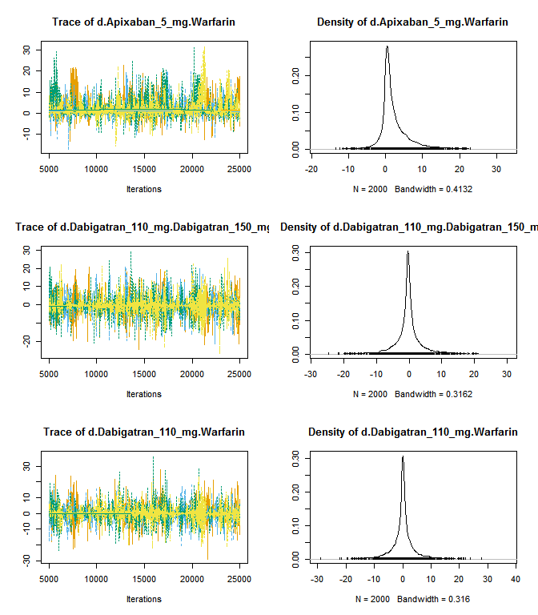 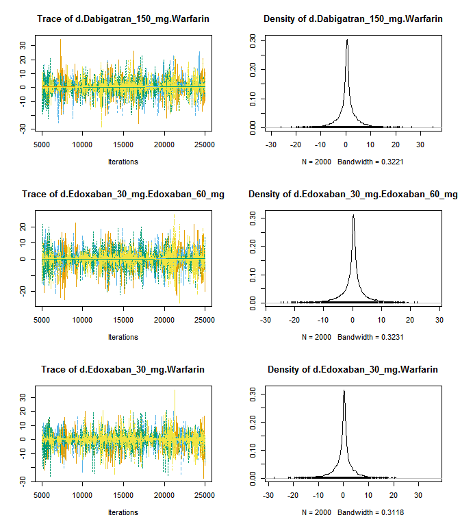 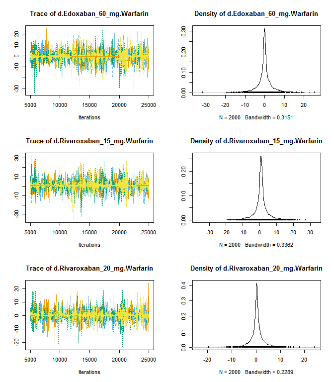 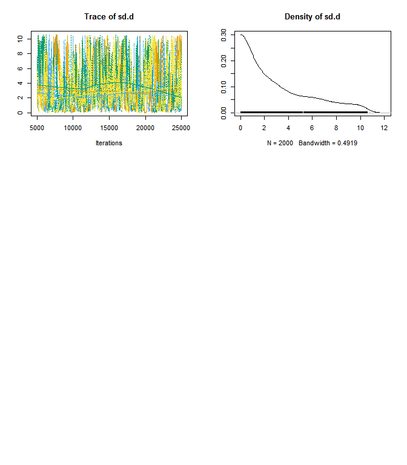 

```
## Consistency model:
```

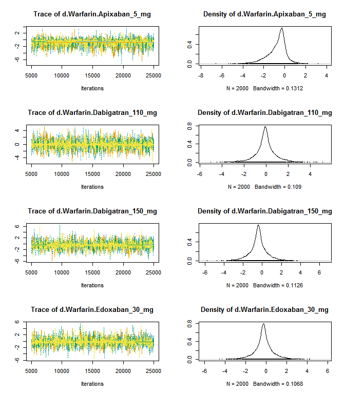 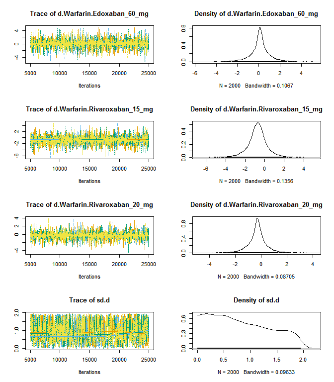 


# MI

Clean up the data (do not show the code).


```
## Warning in `[.data.table`(D, , `:=`(study = NA_character_, noac =
## NA_character_)): Invalid .internal.selfref detected and fixed by taking
## a (shallow) copy of the data.table so that := can add this new column by
## reference. At an earlier point, this data.table has been copied by R (or
## been created manually using structure() or similar). Avoid key<-, names<-
## and attr<- which in R currently (and oddly) may copy the whole data.table.
## Use set* syntax instead to avoid copying: ?set, ?setnames and ?setattr.
## Also, in R<=v3.0.2, list(DT1,DT2) copied the entire DT1 and DT2 (R's list()
## used to copy named objects); please upgrade to R>v3.0.2 if that is biting.
## If this message doesn't help, please report to datatable-help so the root
## cause can be fixed.
```

```
##              study         treatment responders sampleSize
##  1:      ARISTOTLE     Apixaban_5_mg         90       9120
##  2:      ARISTOTLE          Warfarin        102       9081
##  3:    ARISTOTLE-J     Apixaban_5_mg          0         72
##  4:    ARISTOTLE-J          Warfarin          0         75
##  5: ENGAGE AF-TIMI    Edoxaban_30_mg        133       7034
##  6: ENGAGE AF-TIMI    Edoxaban_60_mg        169       7035
##  7: ENGAGE AF-TIMI          Warfarin        141       7036
##  8:       J-ROCKET Rivaroxaban_15_mg          3        639
##  9:       J-ROCKET          Warfarin          1        639
## 10:          RE-LY Dabigatran_110_mg         86       6015
## 11:          RE-LY Dabigatran_150_mg         89       6076
## 12:          RE-LY          Warfarin         63       6022
## 13:      ROCKET-AF Rivaroxaban_20_mg        101       7131
## 14:      ROCKET-AF          Warfarin        126       7133
```


Plot the network.


```r
plot(network)
```

 

Run the model.


```r
M <- mtc.model(network, type="consistency", linearModel="random")
runtime <- system.time(results <- mtc.run(M, n.adapt=5000, n.iter=20000, thin=10))
```


```r
runtime
```

```
##    user  system elapsed 
##    9.17    0.02   10.64
```

Sampler diagnostics.


```r
gelman.plot(results)
```

 

```r
gelman.diag(results)
```

```
## Potential scale reduction factors:
## 
##                              Point est. Upper C.I.
## d.Warfarin.Apixaban_5_mg              1       1.00
## d.Warfarin.Dabigatran_110_mg          1       1.00
## d.Warfarin.Dabigatran_150_mg          1       1.00
## d.Warfarin.Edoxaban_30_mg             1       1.00
## d.Warfarin.Edoxaban_60_mg             1       1.00
## d.Warfarin.Rivaroxaban_15_mg          1       1.01
## d.Warfarin.Rivaroxaban_20_mg          1       1.00
## sd.d                                  1       1.01
## 
## Multivariate psrf
## 
## 1
```


```r
plot(results)
```

  

Summary.


```r
summary(results)
```

```
## $measure
## [1] "Log Odds Ratio"
## 
## $summaries
## 
## Iterations = 5010:25000
## Thinning interval = 10 
## Number of chains = 4 
## Sample size per chain = 2000 
## 
## 1. Empirical mean and standard deviation for each variable,
##    plus standard error of the mean:
## 
##                                 Mean     SD Naive SE Time-series SE
## d.Warfarin.Apixaban_5_mg     -0.1151 0.5091 0.005691       0.005928
## d.Warfarin.Dabigatran_110_mg  0.3277 0.5173 0.005783       0.006067
## d.Warfarin.Dabigatran_150_mg  0.3496 0.5201 0.005815       0.005929
## d.Warfarin.Edoxaban_30_mg    -0.0558 0.4939 0.005521       0.005581
## d.Warfarin.Edoxaban_60_mg     0.1810 0.5052 0.005649       0.005649
## d.Warfarin.Rivaroxaban_15_mg  1.4852 1.5155 0.016943       0.037126
## d.Warfarin.Rivaroxaban_20_mg -0.2309 0.5031 0.005624       0.005644
## sd.d                          0.4240 0.2442 0.002730       0.005600
## 
## 2. Quantiles for each variable:
## 
##                                  2.5%      25%      50%     75%  97.5%
## d.Warfarin.Apixaban_5_mg     -1.20870 -0.37526 -0.11875 0.13683 0.9657
## d.Warfarin.Dabigatran_110_mg -0.76154  0.05887  0.32605 0.59561 1.4490
## d.Warfarin.Dabigatran_150_mg -0.75661  0.08146  0.34439 0.61545 1.4863
## d.Warfarin.Edoxaban_30_mg    -1.12912 -0.29352 -0.06044 0.17929 0.9951
## d.Warfarin.Edoxaban_60_mg    -0.88657 -0.06413  0.18114 0.42311 1.2441
## d.Warfarin.Rivaroxaban_15_mg -1.07971  0.47876  1.31499 2.33861 5.0010
## d.Warfarin.Rivaroxaban_20_mg -1.29449 -0.48568 -0.22830 0.01964 0.8528
## sd.d                          0.02344  0.21256  0.42065 0.63730 0.8292
## 
## 
## $DIC
##     Dbar       pD      DIC 
## 12.31637 12.14848 24.46485 
## 
## attr(,"class")
## [1] "summary.mtc.result"
```

```r
forest(results)
```

 

Assess the degree of heterogeneity and inconsistency.


```r
anohe <- mtc.anohe(network, n.adapt=5000, n.iter=20000, thin=10)
```


```r
summary(anohe)
```

```
## Analysis of heterogeneity
## =========================
## 
## Per-comparison I-squared:
## -------------------------
## 
##                  t1                t2 i2.pair i2.cons incons.p
## 1     Apixaban_5_mg          Warfarin       0       0       NA
## 2 Dabigatran_110_mg Dabigatran_150_mg      NA      NA       NA
## 3 Dabigatran_110_mg          Warfarin      NA      NA       NA
## 4 Dabigatran_150_mg          Warfarin      NA      NA       NA
## 5    Edoxaban_30_mg    Edoxaban_60_mg      NA      NA       NA
## 6    Edoxaban_30_mg          Warfarin      NA      NA       NA
## 7    Edoxaban_60_mg          Warfarin      NA      NA       NA
## 8 Rivaroxaban_15_mg          Warfarin      NA      NA       NA
## 9 Rivaroxaban_20_mg          Warfarin      NA      NA       NA
## 
## Global I-squared:
## -------------------------
## 
##   i2.pair i2.cons
## 1       0       0
```

```r
plot(anohe)
```

```
## Analysis of heterogeneity -- convergence plots
## Unrelated Study Effects (USE) model:
```

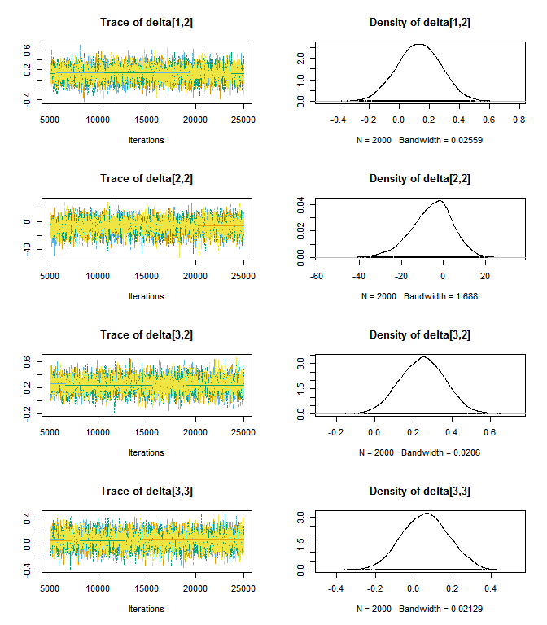 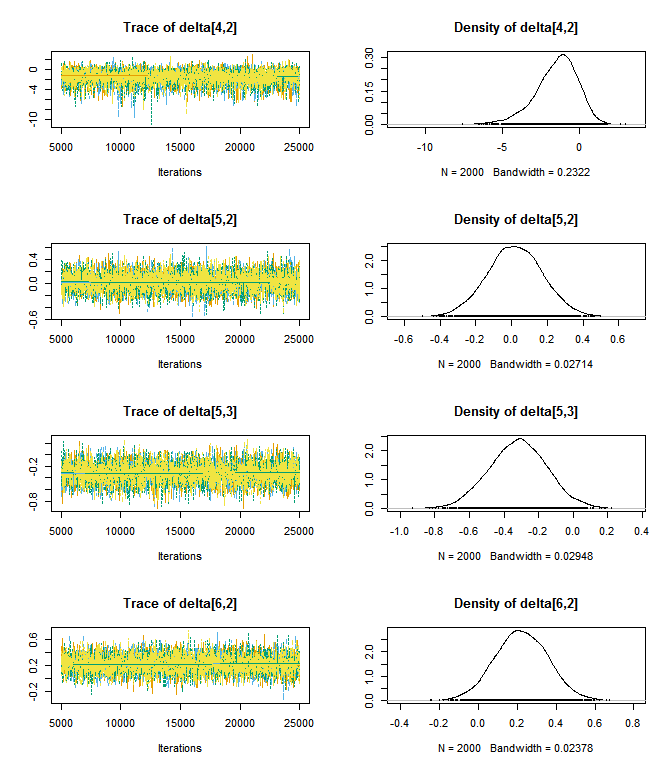 

```
## Unrelated Mean Effects (UME) model:
```

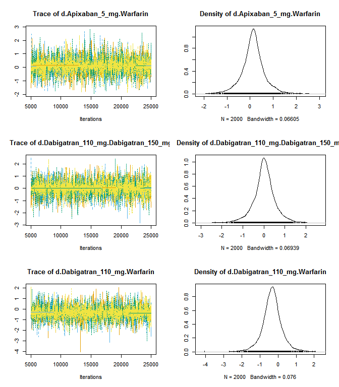 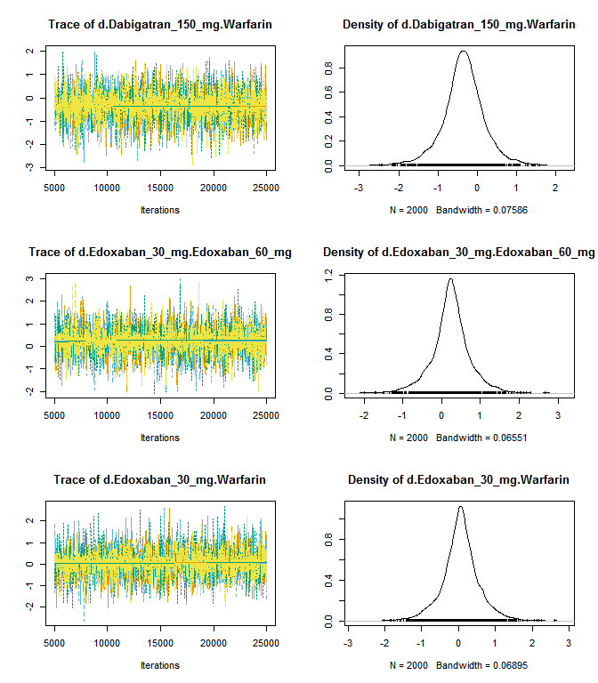 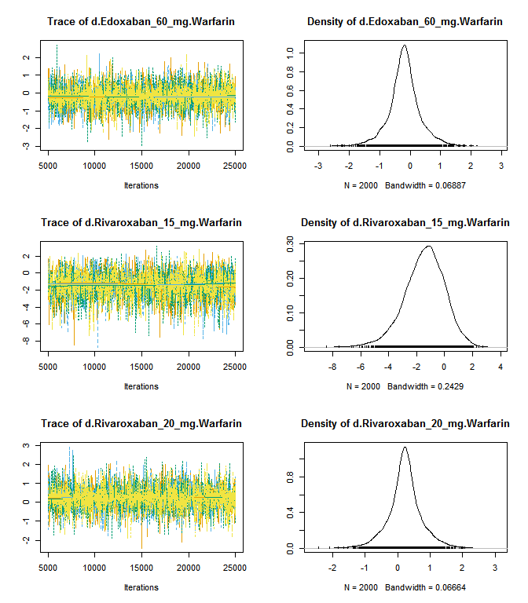 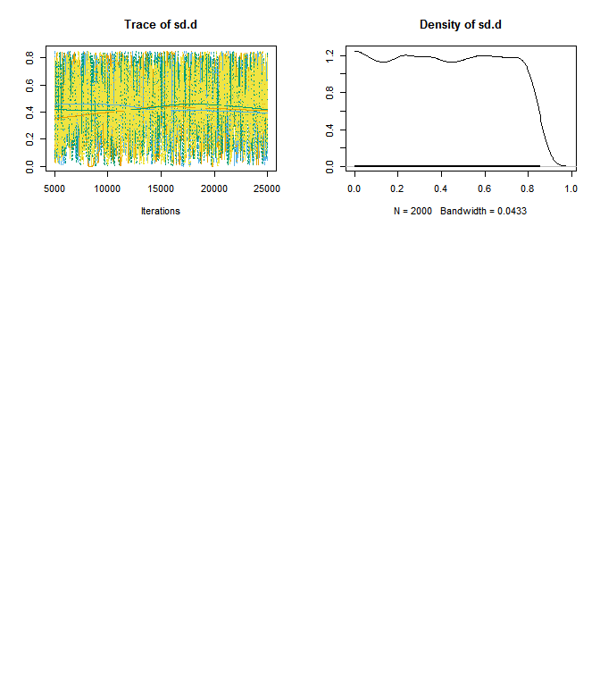 

```
## Consistency model:
```

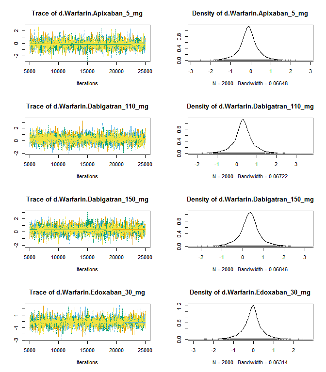 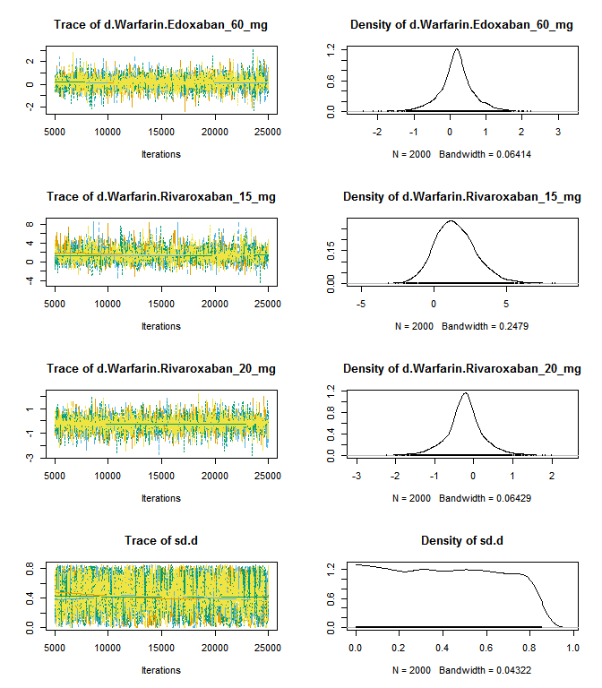 


# Bleeding

Clean up the data (do not show the code).


```
## Warning in `[.data.table`(D, , `:=`(study = NA_character_, noac =
## NA_character_)): Invalid .internal.selfref detected and fixed by taking
## a (shallow) copy of the data.table so that := can add this new column by
## reference. At an earlier point, this data.table has been copied by R (or
## been created manually using structure() or similar). Avoid key<-, names<-
## and attr<- which in R currently (and oddly) may copy the whole data.table.
## Use set* syntax instead to avoid copying: ?set, ?setnames and ?setattr.
## Also, in R<=v3.0.2, list(DT1,DT2) copied the entire DT1 and DT2 (R's list()
## used to copy named objects); please upgrade to R>v3.0.2 if that is biting.
## If this message doesn't help, please report to datatable-help so the root
## cause can be fixed.
```

```
##               study         treatment responders sampleSize
##  1:       ARISTOTLE     Apixaban_5_mg        148       9120
##  2:       ARISTOTLE          Warfarin        256       9081
##  3:     ARISTOTLE-J     Apixaban_5_mg          0         72
##  4:     ARISTOTLE-J          Warfarin          1         75
##  5:  ENGAGE AF-TIMI    Edoxaban_30_mg        418       7034
##  6:  ENGAGE AF-TIMI    Edoxaban_60_mg        254       7035
##  7:  ENGAGE AF-TIMI          Warfarin        524       7036
##  8:        J-ROCKET Rivaroxaban_15_mg         NA        639
##  9:        J-ROCKET          Warfarin         NA        639
## 10:           PETRO Dabigatran_150_mg          4        166
## 11:           PETRO          Warfarin          0         70
## 12:           RE-LY Dabigatran_110_mg        322       6015
## 13:           RE-LY Dabigatran_150_mg        375       6076
## 14:           RE-LY          Warfarin        397       6022
## 15:       ROCKET-AF Rivaroxaban_20_mg        395       7131
## 16:       ROCKET-AF          Warfarin        386       7133
## 17: Yamashita, 2012    Edoxaban_30_mg          0        131
## 18: Yamashita, 2012    Edoxaban_60_mg          2        131
## 19: Yamashita, 2012          Warfarin          0        129
```


Plot the network.


```r
plot(network)
```

 

Run the model.


```r
M <- mtc.model(network, type="consistency", linearModel="random")
runtime <- system.time(results <- mtc.run(M, n.adapt=5000, n.iter=20000, thin=10))
```


```r
runtime
```

```
##    user  system elapsed 
##   10.98    0.00   11.37
```

Sampler diagnostics.


```r
gelman.plot(results)
```

 

```r
gelman.diag(results)
```

```
## Potential scale reduction factors:
## 
##                              Point est. Upper C.I.
## d.Warfarin.Apixaban_5_mg              1       1.00
## d.Warfarin.Dabigatran_110_mg          1       1.00
## d.Warfarin.Dabigatran_150_mg          1       1.00
## d.Warfarin.Edoxaban_30_mg             1       1.00
## d.Warfarin.Edoxaban_60_mg             1       1.00
## d.Warfarin.Rivaroxaban_20_mg          1       1.00
## sd.d                                  1       1.01
## 
## Multivariate psrf
## 
## 1
```


```r
plot(results)
```

  

Summary.


```r
summary(results)
```

```
## $measure
## [1] "Log Odds Ratio"
## 
## $summaries
## 
## Iterations = 5010:25000
## Thinning interval = 10 
## Number of chains = 4 
## Sample size per chain = 2000 
## 
## 1. Empirical mean and standard deviation for each variable,
##    plus standard error of the mean:
## 
##                                  Mean     SD Naive SE Time-series SE
## d.Warfarin.Apixaban_5_mg     -0.86635 1.0359 0.011581        0.01227
## d.Warfarin.Dabigatran_110_mg  0.10958 1.0816 0.012092        0.01210
## d.Warfarin.Dabigatran_150_mg  0.57418 1.0211 0.011416        0.01273
## d.Warfarin.Edoxaban_30_mg    -0.20444 1.0224 0.011431        0.01249
## d.Warfarin.Edoxaban_60_mg     0.02606 1.0496 0.011735        0.01438
## d.Warfarin.Rivaroxaban_20_mg  0.01306 1.1183 0.012503        0.01235
## sd.d                          1.02791 0.4324 0.004835        0.01092
## 
## 2. Quantiles for each variable:
## 
##                                  2.5%      25%      50%     75% 97.5%
## d.Warfarin.Apixaban_5_mg     -3.13546 -1.44794 -0.76579 -0.2709 1.167
## d.Warfarin.Dabigatran_110_mg -2.01184 -0.51068 -0.01476  0.7052 2.453
## d.Warfarin.Dabigatran_150_mg -1.18377 -0.09001  0.41965  1.1603 2.913
## d.Warfarin.Edoxaban_30_mg    -2.30235 -0.76750 -0.21361  0.3628 1.911
## d.Warfarin.Edoxaban_60_mg    -1.78298 -0.71882 -0.12145  0.6592 2.350
## d.Warfarin.Rivaroxaban_20_mg -2.32341 -0.57642  0.02464  0.6190 2.366
## sd.d                          0.09235  0.72486  1.11017  1.3902 1.607
## 
## 
## $DIC
##     Dbar       pD      DIC 
## 18.88137 13.91594 32.79731 
## 
## attr(,"class")
## [1] "summary.mtc.result"
```

```r
forest(results)
```

 

Assess the degree of heterogeneity and inconsistency.


```r
anohe <- mtc.anohe(network, n.adapt=5000, n.iter=20000, thin=10)
```


```r
summary(anohe)
```

```
## Analysis of heterogeneity
## =========================
## 
## Per-comparison I-squared:
## -------------------------
## 
##                  t1                t2  i2.pair  i2.cons incons.p
## 1     Apixaban_5_mg          Warfarin 99.94926 78.63290       NA
## 2 Dabigatran_110_mg Dabigatran_150_mg       NA       NA       NA
## 3 Dabigatran_110_mg          Warfarin       NA       NA       NA
## 4 Dabigatran_150_mg          Warfarin 99.95921 96.50243       NA
## 5    Edoxaban_30_mg    Edoxaban_60_mg 99.90591 96.79389       NA
## 6    Edoxaban_30_mg          Warfarin 99.35676  0.00000       NA
## 7    Edoxaban_60_mg          Warfarin 99.71464 97.71766       NA
## 8 Rivaroxaban_20_mg          Warfarin       NA       NA       NA
## 
## Global I-squared:
## -------------------------
## 
##    i2.pair  i2.cons
## 1 99.79975 89.80639
```

```r
plot(anohe)
```

```
## Analysis of heterogeneity -- convergence plots
## Unrelated Study Effects (USE) model:
```

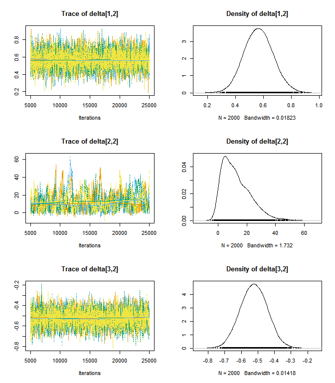 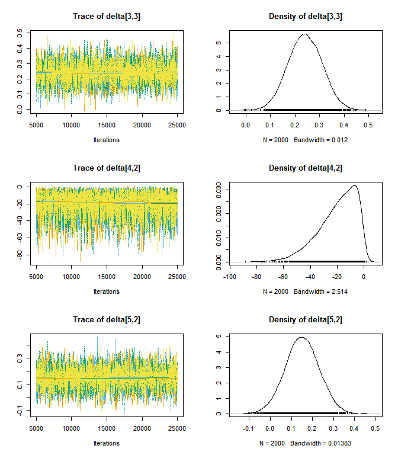 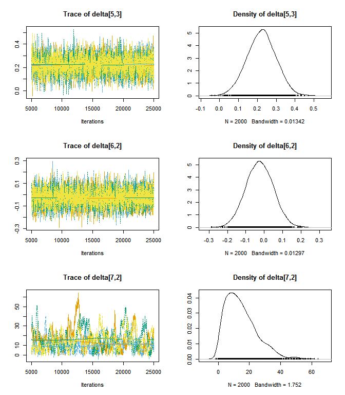 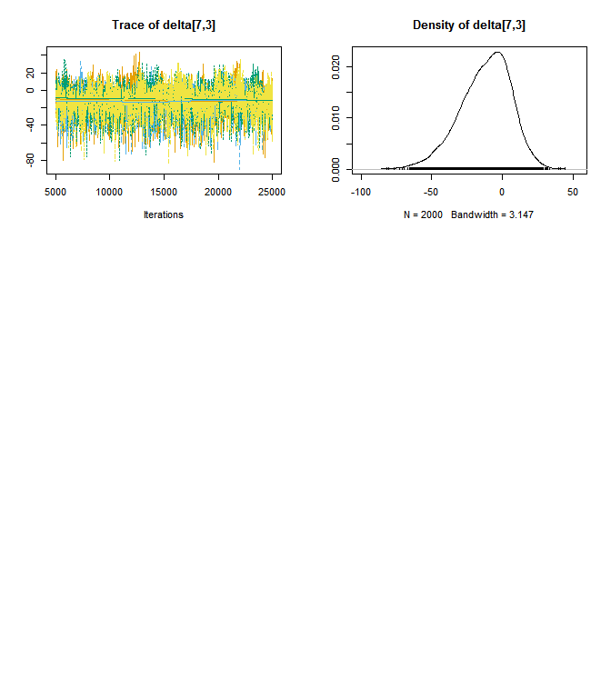 

```
## Unrelated Mean Effects (UME) model:
```

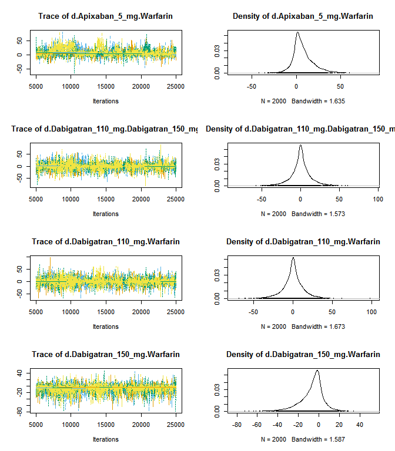 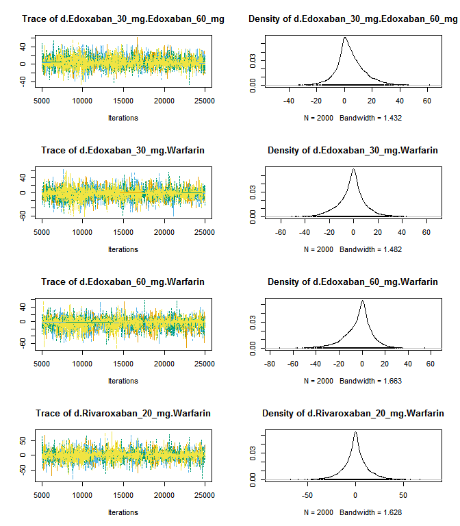 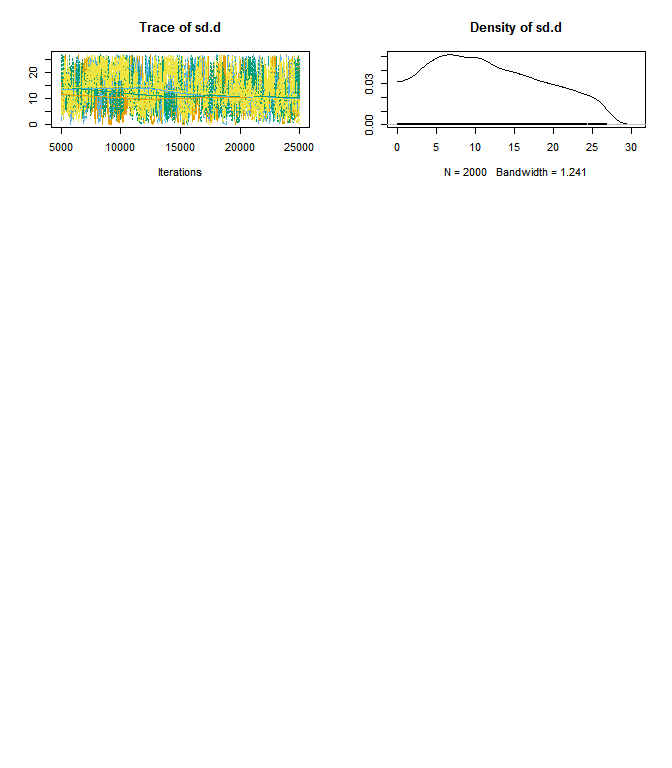 

```
## Consistency model:
```

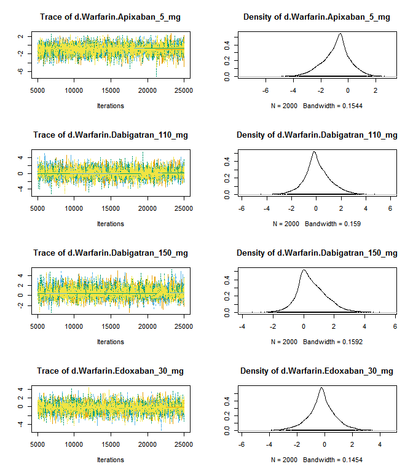 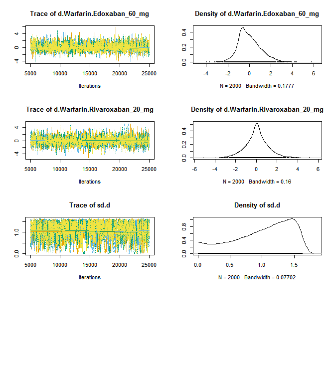 
