# Novel oral anticoagulants network meta-analysis
Benjamin Chan  
`r Sys.time()`  


This network meta-analysis is an update to
[Fu *et al*, 2014](http://www.ncbi.nlm.nih.gov/pmc/articles/PMC4244213/),
*J Cardiovasc Med (Hagerstown).* 2014 Dec; 15(12): 873-879.


> From: Marian McDonagh  
> Sent: Friday, January 29, 2016 4:19 PM  
> To: Benjamin Chan  
> Subject: Re: Network Meta-analysis  
> 
> OK, last email for today!
> I put it all into an excel spreadsheet --- all the outcomes.
> Looks like it might not add up to much since several outcome cells are 0's.
> Let me know what you think.


```
##                                  mtime  size
## NOAC NMA Data.xlsx 2016-01-30 06:00:03 48838
```


# Mortality

Clean up the data (do not show the code).


```
## Warning in `[.data.table`(D, , `:=`(study = NA_character_, noac =
## NA_character_)): Invalid .internal.selfref detected and fixed by taking
## a (shallow) copy of the data.table so that := can add this new column by
## reference. At an earlier point, this data.table has been copied by R (or
## been created manually using structure() or similar). Avoid key<-, names<-
## and attr<- which in R currently (and oddly) may copy the whole data.table.
## Use set* syntax instead to avoid copying: ?set, ?setnames and ?setattr.
## Also, in R<=v3.0.2, list(DT1,DT2) copied the entire DT1 and DT2 (R's list()
## used to copy named objects); please upgrade to R>v3.0.2 if that is biting.
## If this message doesn't help, please report to datatable-help so the root
## cause can be fixed.
```

```
##               study         treatment responders sampleSize
##  1:       ARISTOTLE     Apixaban_5_mg        603       9120
##  2:       ARISTOTLE          Warfarin        669       9081
##  3:     ARISTOTLE-J     Apixaban_5_mg          0         72
##  4:     ARISTOTLE-J          Warfarin          0         75
##  5:  ENGAGE AF-TIMI    Edoxaban_30_mg        737       7034
##  6:  ENGAGE AF-TIMI    Edoxaban_60_mg        773       7035
##  7:  ENGAGE AF-TIMI          Warfarin        839       7036
##  8:        J-ROCKET Rivaroxaban_15_mg          7        639
##  9:        J-ROCKET          Warfarin          5        639
## 10:           RE-LY Dabigatran_110_mg        446       6015
## 11:           RE-LY Dabigatran_150_mg        438       6076
## 12:           RE-LY          Warfarin        487       6022
## 13:       ROCKET-AF Rivaroxaban_20_mg        208       7131
## 14:       ROCKET-AF          Warfarin        250       7133
## 15: Yamashita, 2012    Edoxaban_30_mg          0        131
## 16: Yamashita, 2012    Edoxaban_60_mg          1        131
## 17: Yamashita, 2012          Warfarin          1        129
```

Plot the network.


```r
network <- mtc.network(D1)
plot(network)
```

 

Run the model.


```r
M <- mtc.model(network, type="consistency", linearModel="fixed")
system.time(results <- mtc.run(M, n.adapt=20000, n.iter=20000, thin=20))
```

Sampler diagnostics.


```r
gelman.plot(results)
```

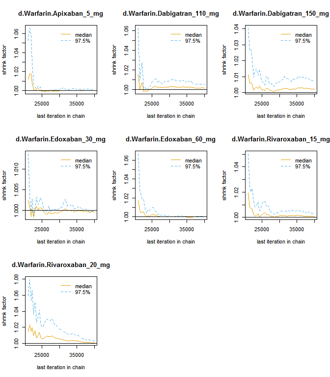 


```r
plot(results)
```

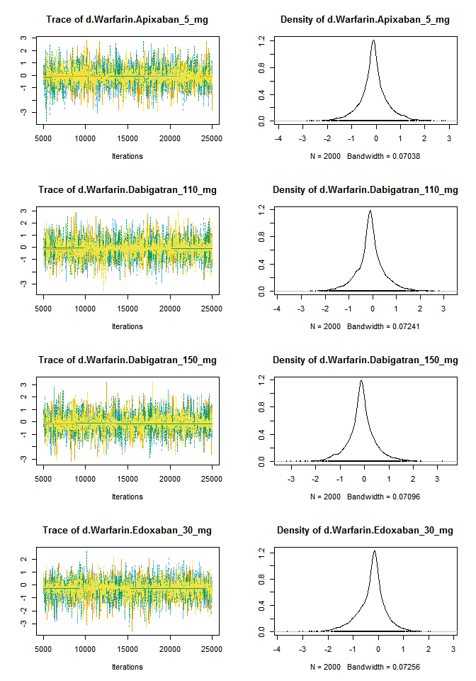 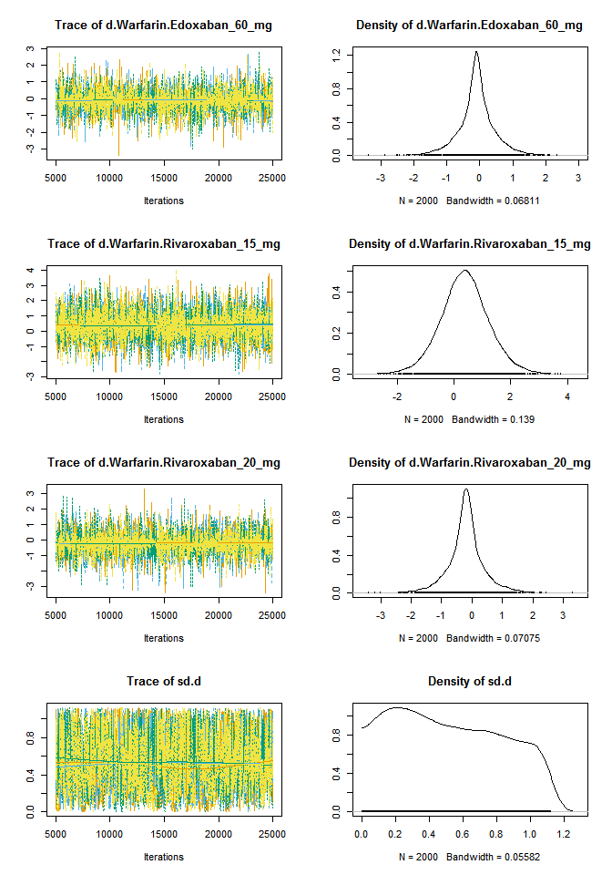 

Summary.


```r
summary(results)
```

```
## $measure
## [1] "Log Odds Ratio"
## 
## $summaries
## 
## Iterations = 20020:40000
## Thinning interval = 20 
## Number of chains = 4 
## Sample size per chain = 1000 
## 
## 1. Empirical mean and standard deviation for each variable,
##    plus standard error of the mean:
## 
##                                  Mean      SD  Naive SE Time-series SE
## d.Warfarin.Apixaban_5_mg     -0.11520 0.05908 0.0009341      0.0009342
## d.Warfarin.Dabigatran_110_mg -0.09256 0.06840 0.0010815      0.0010941
## d.Warfarin.Dabigatran_150_mg -0.12333 0.06858 0.0010843      0.0011018
## d.Warfarin.Edoxaban_30_mg    -0.14733 0.05471 0.0008650      0.0008558
## d.Warfarin.Edoxaban_60_mg    -0.09274 0.05254 0.0008308      0.0008416
## d.Warfarin.Rivaroxaban_15_mg  0.36580 0.61363 0.0097024      0.0094432
## d.Warfarin.Rivaroxaban_20_mg -0.19044 0.09482 0.0014992      0.0015483
## 
## 2. Quantiles for each variable:
## 
##                                 2.5%      25%      50%      75%     97.5%
## d.Warfarin.Apixaban_5_mg     -0.2330 -0.15488 -0.11508 -0.07553  0.001401
## d.Warfarin.Dabigatran_110_mg -0.2287 -0.13766 -0.09178 -0.04611  0.041293
## d.Warfarin.Dabigatran_150_mg -0.2577 -0.16966 -0.12287 -0.07727  0.008726
## d.Warfarin.Edoxaban_30_mg    -0.2555 -0.18518 -0.14668 -0.11044 -0.042499
## d.Warfarin.Edoxaban_60_mg    -0.1961 -0.12855 -0.09266 -0.05595  0.006897
## d.Warfarin.Rivaroxaban_15_mg -0.8328 -0.03673  0.34960  0.76289  1.640298
## d.Warfarin.Rivaroxaban_20_mg -0.3764 -0.25467 -0.19072 -0.12866 -0.007603
## 
## 
## $DIC
##     Dbar       pD      DIC 
## 14.75180 13.11803 27.86982 
## 
## attr(,"class")
## [1] "summary.mtc.result"
```

```r
forest(results)
```

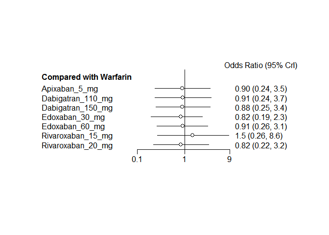 


# Stroke

Clean up the data (do not show the code).


```
## Warning in `[.data.table`(D, , `:=`(study = NA_character_, noac =
## NA_character_)): Invalid .internal.selfref detected and fixed by taking
## a (shallow) copy of the data.table so that := can add this new column by
## reference. At an earlier point, this data.table has been copied by R (or
## been created manually using structure() or similar). Avoid key<-, names<-
## and attr<- which in R currently (and oddly) may copy the whole data.table.
## Use set* syntax instead to avoid copying: ?set, ?setnames and ?setattr.
## Also, in R<=v3.0.2, list(DT1,DT2) copied the entire DT1 and DT2 (R's list()
## used to copy named objects); please upgrade to R>v3.0.2 if that is biting.
## If this message doesn't help, please report to datatable-help so the root
## cause can be fixed.
```

```
##               study         treatment responders sampleSize
##  1:       ARISTOTLE     Apixaban_5_mg        212       9120
##  2:       ARISTOTLE          Warfarin        265       9081
##  3:     ARISTOTLE-J     Apixaban_5_mg          0         72
##  4:     ARISTOTLE-J          Warfarin          3         75
##  5:  ENGAGE AF-TIMI    Edoxaban_30_mg        182       7034
##  6:  ENGAGE AF-TIMI    Edoxaban_60_mg        253       7035
##  7:  ENGAGE AF-TIMI          Warfarin        232       7036
##  8:        J-ROCKET Rivaroxaban_15_mg         11        639
##  9:        J-ROCKET          Warfarin         22        639
## 10:       Mao, 2014 Rivaroxaban_20_mg          5        177
## 11:       Mao, 2014          Warfarin          7        176
## 12:           PETRO Dabigatran_150_mg          0        166
## 13:           PETRO          Warfarin          0         70
## 14:           RE-LY Dabigatran_110_mg        182       6015
## 15:           RE-LY Dabigatran_150_mg        134       6076
## 16:           RE-LY          Warfarin        199       6022
## 17:       ROCKET-AF Rivaroxaban_20_mg        188       7131
## 18:       ROCKET-AF          Warfarin        241       7133
## 19: Yamashita, 2012    Edoxaban_30_mg          0        131
## 20: Yamashita, 2012    Edoxaban_60_mg          0        131
## 21: Yamashita, 2012          Warfarin          0        129
##               study         treatment responders sampleSize
```


Plot the network.


```r
network <- mtc.network(D2)
plot(network)
```

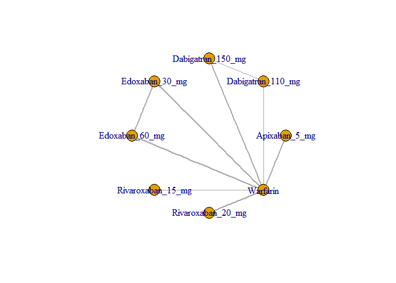 

Run the model.


```r
M <- mtc.model(network, type="consistency", linearModel="fixed")
system.time(results <- mtc.run(M, n.adapt=20000, n.iter=20000, thin=20))
```

Sampler diagnostics.


```r
gelman.plot(results)
```

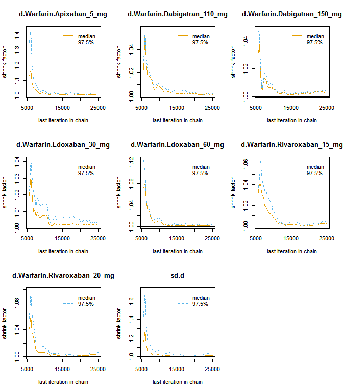 


```r
plot(results)
```

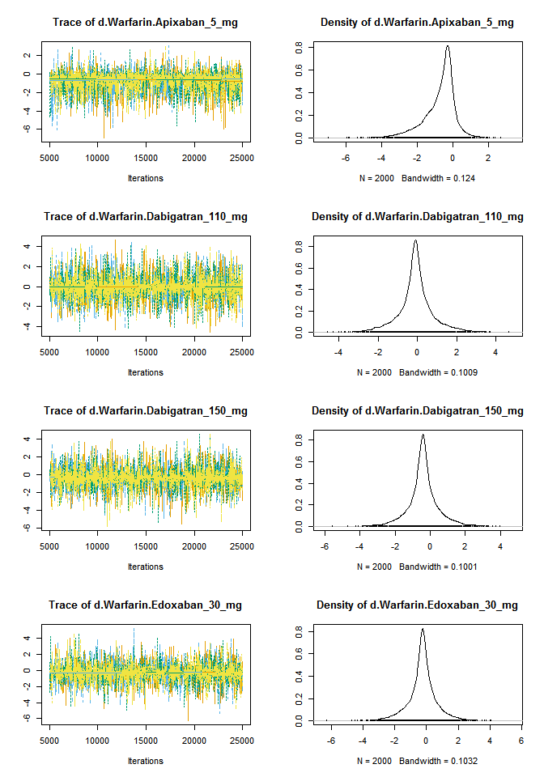 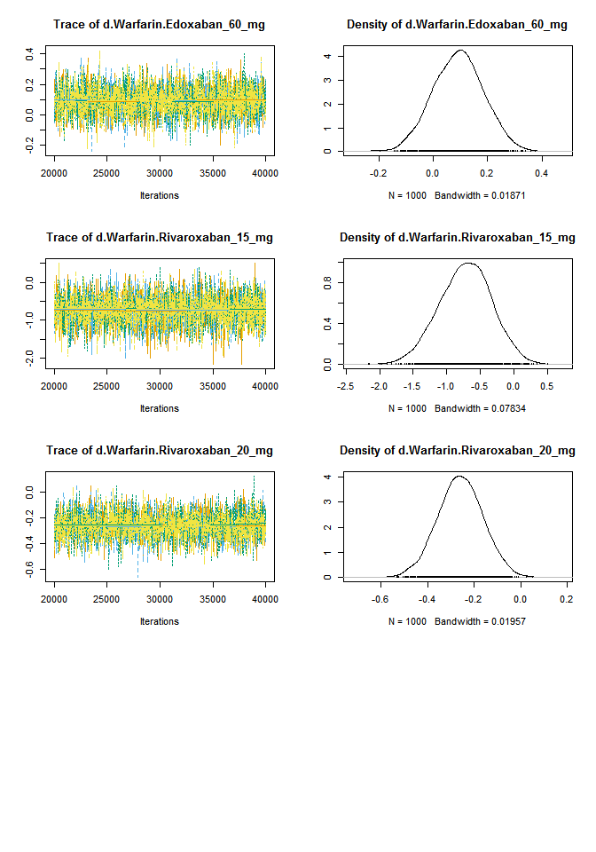 

Summary.


```r
summary(results)
```

```
## $measure
## [1] "Log Odds Ratio"
## 
## $summaries
## 
## Iterations = 20020:40000
## Thinning interval = 20 
## Number of chains = 4 
## Sample size per chain = 1000 
## 
## 1. Empirical mean and standard deviation for each variable,
##    plus standard error of the mean:
## 
##                                  Mean      SD Naive SE Time-series SE
## d.Warfarin.Apixaban_5_mg     -0.24494 0.09315 0.001473       0.001472
## d.Warfarin.Dabigatran_110_mg -0.09111 0.10352 0.001637       0.001604
## d.Warfarin.Dabigatran_150_mg -0.41885 0.11532 0.001823       0.001823
## d.Warfarin.Edoxaban_30_mg    -0.24601 0.09948 0.001573       0.001557
## d.Warfarin.Edoxaban_60_mg     0.09241 0.09271 0.001466       0.001466
## d.Warfarin.Rivaroxaban_15_mg -0.72523 0.38825 0.006139       0.006354
## d.Warfarin.Rivaroxaban_20_mg -0.25932 0.09736 0.001539       0.001491
## 
## 2. Quantiles for each variable:
## 
##                                  2.5%      25%      50%      75%    97.5%
## d.Warfarin.Apixaban_5_mg     -0.42747 -0.30953 -0.24545 -0.18122 -0.06336
## d.Warfarin.Dabigatran_110_mg -0.29392 -0.16046 -0.09206 -0.02219  0.11182
## d.Warfarin.Dabigatran_150_mg -0.64890 -0.49627 -0.42003 -0.34042 -0.19639
## d.Warfarin.Edoxaban_30_mg    -0.43355 -0.31331 -0.24683 -0.18011 -0.05111
## d.Warfarin.Edoxaban_60_mg    -0.08831  0.02896  0.09336  0.15453  0.27090
## d.Warfarin.Rivaroxaban_15_mg -1.52260 -0.98898 -0.71351 -0.45995  0.01184
## d.Warfarin.Rivaroxaban_20_mg -0.45476 -0.32411 -0.25945 -0.19415 -0.06721
## 
## 
## $DIC
##     Dbar       pD      DIC 
## 17.80267 14.20603 32.00869 
## 
## attr(,"class")
## [1] "summary.mtc.result"
```

```r
forest(results)
```

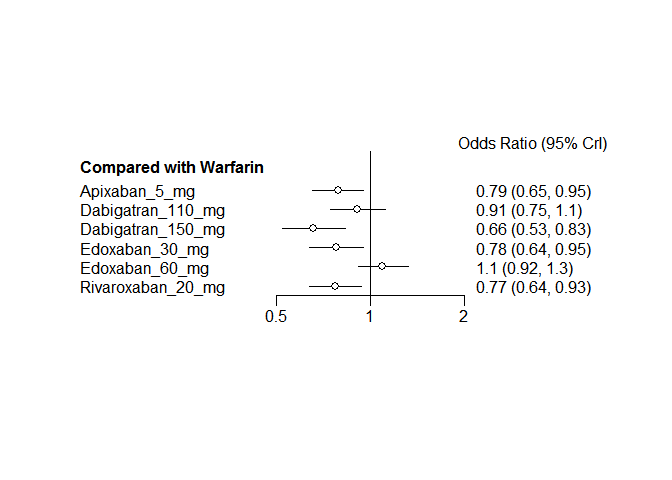 


# MI

Clean up the data (do not show the code).


```
## Warning in `[.data.table`(D, , `:=`(study = NA_character_, noac =
## NA_character_)): Invalid .internal.selfref detected and fixed by taking
## a (shallow) copy of the data.table so that := can add this new column by
## reference. At an earlier point, this data.table has been copied by R (or
## been created manually using structure() or similar). Avoid key<-, names<-
## and attr<- which in R currently (and oddly) may copy the whole data.table.
## Use set* syntax instead to avoid copying: ?set, ?setnames and ?setattr.
## Also, in R<=v3.0.2, list(DT1,DT2) copied the entire DT1 and DT2 (R's list()
## used to copy named objects); please upgrade to R>v3.0.2 if that is biting.
## If this message doesn't help, please report to datatable-help so the root
## cause can be fixed.
```

```
##              study         treatment responders sampleSize
##  1:      ARISTOTLE     Apixaban_5_mg         90       9120
##  2:      ARISTOTLE          Warfarin        102       9081
##  3:    ARISTOTLE-J     Apixaban_5_mg          0         72
##  4:    ARISTOTLE-J          Warfarin          0         75
##  5: ENGAGE AF-TIMI    Edoxaban_30_mg        133       7034
##  6: ENGAGE AF-TIMI    Edoxaban_60_mg        169       7035
##  7: ENGAGE AF-TIMI          Warfarin        141       7036
##  8:       J-ROCKET Rivaroxaban_15_mg          3        639
##  9:       J-ROCKET          Warfarin          1        639
## 10:          RE-LY Dabigatran_110_mg         86       6015
## 11:          RE-LY Dabigatran_150_mg         89       6076
## 12:          RE-LY          Warfarin         63       6022
## 13:      ROCKET-AF Rivaroxaban_20_mg        101       7131
## 14:      ROCKET-AF          Warfarin        126       7133
```


Plot the network.


```r
network <- mtc.network(D3)
plot(network)
```

 

Run the model.


```r
M <- mtc.model(network, type="consistency", linearModel="fixed")
system.time(results <- mtc.run(M, n.adapt=20000, n.iter=20000, thin=20))
```

Sampler diagnostics.


```r
gelman.plot(results)
```

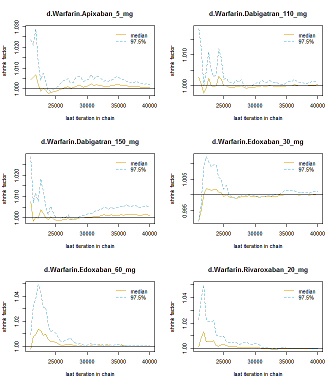 


```r
plot(results)
```

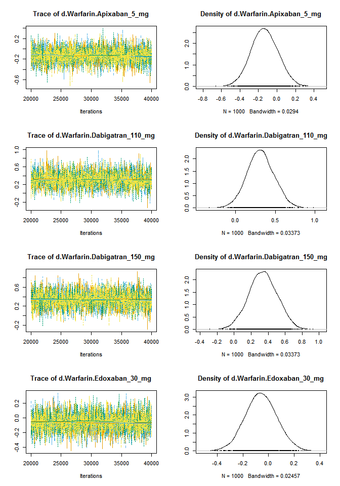 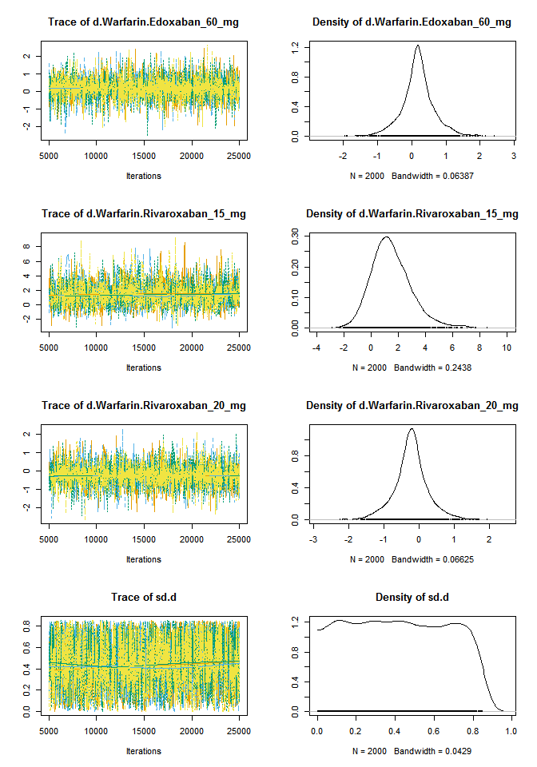 

Summary.


```r
summary(results)
```

```
## $measure
## [1] "Log Odds Ratio"
## 
## $summaries
## 
## Iterations = 20020:40000
## Thinning interval = 20 
## Number of chains = 4 
## Sample size per chain = 1000 
## 
## 1. Empirical mean and standard deviation for each variable,
##    plus standard error of the mean:
## 
##                                  Mean     SD Naive SE Time-series SE
## d.Warfarin.Apixaban_5_mg     -0.13392 0.1457 0.002304       0.002312
## d.Warfarin.Dabigatran_110_mg  0.31636 0.1699 0.002687       0.002752
## d.Warfarin.Dabigatran_150_mg  0.33974 0.1672 0.002643       0.002693
## d.Warfarin.Edoxaban_30_mg    -0.05776 0.1218 0.001926       0.001924
## d.Warfarin.Edoxaban_60_mg     0.18548 0.1163 0.001838       0.001835
## d.Warfarin.Rivaroxaban_15_mg  1.51047 1.4366 0.022714       0.022347
## d.Warfarin.Rivaroxaban_20_mg -0.22446 0.1360 0.002150       0.002127
## 
## 2. Quantiles for each variable:
## 
##                                  2.5%     25%      50%      75%   97.5%
## d.Warfarin.Apixaban_5_mg     -0.41763 -0.2331 -0.13639 -0.03535 0.15473
## d.Warfarin.Dabigatran_110_mg -0.01135  0.2039  0.31312  0.42787 0.65136
## d.Warfarin.Dabigatran_150_mg  0.01097  0.2281  0.33977  0.45390 0.66764
## d.Warfarin.Edoxaban_30_mg    -0.29696 -0.1403 -0.05816  0.02335 0.18487
## d.Warfarin.Edoxaban_60_mg    -0.03849  0.1046  0.18561  0.26286 0.41743
## d.Warfarin.Rivaroxaban_15_mg -0.88645  0.5575  1.34321  2.30338 4.90191
## d.Warfarin.Rivaroxaban_20_mg -0.49458 -0.3127 -0.22562 -0.13281 0.03673
## 
## 
## $DIC
##     Dbar       pD      DIC 
## 12.35913 12.17120 24.53033 
## 
## attr(,"class")
## [1] "summary.mtc.result"
```

```r
forest(results)
```

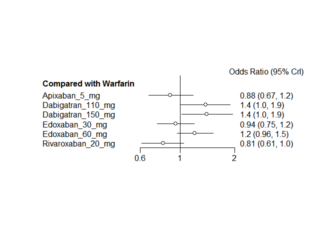 


# Bleeding

Clean up the data (do not show the code).


```
## Warning in `[.data.table`(D, , `:=`(study = NA_character_, noac =
## NA_character_)): Invalid .internal.selfref detected and fixed by taking
## a (shallow) copy of the data.table so that := can add this new column by
## reference. At an earlier point, this data.table has been copied by R (or
## been created manually using structure() or similar). Avoid key<-, names<-
## and attr<- which in R currently (and oddly) may copy the whole data.table.
## Use set* syntax instead to avoid copying: ?set, ?setnames and ?setattr.
## Also, in R<=v3.0.2, list(DT1,DT2) copied the entire DT1 and DT2 (R's list()
## used to copy named objects); please upgrade to R>v3.0.2 if that is biting.
## If this message doesn't help, please report to datatable-help so the root
## cause can be fixed.
```

```
##               study         treatment responders sampleSize
##  1:       ARISTOTLE     Apixaban_5_mg        148       9120
##  2:       ARISTOTLE          Warfarin        256       9081
##  3:     ARISTOTLE-J     Apixaban_5_mg          0         72
##  4:     ARISTOTLE-J          Warfarin          1         75
##  5:  ENGAGE AF-TIMI    Edoxaban_30_mg        418       7034
##  6:  ENGAGE AF-TIMI    Edoxaban_60_mg        254       7035
##  7:  ENGAGE AF-TIMI          Warfarin        524       7036
##  8:        J-ROCKET Rivaroxaban_15_mg         NA        639
##  9:        J-ROCKET          Warfarin         NA        639
## 10:           PETRO Dabigatran_150_mg          4        166
## 11:           PETRO          Warfarin          0         70
## 12:           RE-LY Dabigatran_110_mg        322       6015
## 13:           RE-LY Dabigatran_150_mg        375       6076
## 14:           RE-LY          Warfarin        397       6022
## 15:       ROCKET-AF Rivaroxaban_20_mg        395       7131
## 16:       ROCKET-AF          Warfarin        386       7133
## 17: Yamashita, 2012    Edoxaban_30_mg          0        131
## 18: Yamashita, 2012    Edoxaban_60_mg          2        131
## 19: Yamashita, 2012          Warfarin          0        129
```


Plot the network.


```r
network <- mtc.network(D4[!is.na(responders)])
plot(network)
```

 

Run the model.


```r
M <- mtc.model(network, type="consistency", linearModel="fixed")
system.time(results <- mtc.run(M, n.adapt=20000, n.iter=20000, thin=20))
```

Sampler diagnostics.


```r
gelman.plot(results)
```

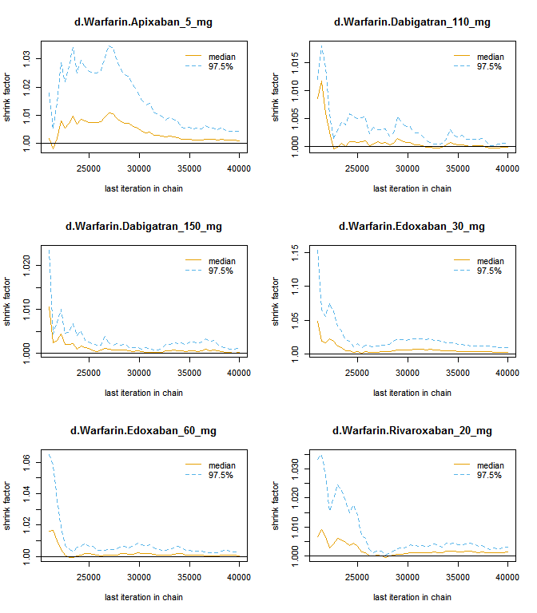 


```r
plot(results)
```

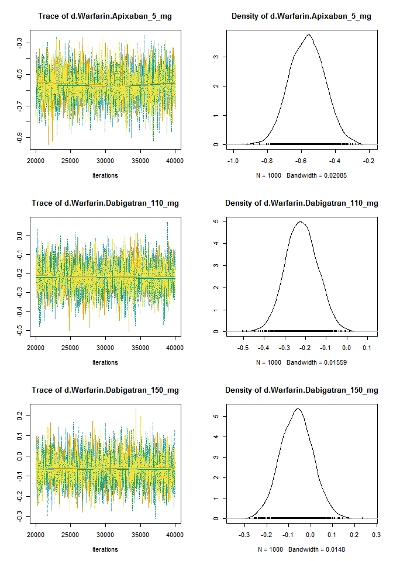 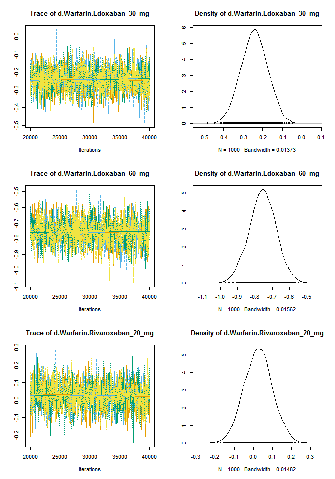 

Summary.


```r
summary(results)
```

```
## $measure
## [1] "Log Odds Ratio"
## 
## $summaries
## 
## Iterations = 20020:40000
## Thinning interval = 20 
## Number of chains = 4 
## Sample size per chain = 1000 
## 
## 1. Empirical mean and standard deviation for each variable,
##    plus standard error of the mean:
## 
##                                  Mean      SD Naive SE Time-series SE
## d.Warfarin.Apixaban_5_mg     -0.56794 0.10331 0.001633       0.001692
## d.Warfarin.Dabigatran_110_mg -0.21841 0.07728 0.001222       0.001238
## d.Warfarin.Dabigatran_150_mg -0.06315 0.07337 0.001160       0.001176
## d.Warfarin.Edoxaban_30_mg    -0.24235 0.06804 0.001076       0.001024
## d.Warfarin.Edoxaban_60_mg    -0.75573 0.07752 0.001226       0.001242
## d.Warfarin.Rivaroxaban_20_mg  0.02585 0.07371 0.001165       0.001128
## 
## 2. Quantiles for each variable:
## 
##                                 2.5%      25%      50%      75%    97.5%
## d.Warfarin.Apixaban_5_mg     -0.7670 -0.63962 -0.56684 -0.49737 -0.36437
## d.Warfarin.Dabigatran_110_mg -0.3675 -0.27152 -0.22021 -0.16647 -0.06632
## d.Warfarin.Dabigatran_150_mg -0.2081 -0.11358 -0.06249 -0.01473  0.08457
## d.Warfarin.Edoxaban_30_mg    -0.3764 -0.28807 -0.24181 -0.19664 -0.11234
## d.Warfarin.Edoxaban_60_mg    -0.9094 -0.80680 -0.75445 -0.70309 -0.60517
## d.Warfarin.Rivaroxaban_20_mg -0.1189 -0.02414  0.02568  0.07425  0.17077
## 
## 
## $DIC
##     Dbar       pD      DIC 
## 23.42012 13.25690 36.67702 
## 
## attr(,"class")
## [1] "summary.mtc.result"
```

```r
forest(results)
```

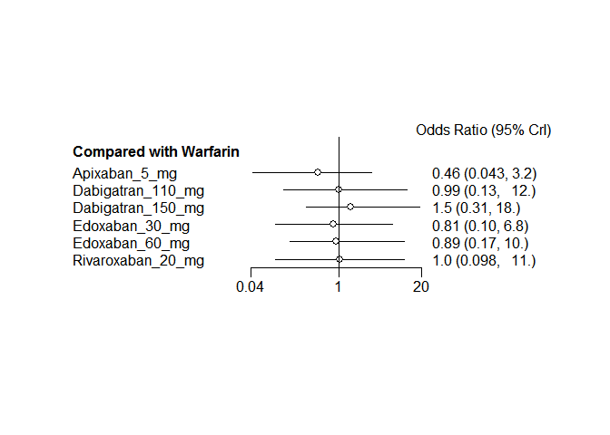 
