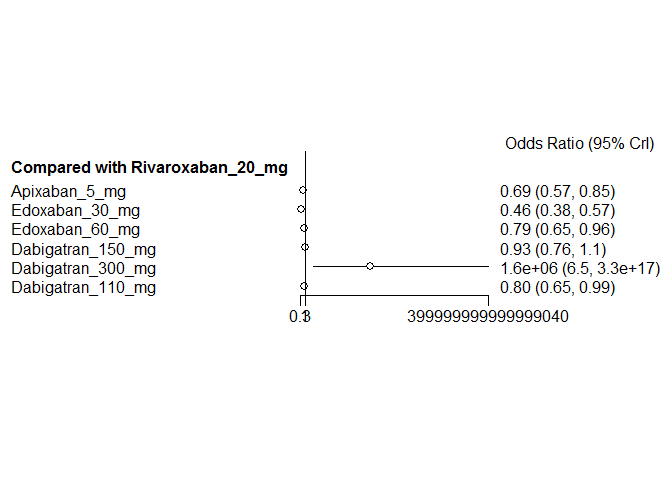
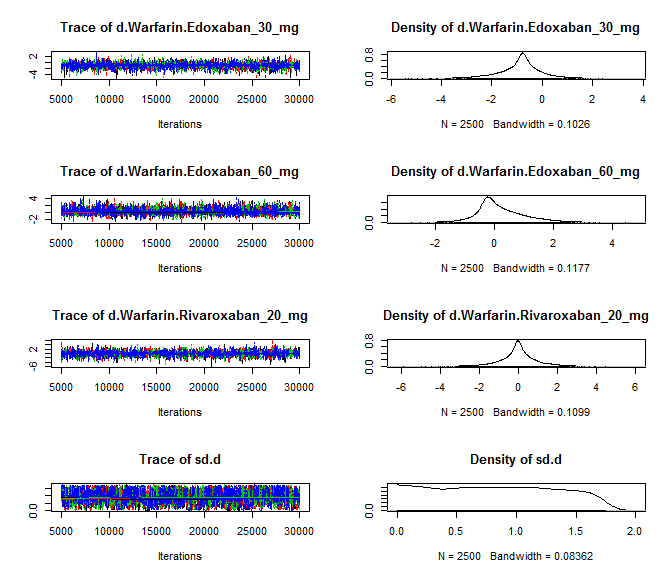

# NOAC network meta-analysis: Bleeding
Benjamin Chan  
`r Sys.time()`  

[Back](README.md) to main page.

Read data.


```r
D <- readSheet("Bleeding")
D <- D[!is.na(label)]
D <- D[,
       `:=` (nWarfarin = as.numeric(nWarfarin),
             yWarfarin = as.numeric(yWarfarin))]
```

Tidy up the data and bias the warfarin arm of ROCKET-AF to be similar to the Rivaroxaban arm.


```r
D <- tidyData(D)
D <- biasROCKETAF()
```

<!-- html table generated in R 3.2.2 by xtable 1.7-4 package -->
<!-- Fri Mar 11 15:42:52 2016 -->
<table border=1>
<tr> <th> study </th> <th> treatment </th> <th> responders </th> <th> sampleSize </th>  </tr>
  <tr> <td> ARISTOTLE </td> <td> Apixaban_5_mg </td> <td align="right"> 327 </td> <td align="right"> 9088 </td> </tr>
  <tr> <td> ARISTOTLE </td> <td> Warfarin </td> <td align="right"> 462 </td> <td align="right"> 9052 </td> </tr>
  <tr> <td> ARISTOTLE-J </td> <td> Apixaban_5_mg </td> <td align="right"> 0 </td> <td align="right"> 74 </td> </tr>
  <tr> <td> ARISTOTLE-J </td> <td> Warfarin </td> <td align="right"> 1 </td> <td align="right"> 74 </td> </tr>
  <tr> <td> ENGAGE AF-TIMI </td> <td> Edoxaban_30_mg </td> <td align="right"> 254 </td> <td align="right"> 7034 </td> </tr>
  <tr> <td> ENGAGE AF-TIMI </td> <td> Edoxaban_60_mg </td> <td align="right"> 418 </td> <td align="right"> 7035 </td> </tr>
  <tr> <td> ENGAGE AF-TIMI </td> <td> Warfarin </td> <td align="right"> 524 </td> <td align="right"> 7036 </td> </tr>
  <tr> <td> PETRO </td> <td> Dabigatran_150_mg </td> <td align="right"> 0 </td> <td align="right"> 100 </td> </tr>
  <tr> <td> PETRO </td> <td> Dabigatran_300_mg </td> <td align="right"> 4 </td> <td align="right"> 161 </td> </tr>
  <tr> <td> PETRO </td> <td> Warfarin </td> <td align="right"> 0 </td> <td align="right"> 70 </td> </tr>
  <tr> <td> RE-LY </td> <td> Dabigatran_110_mg </td> <td align="right"> 322 </td> <td align="right"> 6015 </td> </tr>
  <tr> <td> RE-LY </td> <td> Dabigatran_150_mg </td> <td align="right"> 375 </td> <td align="right"> 6076 </td> </tr>
  <tr> <td> RE-LY </td> <td> Warfarin </td> <td align="right"> 397 </td> <td align="right"> 6022 </td> </tr>
  <tr> <td> ROCKET-AF </td> <td> Rivaroxaban_20_mg </td> <td align="right"> 395 </td> <td align="right"> 7081 </td> </tr>
  <tr> <td> ROCKET-AF </td> <td> Warfarin </td> <td align="right"> 396 </td> <td align="right"> 7090 </td> </tr>
  <tr> <td> Weitz, 2010 </td> <td> Edoxaban_30_mg </td> <td align="right"> 0 </td> <td align="right"> 235 </td> </tr>
  <tr> <td> Weitz, 2010 </td> <td> Edoxaban_60_mg </td> <td align="right"> 1 </td> <td align="right"> 234 </td> </tr>
  <tr> <td> Weitz, 2010 </td> <td> Warfarin </td> <td align="right"> 1 </td> <td align="right"> 250 </td> </tr>
  <tr> <td> Yamashita, 2012 </td> <td> Edoxaban_30_mg </td> <td align="right"> 0 </td> <td align="right"> 131 </td> </tr>
  <tr> <td> Yamashita, 2012 </td> <td> Edoxaban_60_mg </td> <td align="right"> 2 </td> <td align="right"> 131 </td> </tr>
  <tr> <td> Yamashita, 2012 </td> <td> Warfarin </td> <td align="right"> 0 </td> <td align="right"> 129 </td> </tr>
   </table>

Run the model using fixed-effects.


```r
M <- mtc.model(network, type="consistency", linearModel=effect)
plot(M)
```

 

```r
results <- mtc.run(M, n.adapt=nAdapt, n.iter=nIter, thin=thin)
```

# Summary

Direct and indirect odds ratios and 95% confidence bounds are stored in
[mtcBleedingOddsRatios.csv](mtcBleedingOddsRatios.csv).


```r
or <- combineResults(outcomeBleeding=TRUE)
write.csv(or, file="mtcBleedingOddsRatios.csv", row.names=FALSE)
print(xtable(or), type="html", include.rownames=FALSE)
```

<!-- html table generated in R 3.2.2 by xtable 1.7-4 package -->
<!-- Fri Mar 11 15:43:14 2016 -->
<table border=1>
<tr> <th> treatment </th> <th> Apixaban 5 mg </th> <th> Dabigatran 110 mg </th> <th> Dabigatran 150 mg </th> <th> Edoxaban 30 mg </th> <th> Edoxaban 60 mg </th> <th> Rivaroxaban 20 mg </th> <th> Warfarin </th>  </tr>
  <tr> <td> Apixaban 5 mg vs </td> <td>  </td> <td> 0.86 (0.70, 1.07) </td> <td> 0.74 (0.60, 0.91) </td> <td> 1.49 (1.21, 1.84) </td> <td> 0.88 (0.72, 1.07) </td> <td> 0.69 (0.57, 0.85) </td> <td> 0.69 (0.60, 0.80) </td> </tr>
  <tr> <td> Dabigatran 110 mg vs </td> <td> 1.16 (0.94, 1.43) </td> <td>  </td> <td> 0.86 (0.74, 1.00) </td> <td> 1.73 (1.39, 2.14) </td> <td> 1.02 (0.83, 1.24) </td> <td> 0.80 (0.65, 0.99) </td> <td> 0.80 (0.69, 0.93) </td> </tr>
  <tr> <td> Dabigatran 150 mg vs </td> <td> 1.35 (1.09, 1.66) </td> <td> 1.16 (1.00, 1.36) </td> <td>  </td> <td> 2.01 (1.62, 2.48) </td> <td> 1.18 (0.97, 1.44) </td> <td> 0.93 (0.76, 1.14) </td> <td> 0.93 (0.80, 1.08) </td> </tr>
  <tr> <td> Dabigatran 300 mg vs </td> <td> 2322714.21 (9.46, 462618780497898368.00) </td> <td> 1994874.73 (8.15, 416205612205711872.00) </td> <td> 1752328.26 (7.07, 358771876633999296.00) </td> <td> 3555421.79 (13.90, 700689561540400384.00) </td> <td> 2057703.42 (8.25, 409048199901792256.00) </td> <td> 1636668.72 (6.46, 328899661985488960.00) </td> <td> 1618982.14 (6.58, 320413867723107904.00) </td> </tr>
  <tr> <td> Edoxaban 30 mg vs </td> <td> 0.67 (0.54, 0.83) </td> <td> 0.58 (0.47, 0.72) </td> <td> 0.50 (0.40, 0.62) </td> <td>  </td> <td> 0.59 (0.50, 0.69) </td> <td> 0.46 (0.38, 0.57) </td> <td> 0.46 (0.40, 0.54) </td> </tr>
  <tr> <td> Edoxaban 60 mg vs </td> <td> 1.14 (0.94, 1.39) </td> <td> 0.98 (0.80, 1.20) </td> <td> 0.85 (0.69, 1.03) </td> <td> 1.70 (1.45, 1.99) </td> <td>  </td> <td> 0.79 (0.65, 0.96) </td> <td> 0.79 (0.69, 0.90) </td> </tr>
  <tr> <td> Rivaroxaban 20 mg vs </td> <td> 1.45 (1.18, 1.76) </td> <td> 1.25 (1.01, 1.53) </td> <td> 1.07 (0.87, 1.31) </td> <td> 2.15 (1.75, 2.65) </td> <td> 1.27 (1.04, 1.53) </td> <td>  </td> <td> 1.00 (0.87, 1.15) </td> </tr>
  <tr> <td> Warfarin vs </td> <td> 1.45 (1.25, 1.67) </td> <td> 1.25 (1.07, 1.45) </td> <td> 1.07 (0.92, 1.24) </td> <td> 2.15 (1.85, 2.51) </td> <td> 1.27 (1.11, 1.45) </td> <td> 1.00 (0.87, 1.15) </td> <td>  </td> </tr>
   </table>

# Forest plots, NOAC vs NOAC


```r
noac <- unique(D[treatment != "Warfarin", treatment])
for (i in 1:length(noac)) {
  forest(relative.effect(results, noac[i], noac[1:length(noac) != i]))
}
```

       

# Diagnostics


```r
summary(results)
```

```
## $measure
## [1] "Log Odds Ratio"
## 
## $summaries
## 
## Iterations = 5010:30000
## Thinning interval = 10 
## Number of chains = 4 
## Sample size per chain = 2500 
## 
## 1. Empirical mean and standard deviation for each variable,
##    plus standard error of the mean:
## 
##                                   Mean       SD  Naive SE Time-series SE
## d.Warfarin.Apixaban_5_mg     -0.368974  0.07411 0.0007411      0.0007390
## d.Warfarin.Dabigatran_110_mg -0.221196  0.07820 0.0007820      0.0008547
## d.Warfarin.Dabigatran_150_mg -0.069440  0.07544 0.0007544      0.0007483
## d.Warfarin.Dabigatran_300_mg 16.448960 10.81930 0.1081930      1.2510023
## d.Warfarin.Edoxaban_30_mg    -0.767576  0.07862 0.0007862      0.0010152
## d.Warfarin.Edoxaban_60_mg    -0.237171  0.06732 0.0006732      0.0006833
## d.Warfarin.Rivaroxaban_20_mg -0.001202  0.07266 0.0007266      0.0007502
## 
## 2. Quantiles for each variable:
## 
##                                 2.5%      25%        50%      75%    97.5%
## d.Warfarin.Apixaban_5_mg     -0.5147 -0.41902 -0.3688435 -0.31997 -0.22212
## d.Warfarin.Dabigatran_110_mg -0.3738 -0.27407 -0.2209218 -0.16864 -0.06791
## d.Warfarin.Dabigatran_150_mg -0.2173 -0.11986 -0.0699830 -0.01922  0.07997
## d.Warfarin.Dabigatran_300_mg  1.8843  7.77221 14.2973082 23.25195 40.30839
## d.Warfarin.Edoxaban_30_mg    -0.9211 -0.82001 -0.7666817 -0.71461 -0.61438
## d.Warfarin.Edoxaban_60_mg    -0.3686 -0.28218 -0.2370301 -0.19250 -0.10432
## d.Warfarin.Rivaroxaban_20_mg -0.1415 -0.05015 -0.0008602  0.04858  0.14069
## 
## 
## $DIC
##     Dbar       pD      DIC 
## 20.63422 14.33686 34.97108 
## 
## attr(,"class")
## [1] "summary.mtc.result"
```

Sampler diagnostics.


```r
gelman.plot(results)
```

 

```r
gelman.diag(results)
```

```
## Potential scale reduction factors:
## 
##                              Point est. Upper C.I.
## d.Warfarin.Apixaban_5_mg           1.00       1.00
## d.Warfarin.Dabigatran_110_mg       1.00       1.00
## d.Warfarin.Dabigatran_150_mg       1.00       1.00
## d.Warfarin.Dabigatran_300_mg       1.01       1.03
## d.Warfarin.Edoxaban_30_mg          1.00       1.00
## d.Warfarin.Edoxaban_60_mg          1.00       1.00
## d.Warfarin.Rivaroxaban_20_mg       1.00       1.00
## 
## Multivariate psrf
## 
## 1.01
```


```r
plot(results)
```

  


```r
autocorr.plot(results$samples)
```

    

Assess the degree of heterogeneity and inconsistency.


```r
anohe <- mtc.anohe(network, n.adapt=nAdapt, n.iter=nIter, thin=thin)
```


```r
summary(anohe)
```

```
## Analysis of heterogeneity
## =========================
## 
## Per-comparison I-squared:
## -------------------------
## 
##                   t1                t2   i2.pair  i2.cons incons.p
## 1      Apixaban_5_mg          Warfarin 98.599250 77.83360       NA
## 2  Dabigatran_110_mg Dabigatran_150_mg        NA       NA       NA
## 3  Dabigatran_110_mg          Warfarin        NA       NA       NA
## 4  Dabigatran_150_mg Dabigatran_300_mg        NA       NA       NA
## 5  Dabigatran_150_mg          Warfarin  0.000000  0.00000       NA
## 6  Dabigatran_300_mg          Warfarin        NA       NA       NA
## 7     Edoxaban_30_mg    Edoxaban_60_mg 94.014012 83.81383       NA
## 8     Edoxaban_30_mg          Warfarin  2.581137  0.00000       NA
## 9     Edoxaban_60_mg          Warfarin 54.844508 86.86773       NA
## 10 Rivaroxaban_20_mg          Warfarin        NA       NA       NA
## 
## Global I-squared:
## -------------------------
## 
##    i2.pair  i2.cons
## 1 84.82497 50.08798
```

```r
plot(anohe)
```

```
## Analysis of heterogeneity -- convergence plots
## Unrelated Study Effects (USE) model:
```

    

```
## Unrelated Mean Effects (UME) model:
```

    

```
## Consistency model:
```

  
