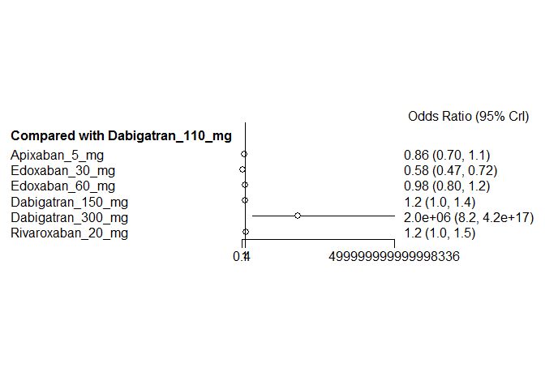
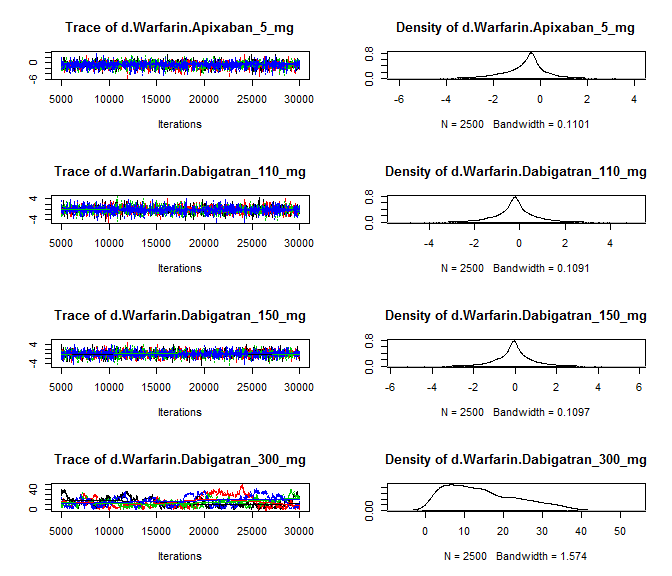

# NOAC network meta-analysis: Bleeding
Benjamin Chan  
`r Sys.time()`  

[Back](README.md) to main page.

Read data.


```r
D <- readSheet("Bleeding")
D <- D[!is.na(label)]
D <- D[,
       `:=` (nWarfarin = as.numeric(nWarfarin),
             yWarfarin = as.numeric(yWarfarin))]
```

Hard-code data corrections and additions to the PETRO study.

> From: Marian McDonagh  
> Sent: Friday, March 11, 2016 4:17 PM  
> To: Benjamin Chan  
> Subject: Re: Network Meta-analysis  
> 
> Hi Ben,  
> Yes, I was noticing the Dabi 300mg problem.
> We should definitely exclude that dose as it is not used (too much bleeding).
> There were three dabi 150 arms (with varying aspirin doses).
> Since the aspirin made no difference, and other studies allow its use, we can use all 3 arms.
> But, the major bleeding events were still 0 across those.
> The total N for that is actually 169.
> And of course the 70 patients on warfarin with no events also.


```r
D <- D[label != "PETRO Dabigatran 300 mg"]
D <- D[label == "PETRO Dabigatran 150 mg", nNOAC := 169]
```

Tidy up the data.


```r
D <- tidyData(D)
write.csv(D, file="mtcBleedingData.csv", row.names=FALSE)
print(xtable(D, digits=rep(0, 5)), type="html", include.rownames=FALSE)
```

<!-- html table generated in R 3.2.2 by xtable 1.7-4 package -->
<!-- Fri Mar 11 19:38:13 2016 -->
<table border=1>
<tr> <th> study </th> <th> treatment </th> <th> responders </th> <th> sampleSize </th>  </tr>
  <tr> <td> ARISTOTLE </td> <td> Apixaban_5_mg </td> <td align="right"> 327 </td> <td align="right"> 9088 </td> </tr>
  <tr> <td> ARISTOTLE </td> <td> Warfarin </td> <td align="right"> 462 </td> <td align="right"> 9052 </td> </tr>
  <tr> <td> ARISTOTLE-J </td> <td> Apixaban_5_mg </td> <td align="right"> 0 </td> <td align="right"> 74 </td> </tr>
  <tr> <td> ARISTOTLE-J </td> <td> Warfarin </td> <td align="right"> 1 </td> <td align="right"> 74 </td> </tr>
  <tr> <td> ENGAGE AF-TIMI </td> <td> Edoxaban_30_mg </td> <td align="right"> 254 </td> <td align="right"> 7034 </td> </tr>
  <tr> <td> ENGAGE AF-TIMI </td> <td> Edoxaban_60_mg </td> <td align="right"> 418 </td> <td align="right"> 7035 </td> </tr>
  <tr> <td> ENGAGE AF-TIMI </td> <td> Warfarin </td> <td align="right"> 524 </td> <td align="right"> 7036 </td> </tr>
  <tr> <td> PETRO </td> <td> Dabigatran_150_mg </td> <td align="right"> 0 </td> <td align="right"> 169 </td> </tr>
  <tr> <td> PETRO </td> <td> Warfarin </td> <td align="right"> 0 </td> <td align="right"> 70 </td> </tr>
  <tr> <td> RE-LY </td> <td> Dabigatran_110_mg </td> <td align="right"> 322 </td> <td align="right"> 6015 </td> </tr>
  <tr> <td> RE-LY </td> <td> Dabigatran_150_mg </td> <td align="right"> 375 </td> <td align="right"> 6076 </td> </tr>
  <tr> <td> RE-LY </td> <td> Warfarin </td> <td align="right"> 397 </td> <td align="right"> 6022 </td> </tr>
  <tr> <td> ROCKET-AF </td> <td> Rivaroxaban_20_mg </td> <td align="right"> 395 </td> <td align="right"> 7081 </td> </tr>
  <tr> <td> ROCKET-AF </td> <td> Warfarin </td> <td align="right"> 386 </td> <td align="right"> 7090 </td> </tr>
  <tr> <td> Weitz, 2010 </td> <td> Edoxaban_30_mg </td> <td align="right"> 0 </td> <td align="right"> 235 </td> </tr>
  <tr> <td> Weitz, 2010 </td> <td> Edoxaban_60_mg </td> <td align="right"> 1 </td> <td align="right"> 234 </td> </tr>
  <tr> <td> Weitz, 2010 </td> <td> Warfarin </td> <td align="right"> 1 </td> <td align="right"> 250 </td> </tr>
  <tr> <td> Yamashita, 2012 </td> <td> Edoxaban_30_mg </td> <td align="right"> 0 </td> <td align="right"> 131 </td> </tr>
  <tr> <td> Yamashita, 2012 </td> <td> Edoxaban_60_mg </td> <td align="right"> 2 </td> <td align="right"> 131 </td> </tr>
  <tr> <td> Yamashita, 2012 </td> <td> Warfarin </td> <td align="right"> 0 </td> <td align="right"> 129 </td> </tr>
   </table>

```r
D <- D[!is.na(responders)]
network <- mtc.network(D)
```

Run the model using fixed-effects.


```r
M <- mtc.model(network, type="consistency", linearModel=effect)
plot(M)
```

 

```r
results <- mtc.run(M, n.adapt=nAdapt, n.iter=nIter, thin=thin)
```

# Summary

Direct and indirect odds ratios and 95% confidence bounds are stored in
[mtcBleedingOddsRatios.csv](mtcBleedingOddsRatios.csv).


```r
or <- combineResults(outcomeBleeding=TRUE)
write.csv(or, file="mtcBleedingOddsRatios.csv", row.names=FALSE)
print(xtable(or), type="html", include.rownames=FALSE)
```

<!-- html table generated in R 3.2.2 by xtable 1.7-4 package -->
<!-- Fri Mar 11 19:38:32 2016 -->
<table border=1>
<tr> <th> treatment </th> <th> Apixaban 5 mg </th> <th> Dabigatran 110 mg </th> <th> Dabigatran 150 mg </th> <th> Edoxaban 30 mg </th> <th> Edoxaban 60 mg </th> <th> Rivaroxaban 20 mg </th> <th> Warfarin </th>  </tr>
  <tr> <td> Apixaban 5 mg vs </td> <td>  </td> <td> 0.86 (0.70, 1.06) </td> <td> 0.74 (0.60, 0.91) </td> <td> 1.49 (1.21, 1.84) </td> <td> 0.88 (0.72, 1.07) </td> <td> 0.67 (0.55, 0.83) </td> <td> 0.69 (0.60, 0.80) </td> </tr>
  <tr> <td> Dabigatran 110 mg vs </td> <td> 1.16 (0.94, 1.42) </td> <td>  </td> <td> 0.86 (0.74, 1.00) </td> <td> 1.73 (1.39, 2.15) </td> <td> 1.02 (0.83, 1.24) </td> <td> 0.78 (0.63, 0.96) </td> <td> 0.80 (0.69, 0.93) </td> </tr>
  <tr> <td> Dabigatran 150 mg vs </td> <td> 1.35 (1.10, 1.66) </td> <td> 1.16 (1.00, 1.36) </td> <td>  </td> <td> 2.01 (1.63, 2.49) </td> <td> 1.18 (0.97, 1.44) </td> <td> 0.91 (0.74, 1.12) </td> <td> 0.93 (0.81, 1.08) </td> </tr>
  <tr> <td> Edoxaban 30 mg vs </td> <td> 0.67 (0.54, 0.83) </td> <td> 0.58 (0.46, 0.72) </td> <td> 0.50 (0.40, 0.61) </td> <td>  </td> <td> 0.59 (0.50, 0.69) </td> <td> 0.45 (0.37, 0.56) </td> <td> 0.46 (0.40, 0.54) </td> </tr>
  <tr> <td> Edoxaban 60 mg vs </td> <td> 1.14 (0.94, 1.38) </td> <td> 0.98 (0.80, 1.20) </td> <td> 0.85 (0.69, 1.03) </td> <td> 1.70 (1.45, 2.00) </td> <td>  </td> <td> 0.77 (0.63, 0.94) </td> <td> 0.79 (0.69, 0.90) </td> </tr>
  <tr> <td> Rivaroxaban 20 mg vs </td> <td> 1.48 (1.21, 1.81) </td> <td> 1.28 (1.04, 1.58) </td> <td> 1.10 (0.90, 1.35) </td> <td> 2.21 (1.78, 2.73) </td> <td> 1.30 (1.06, 1.58) </td> <td>  </td> <td> 1.03 (0.89, 1.19) </td> </tr>
  <tr> <td> Warfarin vs </td> <td> 1.44 (1.25, 1.66) </td> <td> 1.25 (1.07, 1.45) </td> <td> 1.07 (0.93, 1.24) </td> <td> 2.15 (1.84, 2.52) </td> <td> 1.27 (1.11, 1.45) </td> <td> 0.97 (0.84, 1.13) </td> <td>  </td> </tr>
   </table>

# Forest plots, NOAC vs NOAC


```r
noac <- unique(D[treatment != "Warfarin", treatment])
for (i in 1:length(noac)) {
  forest(relative.effect(results, noac[i], noac[1:length(noac) != i]))
}
```

      

# Diagnostics


```r
summary(results)
```

```
## $measure
## [1] "Log Odds Ratio"
## 
## $summaries
## 
## Iterations = 5010:30000
## Thinning interval = 10 
## Number of chains = 4 
## Sample size per chain = 2500 
## 
## 1. Empirical mean and standard deviation for each variable,
##    plus standard error of the mean:
## 
##                                  Mean      SD  Naive SE Time-series SE
## d.Warfarin.Apixaban_5_mg     -0.36700 0.07342 0.0007342      0.0007874
## d.Warfarin.Dabigatran_110_mg -0.22111 0.07742 0.0007742      0.0008587
## d.Warfarin.Dabigatran_150_mg -0.06927 0.07530 0.0007530      0.0007667
## d.Warfarin.Edoxaban_30_mg    -0.76778 0.07924 0.0007924      0.0009973
## d.Warfarin.Edoxaban_60_mg    -0.23652 0.06831 0.0006831      0.0007119
## d.Warfarin.Rivaroxaban_20_mg  0.02573 0.07348 0.0007348      0.0007349
## 
## 2. Quantiles for each variable:
## 
##                                 2.5%      25%      50%      75%    97.5%
## d.Warfarin.Apixaban_5_mg     -0.5087 -0.41666 -0.36741 -0.31759 -0.22215
## d.Warfarin.Dabigatran_110_mg -0.3731 -0.27297 -0.22092 -0.16971 -0.06959
## d.Warfarin.Dabigatran_150_mg -0.2139 -0.12060 -0.06939 -0.01720  0.07624
## d.Warfarin.Edoxaban_30_mg    -0.9231 -0.82051 -0.76671 -0.71490 -0.61055
## d.Warfarin.Edoxaban_60_mg    -0.3692 -0.28229 -0.23642 -0.19096 -0.10255
## d.Warfarin.Rivaroxaban_20_mg -0.1182 -0.02297  0.02579  0.07526  0.16980
## 
## 
## $DIC
##     Dbar       pD      DIC 
## 19.62479 13.34329 32.96808 
## 
## attr(,"class")
## [1] "summary.mtc.result"
```

Sampler diagnostics.


```r
gelman.plot(results)
```

 

```r
gelman.diag(results)
```

```
## Potential scale reduction factors:
## 
##                              Point est. Upper C.I.
## d.Warfarin.Apixaban_5_mg              1          1
## d.Warfarin.Dabigatran_110_mg          1          1
## d.Warfarin.Dabigatran_150_mg          1          1
## d.Warfarin.Edoxaban_30_mg             1          1
## d.Warfarin.Edoxaban_60_mg             1          1
## d.Warfarin.Rivaroxaban_20_mg          1          1
## 
## Multivariate psrf
## 
## 1
```


```r
plot(results)
```

  


```r
autocorr.plot(results$samples)
```

    

Assess the degree of heterogeneity and inconsistency.


```r
anohe <- mtc.anohe(network, n.adapt=nAdapt, n.iter=nIter, thin=thin)
```


```r
summary(anohe)
```

```
## Analysis of heterogeneity
## =========================
## 
## Per-comparison I-squared:
## -------------------------
## 
##                  t1                t2  i2.pair  i2.cons incons.p
## 1     Apixaban_5_mg          Warfarin 98.78719 71.95419       NA
## 2 Dabigatran_110_mg Dabigatran_150_mg       NA       NA       NA
## 3 Dabigatran_110_mg          Warfarin       NA       NA       NA
## 4 Dabigatran_150_mg          Warfarin  0.00000  0.00000       NA
## 5    Edoxaban_30_mg    Edoxaban_60_mg 95.41014 83.99614       NA
## 6    Edoxaban_30_mg          Warfarin 18.02048  0.00000       NA
## 7    Edoxaban_60_mg          Warfarin 58.14873 86.35277       NA
## 8 Rivaroxaban_20_mg          Warfarin       NA       NA       NA
## 
## Global I-squared:
## -------------------------
## 
##    i2.pair  i2.cons
## 1 88.76641 53.37382
```

```r
plot(anohe)
```

```
## Analysis of heterogeneity -- convergence plots
## Unrelated Study Effects (USE) model:
```

    

```
## Unrelated Mean Effects (UME) model:
```

   

```
## Consistency model:
```

  
