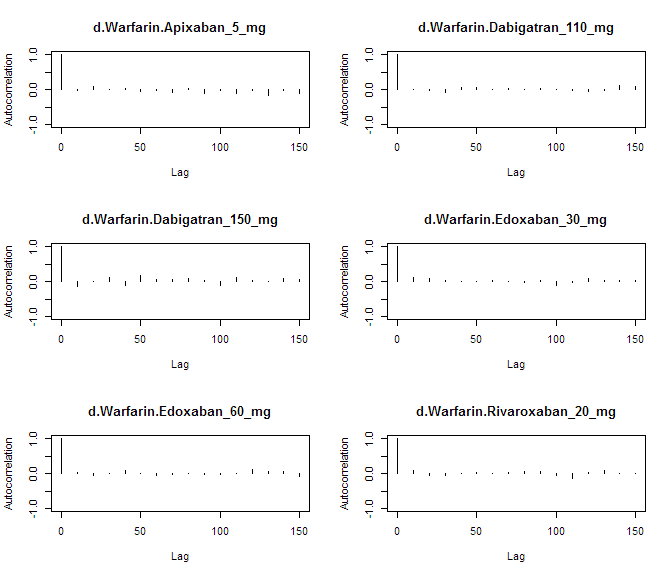
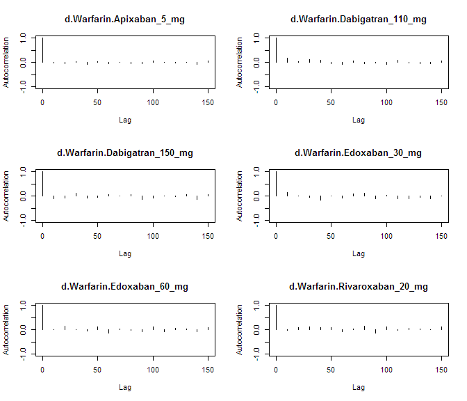
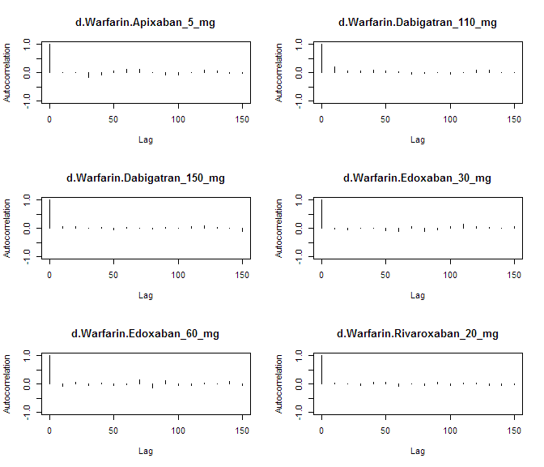
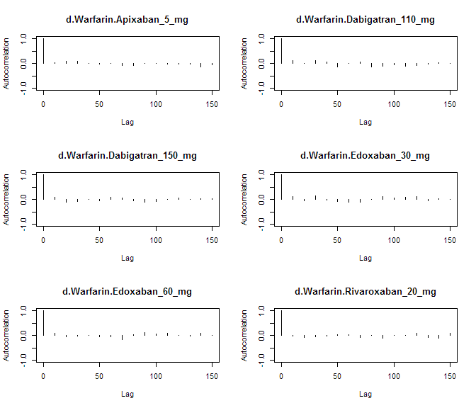

# NOAC network meta-analysis: Bleeding
Benjamin Chan  
`r Sys.time()`  


Clean up the data (do not show the code).


```
##               study         treatment responders sampleSize
##  1:       ARISTOTLE     Apixaban_5_mg        148       9120
##  2:       ARISTOTLE          Warfarin        256       9081
##  3:     ARISTOTLE-J     Apixaban_5_mg          0         72
##  4:     ARISTOTLE-J          Warfarin          1         75
##  5:  ENGAGE AF-TIMI    Edoxaban_30_mg        418       7034
##  6:  ENGAGE AF-TIMI    Edoxaban_60_mg        254       7035
##  7:  ENGAGE AF-TIMI          Warfarin        524       7036
##  8:        J-ROCKET Rivaroxaban_15_mg         NA        639
##  9:        J-ROCKET          Warfarin         NA        639
## 10:           PETRO Dabigatran_150_mg          4        166
## 11:           PETRO          Warfarin          0         70
## 12:           RE-LY Dabigatran_110_mg        322       6015
## 13:           RE-LY Dabigatran_150_mg        375       6076
## 14:           RE-LY          Warfarin        397       6022
## 15:       ROCKET-AF Rivaroxaban_20_mg        395       7131
## 16:       ROCKET-AF          Warfarin        386       7133
## 17: Yamashita, 2012    Edoxaban_30_mg          0        131
## 18: Yamashita, 2012    Edoxaban_60_mg          2        131
## 19: Yamashita, 2012          Warfarin          0        129
```

`Run the model using fixed-effects.


```r
M <- mtc.model(network, type="consistency", linearModel=effect)
plot(M)
```

 

```r
results <- mtc.run(M, n.adapt=nAdapt, n.iter=nIter, thin=thin)
```

# Summary

Direct and indirect odds ratios and 95% confidence bounds are stored in
[mtcBleedingOddsRatios.csv](mtcBleedingOddsRatios.csv).


```r
or <- combineResults(outcomeBleeding=TRUE)
write.csv(or, file="mtcBleedingOddsRatios.csv", row.names=FALSE)
show(or)
```

```
##               treatment     Apixaban 5 mg Dabigatran 110 mg
## 1:     Apixaban 5 mg vs                NA 0.71 (0.54, 0.91)
## 2: Dabigatran 110 mg vs 1.41 (1.10, 1.84)                NA
## 3: Dabigatran 150 mg vs 1.66 (1.28, 2.16) 1.17 (1.00, 1.36)
## 4:    Edoxaban 30 mg vs 1.39 (1.09, 1.76) 0.98 (0.80, 1.20)
## 5:    Edoxaban 60 mg vs 0.83 (0.64, 1.09) 0.58 (0.47, 0.74)
## 6: Rivaroxaban 20 mg vs 1.79 (1.41, 2.30) 1.27 (1.04, 1.56)
## 7:          Warfarin vs 1.77 (1.43, 2.19) 1.25 (1.07, 1.44)
##    Dabigatran 150 mg    Edoxaban 30 mg    Edoxaban 60 mg Rivaroxaban 20 mg
## 1: 0.60 (0.46, 0.78) 0.72 (0.57, 0.92) 1.21 (0.91, 1.55) 0.56 (0.43, 0.71)
## 2: 0.85 (0.74, 1.00) 1.02 (0.83, 1.26) 1.72 (1.35, 2.13) 0.79 (0.64, 0.96)
## 3:                NA 1.20 (0.98, 1.49) 2.01 (1.60, 2.50) 0.92 (0.75, 1.13)
## 4: 0.83 (0.67, 1.03)                NA 1.67 (1.43, 1.96) 0.77 (0.63, 0.93)
## 5: 0.50 (0.40, 0.62) 0.60 (0.51, 0.70)                NA 0.46 (0.37, 0.57)
## 6: 1.09 (0.89, 1.33) 1.30 (1.07, 1.59) 2.18 (1.76, 2.69)                NA
## 7: 1.06 (0.91, 1.23) 1.28 (1.10, 1.45) 2.14 (1.82, 2.49) 0.98 (0.85, 1.13)
##             Warfarin
## 1: 0.57 (0.46, 0.70)
## 2: 0.80 (0.70, 0.93)
## 3: 0.94 (0.81, 1.09)
## 4: 0.78 (0.69, 0.91)
## 5: 0.47 (0.40, 0.55)
## 6: 1.02 (0.89, 1.17)
## 7:                NA
```

# Diagnostics


```r
summary(results)
```

```
## $measure
## [1] "Log Odds Ratio"
## 
## $summaries
## 
## Iterations = 5010:7000
## Thinning interval = 10 
## Number of chains = 4 
## Sample size per chain = 200 
## 
## 1. Empirical mean and standard deviation for each variable,
##    plus standard error of the mean:
## 
##                                  Mean      SD Naive SE Time-series SE
## d.Warfarin.Apixaban_5_mg     -0.56764 0.10658 0.003768       0.003749
## d.Warfarin.Dabigatran_110_mg -0.21910 0.07484 0.002646       0.003018
## d.Warfarin.Dabigatran_150_mg -0.06080 0.07637 0.002700       0.002678
## d.Warfarin.Edoxaban_30_mg    -0.24193 0.07029 0.002485       0.002841
## d.Warfarin.Edoxaban_60_mg    -0.75553 0.08180 0.002892       0.003019
## d.Warfarin.Rivaroxaban_20_mg  0.02022 0.07196 0.002544       0.002548
## 
## 2. Quantiles for each variable:
## 
##                                 2.5%      25%      50%      75%    97.5%
## d.Warfarin.Apixaban_5_mg     -0.7822 -0.63800 -0.56845 -0.50034 -0.35643
## d.Warfarin.Dabigatran_110_mg -0.3613 -0.26941 -0.22309 -0.16582 -0.07114
## d.Warfarin.Dabigatran_150_mg -0.2090 -0.11205 -0.05748 -0.01255  0.08894
## d.Warfarin.Edoxaban_30_mg    -0.3690 -0.29010 -0.24306 -0.19651 -0.09592
## d.Warfarin.Edoxaban_60_mg    -0.9127 -0.81388 -0.75870 -0.70041 -0.59733
## d.Warfarin.Rivaroxaban_20_mg -0.1213 -0.02938  0.02100  0.06644  0.16120
## 
## 
## $DIC
##     Dbar       pD      DIC 
## 23.55015 13.37394 36.92409 
## 
## attr(,"class")
## [1] "summary.mtc.result"
```

Sampler diagnostics.


```r
gelman.plot(results)
```

 

```r
gelman.diag(results)
```

```
## Potential scale reduction factors:
## 
##                              Point est. Upper C.I.
## d.Warfarin.Apixaban_5_mg          1.015       1.04
## d.Warfarin.Dabigatran_110_mg      1.001       1.01
## d.Warfarin.Dabigatran_150_mg      0.999       1.00
## d.Warfarin.Edoxaban_30_mg         0.999       1.00
## d.Warfarin.Edoxaban_60_mg         1.001       1.01
## d.Warfarin.Rivaroxaban_20_mg      1.001       1.00
## 
## Multivariate psrf
## 
## 1.01
```


```r
plot(results)
```

  


```r
autocorr.plot(results$samples)
```

    

Assess the degree of heterogeneity and inconsistency.


```r
anohe <- mtc.anohe(network, n.adapt=nAdapt, n.iter=nIter, thin=thin)
```


```r
summary(anohe)
```

```
## Analysis of heterogeneity
## =========================
## 
## Per-comparison I-squared:
## -------------------------
## 
##                  t1                t2  i2.pair  i2.cons incons.p
## 1     Apixaban_5_mg          Warfarin 99.92231 69.43750       NA
## 2 Dabigatran_110_mg Dabigatran_150_mg       NA       NA       NA
## 3 Dabigatran_110_mg          Warfarin       NA       NA       NA
## 4 Dabigatran_150_mg          Warfarin 99.97168 96.16894       NA
## 5    Edoxaban_30_mg    Edoxaban_60_mg 99.92990 94.58689       NA
## 6    Edoxaban_30_mg          Warfarin 99.36892  0.00000       NA
## 7    Edoxaban_60_mg          Warfarin 99.75594 96.80432       NA
## 8 Rivaroxaban_20_mg          Warfarin       NA       NA       NA
## 
## Global I-squared:
## -------------------------
## 
##    i2.pair  i2.cons
## 1 99.82418 85.74293
```

```r
plot(anohe)
```

```
## Analysis of heterogeneity -- convergence plots
## Unrelated Study Effects (USE) model:
```

    

```
## Unrelated Mean Effects (UME) model:
```

   

```
## Consistency model:
```

  
