# Novel oral anticoagulants network meta-analysis: Bleeding
Benjamin Chan  
`r Sys.time()`  


Clean up the data (do not show the code).


```
## Warning in `[.data.table`(D, , `:=`(study = NA_character_, noac =
## NA_character_)): Invalid .internal.selfref detected and fixed by taking
## a (shallow) copy of the data.table so that := can add this new column by
## reference. At an earlier point, this data.table has been copied by R (or
## been created manually using structure() or similar). Avoid key<-, names<-
## and attr<- which in R currently (and oddly) may copy the whole data.table.
## Use set* syntax instead to avoid copying: ?set, ?setnames and ?setattr.
## Also, in R<=v3.0.2, list(DT1,DT2) copied the entire DT1 and DT2 (R's list()
## used to copy named objects); please upgrade to R>v3.0.2 if that is biting.
## If this message doesn't help, please report to datatable-help so the root
## cause can be fixed.
```

```
##               study         treatment responders sampleSize
##  1:       ARISTOTLE     Apixaban_5_mg        148       9120
##  2:       ARISTOTLE          Warfarin        256       9081
##  3:     ARISTOTLE-J     Apixaban_5_mg          0         72
##  4:     ARISTOTLE-J          Warfarin          1         75
##  5:  ENGAGE AF-TIMI    Edoxaban_30_mg        418       7034
##  6:  ENGAGE AF-TIMI    Edoxaban_60_mg        254       7035
##  7:  ENGAGE AF-TIMI          Warfarin        524       7036
##  8:        J-ROCKET Rivaroxaban_15_mg         NA        639
##  9:        J-ROCKET          Warfarin         NA        639
## 10:           PETRO Dabigatran_150_mg          4        166
## 11:           PETRO          Warfarin          0         70
## 12:           RE-LY Dabigatran_110_mg        322       6015
## 13:           RE-LY Dabigatran_150_mg        375       6076
## 14:           RE-LY          Warfarin        397       6022
## 15:       ROCKET-AF Rivaroxaban_20_mg        395       7131
## 16:       ROCKET-AF          Warfarin        386       7133
## 17: Yamashita, 2012    Edoxaban_30_mg          0        131
## 18: Yamashita, 2012    Edoxaban_60_mg          2        131
## 19: Yamashita, 2012          Warfarin          0        129
```

# Network plot


```r
plot(network)
```

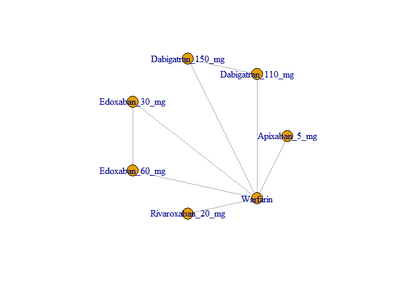 

Run the model.


```r
M <- mtc.model(network, type="consistency", linearModel="random")
runtime <- system.time(results <- mtc.run(M, n.adapt=nAdapt, n.iter=nIter, thin=thin))
```

# Summary


```r
summary(results)
```

```
## $measure
## [1] "Log Odds Ratio"
## 
## $summaries
## 
## Iterations = 5010:25000
## Thinning interval = 10 
## Number of chains = 4 
## Sample size per chain = 2000 
## 
## 1. Empirical mean and standard deviation for each variable,
##    plus standard error of the mean:
## 
##                                  Mean     SD Naive SE Time-series SE
## d.Warfarin.Apixaban_5_mg     -0.87732 1.0292 0.011507        0.01225
## d.Warfarin.Dabigatran_110_mg  0.09058 1.0723 0.011988        0.01215
## d.Warfarin.Dabigatran_150_mg  0.56341 0.9988 0.011167        0.01387
## d.Warfarin.Edoxaban_30_mg    -0.21152 0.9966 0.011142        0.01222
## d.Warfarin.Edoxaban_60_mg     0.01639 1.0491 0.011730        0.01538
## d.Warfarin.Rivaroxaban_20_mg  0.02215 1.1001 0.012299        0.01212
## sd.d                          1.00727 0.4444 0.004969        0.01137
## 
## 2. Quantiles for each variable:
## 
##                                 2.5%     25%      50%     75% 97.5%
## d.Warfarin.Apixaban_5_mg     -3.1407 -1.4423 -0.78092 -0.2967 1.109
## d.Warfarin.Dabigatran_110_mg -2.0377 -0.5107 -0.02727  0.6972 2.408
## d.Warfarin.Dabigatran_150_mg -1.1937 -0.0871  0.40344  1.1380 2.842
## d.Warfarin.Edoxaban_30_mg    -2.3259 -0.7443 -0.22404  0.3292 1.857
## d.Warfarin.Edoxaban_60_mg    -1.7308 -0.7244 -0.15059  0.6500 2.376
## d.Warfarin.Rivaroxaban_20_mg -2.2831 -0.5574  0.02598  0.6167 2.381
## sd.d                          0.0772  0.6751  1.09364  1.3856 1.602
## 
## 
## $DIC
##     Dbar       pD      DIC 
## 18.99726 14.03122 33.02848 
## 
## attr(,"class")
## [1] "summary.mtc.result"
```

```r
forest(results)
```

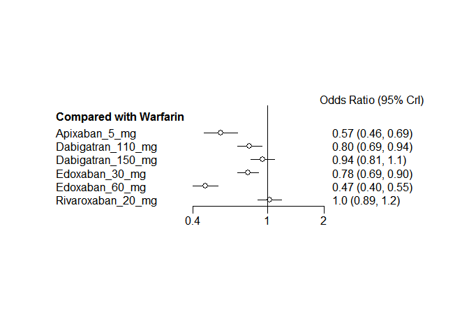 

# Diagnostics


```r
runtime
```

```
##    user  system elapsed 
##   10.85    0.00   11.67
```

Sampler diagnostics.


```r
gelman.plot(results)
```

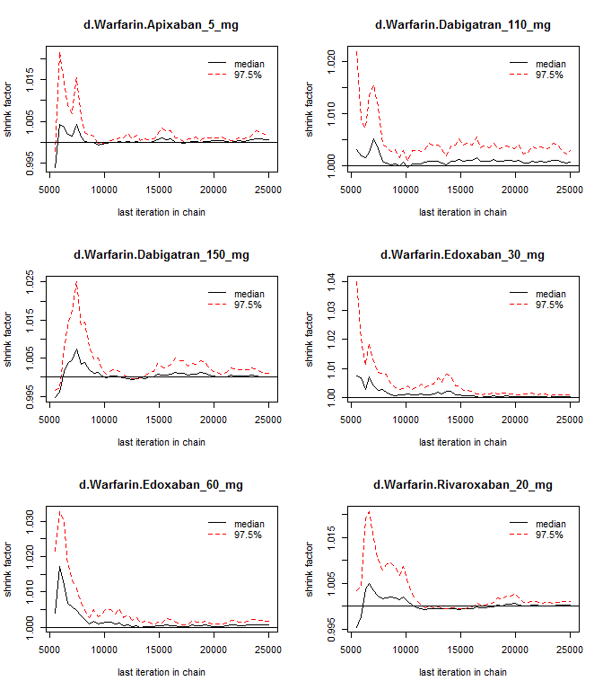 

```r
gelman.diag(results)
```

```
## Potential scale reduction factors:
## 
##                              Point est. Upper C.I.
## d.Warfarin.Apixaban_5_mg           1.00       1.00
## d.Warfarin.Dabigatran_110_mg       1.00       1.00
## d.Warfarin.Dabigatran_150_mg       1.00       1.01
## d.Warfarin.Edoxaban_30_mg          1.00       1.00
## d.Warfarin.Edoxaban_60_mg          1.00       1.00
## d.Warfarin.Rivaroxaban_20_mg       1.00       1.00
## sd.d                               1.01       1.02
## 
## Multivariate psrf
## 
## 1.01
```


```r
plot(results)
```

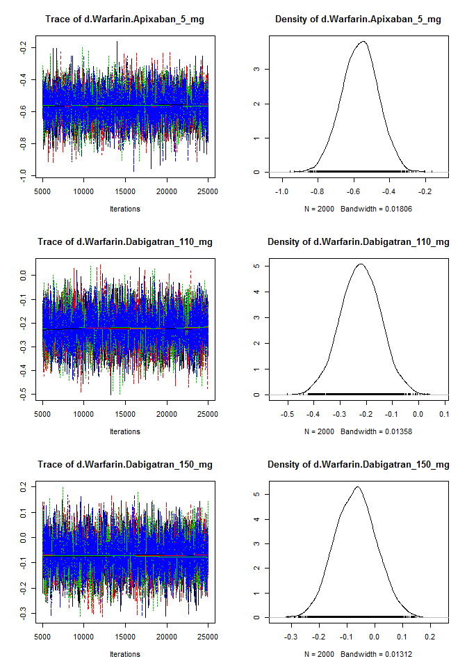 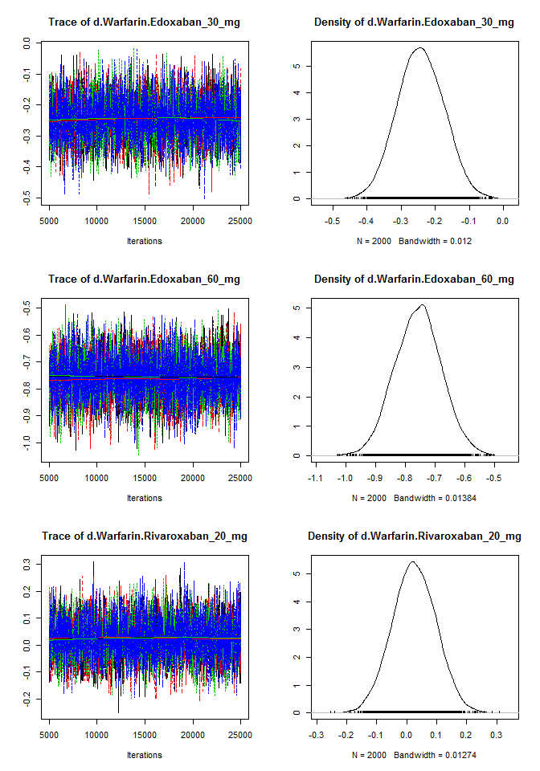 

Assess the degree of heterogeneity and inconsistency.


```r
anohe <- mtc.anohe(network, n.adapt=nAdapt, n.iter=nIter, thin=thin)
```


```r
summary(anohe)
```

```
## Analysis of heterogeneity
## =========================
## 
## Per-comparison I-squared:
## -------------------------
## 
##                  t1                t2  i2.pair  i2.cons incons.p
## 1     Apixaban_5_mg          Warfarin 99.90627 80.85957       NA
## 2 Dabigatran_110_mg Dabigatran_150_mg       NA       NA       NA
## 3 Dabigatran_110_mg          Warfarin       NA       NA       NA
## 4 Dabigatran_150_mg          Warfarin 99.95459 97.24388       NA
## 5    Edoxaban_30_mg    Edoxaban_60_mg 99.88939 96.98497       NA
## 6    Edoxaban_30_mg          Warfarin 99.24825  0.00000       NA
## 7    Edoxaban_60_mg          Warfarin 99.75869 97.79051       NA
## 8 Rivaroxaban_20_mg          Warfarin       NA       NA       NA
## 
## Global I-squared:
## -------------------------
## 
##    i2.pair  i2.cons
## 1 99.74589 90.89703
```

```r
plot(anohe)
```

```
## Analysis of heterogeneity -- convergence plots
## Unrelated Study Effects (USE) model:
```

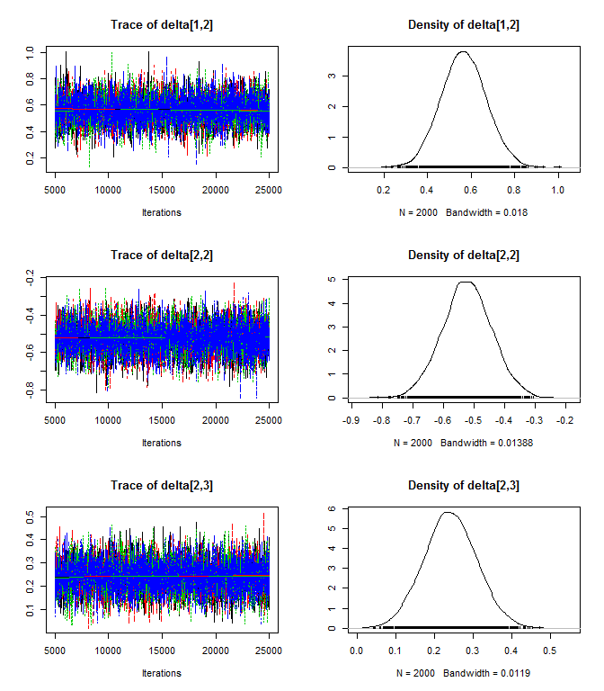 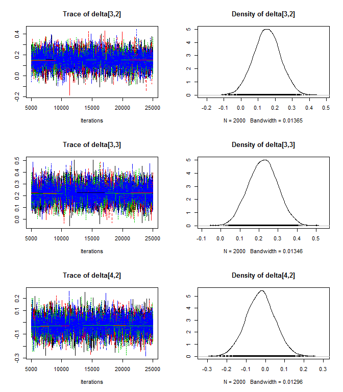 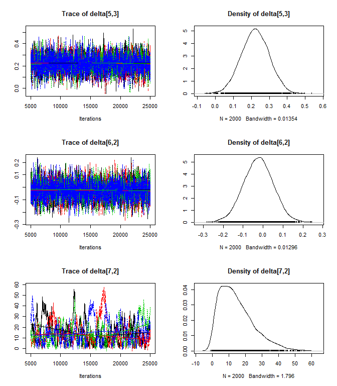 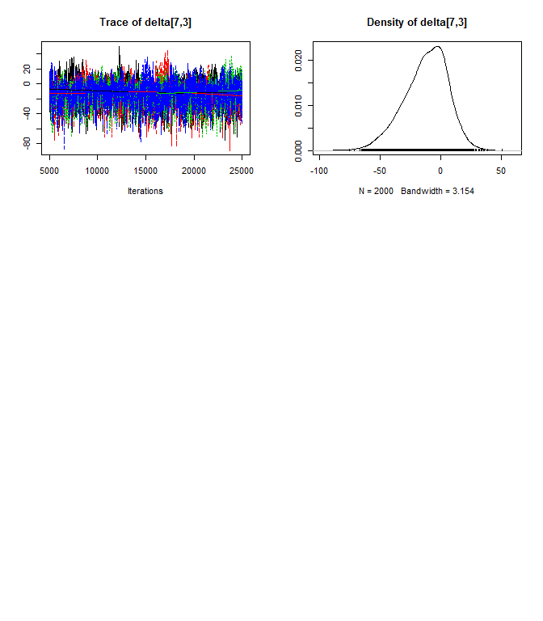 

```
## Unrelated Mean Effects (UME) model:
```

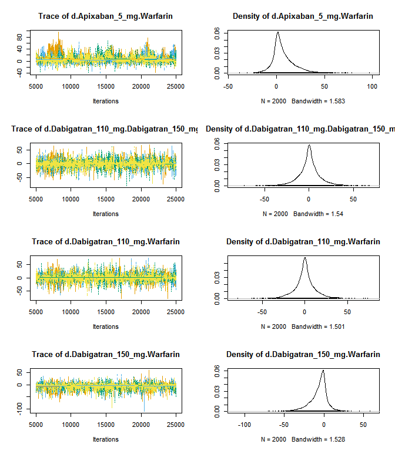  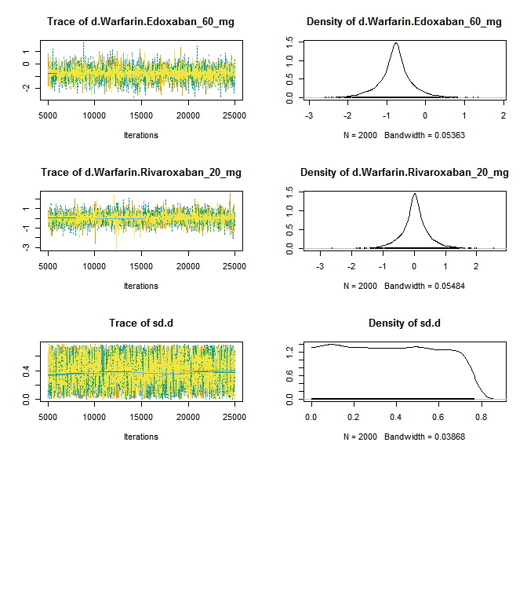 

```
## Consistency model:
```

 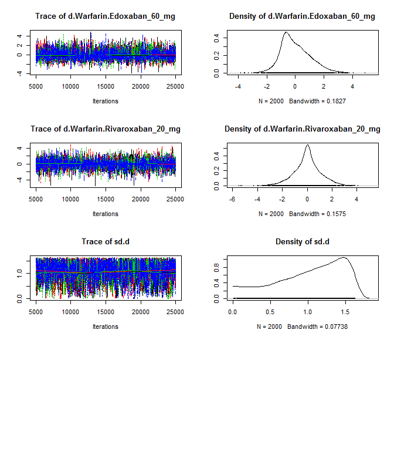 
