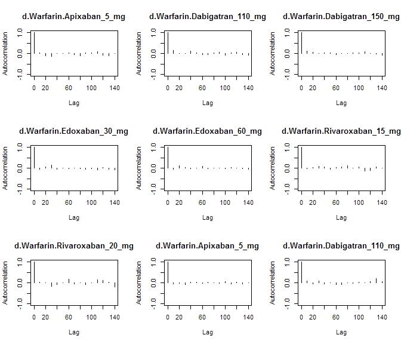
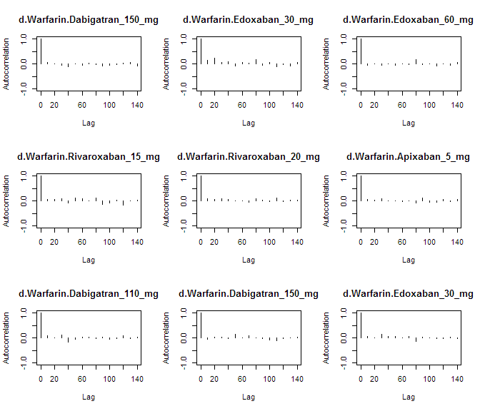
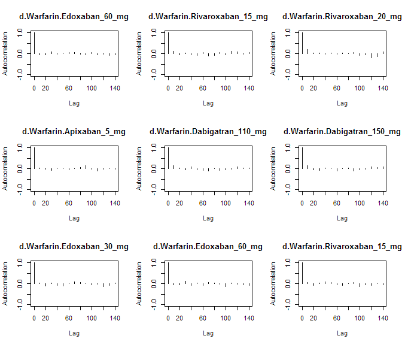
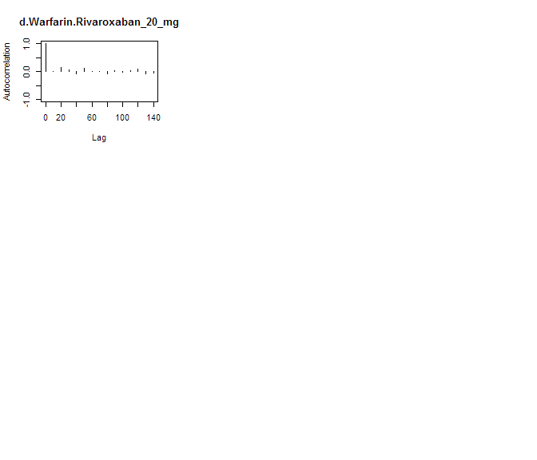

# NOAC network meta-analysis: MI
Benjamin Chan  
`r Sys.time()`  


Clean up the data (do not show the code).


```
##              study         treatment responders sampleSize
##  1:      ARISTOTLE     Apixaban_5_mg         90       9120
##  2:      ARISTOTLE          Warfarin        102       9081
##  3:    ARISTOTLE-J     Apixaban_5_mg          0         72
##  4:    ARISTOTLE-J          Warfarin          0         75
##  5: ENGAGE AF-TIMI    Edoxaban_30_mg        133       7034
##  6: ENGAGE AF-TIMI    Edoxaban_60_mg        169       7035
##  7: ENGAGE AF-TIMI          Warfarin        141       7036
##  8:       J-ROCKET Rivaroxaban_15_mg          3        639
##  9:       J-ROCKET          Warfarin          1        639
## 10:          RE-LY Dabigatran_110_mg         86       6015
## 11:          RE-LY Dabigatran_150_mg         89       6076
## 12:          RE-LY          Warfarin         63       6022
## 13:      ROCKET-AF Rivaroxaban_20_mg        101       7131
## 14:      ROCKET-AF          Warfarin        126       7133
```

Run the model using fixed-effects.


```r
M <- mtc.model(network, type="consistency", linearModel=effect)
plot(M)
```

 

```r
results <- mtc.run(M, n.adapt=nAdapt, n.iter=nIter, thin=thin)
```

# Summary

Direct and indirect odds ratios and 95% confidence bounds are stored in
[mtcMIOddsRatios.csv](mtcMIOddsRatios.csv).


```r
or <- combineResults()
write.csv(or, file="mtcMIOddsRatios.csv", row.names=FALSE)
show(or)
```

```
##               treatment       Apixaban 5 mg  Dabigatran 110 mg
## 1:     Apixaban 5 mg vs                  NA  0.64 (0.40, 0.99)
## 2: Dabigatran 110 mg vs   1.56 (1.01, 2.47)                 NA
## 3: Dabigatran 150 mg vs   1.60 (1.03, 2.54)  1.03 (0.77, 1.40)
## 4:    Edoxaban 30 mg vs   1.08 (0.74, 1.59)  0.70 (0.46, 1.03)
## 5:    Edoxaban 60 mg vs   1.37 (0.98, 1.97)  0.88 (0.60, 1.31)
## 6: Rivaroxaban 15 mg vs 3.85 (0.50, 124.10) 2.46 (0.33, 74.40)
## 7: Rivaroxaban 20 mg vs   0.92 (0.64, 1.37)  0.59 (0.38, 0.89)
## 8:          Warfarin vs   1.15 (0.86, 1.50)  0.74 (0.53, 1.02)
##     Dabigatran 150 mg      Edoxaban 30 mg     Edoxaban 60 mg
## 1:  0.63 (0.39, 0.97)   0.92 (0.63, 1.35)  0.73 (0.51, 1.02)
## 2:  0.98 (0.71, 1.29)   1.44 (0.97, 2.18)  1.13 (0.76, 1.67)
## 3:                 NA   1.47 (0.97, 2.22)  1.16 (0.78, 1.70)
## 4:  0.68 (0.45, 1.03)                  NA  0.78 (0.62, 0.99)
## 5:  0.86 (0.59, 1.28)   1.27 (1.01, 1.61)                 NA
## 6: 2.49 (0.32, 66.29) 3.71 (0.47, 112.72) 2.90 (0.38, 90.36)
## 7:  0.57 (0.37, 0.87)   0.85 (0.61, 1.18)  0.67 (0.49, 0.94)
## 8:  0.72 (0.52, 0.99)   1.05 (0.84, 1.34)  0.83 (0.66, 1.03)
##    Rivaroxaban 15 mg   Rivaroxaban 20 mg            Warfarin
## 1: 0.26 (0.01, 1.98)   1.09 (0.73, 1.57)   0.87 (0.67, 1.16)
## 2: 0.41 (0.01, 3.05)   1.69 (1.13, 2.60)   1.35 (0.98, 1.88)
## 3: 0.40 (0.02, 3.13)   1.75 (1.14, 2.68)   1.39 (1.01, 1.93)
## 4: 0.27 (0.01, 2.14)   1.18 (0.85, 1.65)   0.95 (0.74, 1.19)
## 5: 0.35 (0.01, 2.60)   1.50 (1.06, 2.04)   1.21 (0.97, 1.51)
## 6:                NA 4.17 (0.56, 124.34) 3.38 (0.45, 103.02)
## 7: 0.24 (0.01, 1.77)                  NA   0.80 (0.61, 1.08)
## 8: 0.30 (0.01, 2.21)   1.24 (0.93, 1.63)                  NA
```

# Diagnostics


```r
summary(results)
```

```
## $measure
## [1] "Log Odds Ratio"
## 
## $summaries
## 
## Iterations = 5010:7000
## Thinning interval = 10 
## Number of chains = 4 
## Sample size per chain = 200 
## 
## 1. Empirical mean and standard deviation for each variable,
##    plus standard error of the mean:
## 
##                                  Mean     SD Naive SE Time-series SE
## d.Warfarin.Apixaban_5_mg     -0.13460 0.1448 0.005120       0.004901
## d.Warfarin.Dabigatran_110_mg  0.30760 0.1684 0.005954       0.006435
## d.Warfarin.Dabigatran_150_mg  0.33315 0.1663 0.005878       0.006325
## d.Warfarin.Edoxaban_30_mg    -0.05479 0.1192 0.004215       0.004983
## d.Warfarin.Edoxaban_60_mg     0.18655 0.1132 0.004003       0.004000
## d.Warfarin.Rivaroxaban_15_mg  1.42741 1.3925 0.049234       0.050775
## d.Warfarin.Rivaroxaban_20_mg -0.21858 0.1361 0.004811       0.005065
## 
## 2. Quantiles for each variable:
## 
##                                  2.5%     25%     50%      75%   97.5%
## d.Warfarin.Apixaban_5_mg     -0.40711 -0.2333 -0.1358 -0.03414 0.14914
## d.Warfarin.Dabigatran_110_mg -0.01716  0.1962  0.3005  0.41545 0.63224
## d.Warfarin.Dabigatran_150_mg  0.01074  0.2313  0.3325  0.44167 0.65541
## d.Warfarin.Edoxaban_30_mg    -0.29560 -0.1362 -0.0495  0.02756 0.17409
## d.Warfarin.Edoxaban_60_mg    -0.02543  0.1051  0.1895  0.26297 0.41321
## d.Warfarin.Rivaroxaban_15_mg -0.79270  0.4936  1.2178  2.25001 4.63490
## d.Warfarin.Rivaroxaban_20_mg -0.48682 -0.3060 -0.2182 -0.12947 0.07244
## 
## 
## $DIC
##     Dbar       pD      DIC 
## 12.41547 12.21848 24.63395 
## 
## attr(,"class")
## [1] "summary.mtc.result"
```

Sampler diagnostics.


```r
gelman.plot(results)
```

 

```r
gelman.diag(results)
```

```
## Potential scale reduction factors:
## 
##                              Point est. Upper C.I.
## d.Warfarin.Apixaban_5_mg          1.000       1.00
## d.Warfarin.Dabigatran_110_mg      0.999       1.00
## d.Warfarin.Dabigatran_150_mg      1.009       1.02
## d.Warfarin.Edoxaban_30_mg         1.009       1.03
## d.Warfarin.Edoxaban_60_mg         1.004       1.01
## d.Warfarin.Rivaroxaban_15_mg      0.999       1.00
## d.Warfarin.Rivaroxaban_20_mg      1.002       1.01
## 
## Multivariate psrf
## 
## 1.01
```


```r
plot(results)
```

  


```r
autocorr.plot(results$samples)
```

    

Assess the degree of heterogeneity and inconsistency.


```r
anohe <- mtc.anohe(network, n.adapt=nAdapt, n.iter=nIter, thin=thin)
```


```r
summary(anohe)
```

```
## Analysis of heterogeneity
## =========================
## 
## Per-comparison I-squared:
## -------------------------
## 
##                  t1                t2 i2.pair i2.cons incons.p
## 1     Apixaban_5_mg          Warfarin       0       0       NA
## 2 Dabigatran_110_mg Dabigatran_150_mg      NA      NA       NA
## 3 Dabigatran_110_mg          Warfarin      NA      NA       NA
## 4 Dabigatran_150_mg          Warfarin      NA      NA       NA
## 5    Edoxaban_30_mg    Edoxaban_60_mg      NA      NA       NA
## 6    Edoxaban_30_mg          Warfarin      NA      NA       NA
## 7    Edoxaban_60_mg          Warfarin      NA      NA       NA
## 8 Rivaroxaban_15_mg          Warfarin      NA      NA       NA
## 9 Rivaroxaban_20_mg          Warfarin      NA      NA       NA
## 
## Global I-squared:
## -------------------------
## 
##   i2.pair i2.cons
## 1       0       0
```

```r
plot(anohe)
```

```
## Analysis of heterogeneity -- convergence plots
## Unrelated Study Effects (USE) model:
```

  

```
## Unrelated Mean Effects (UME) model:
```

    

```
## Consistency model:
```

  
