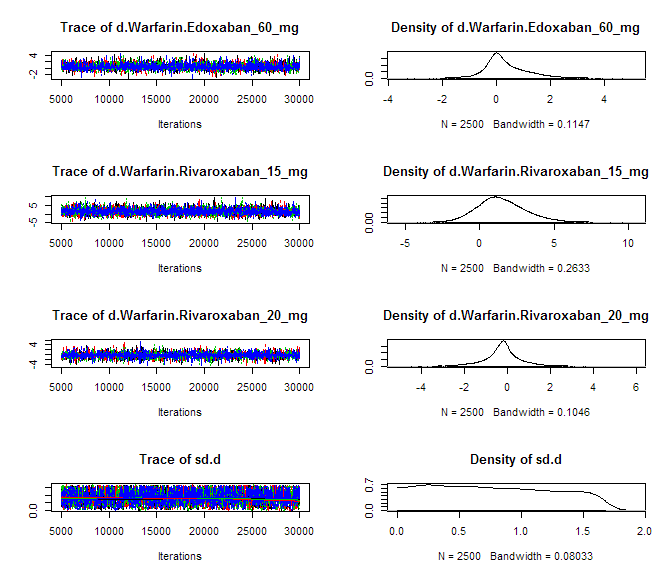

# NOAC network meta-analysis: MI
Benjamin Chan  
`r Sys.time()`  

[Back](README.md) to main page.

Read data.


```r
D <- readSheet("MI")
```

Tidy up the data.


```r
D <- tidyData(D)
write.csv(D, file="mtcMIData.csv", row.names=FALSE)
print(xtable(D, digits=rep(0, 5)), type="html", include.rownames=FALSE)
```

<!-- html table generated in R 3.2.2 by xtable 1.7-4 package -->
<!-- Fri Mar 11 13:35:23 2016 -->
<table border=1>
<tr> <th> study </th> <th> treatment </th> <th> responders </th> <th> sampleSize </th>  </tr>
  <tr> <td> ARISTOTLE </td> <td> Apixaban_5_mg </td> <td align="right"> 90 </td> <td align="right"> 9120 </td> </tr>
  <tr> <td> ARISTOTLE </td> <td> Warfarin </td> <td align="right"> 102 </td> <td align="right"> 9081 </td> </tr>
  <tr> <td> ARISTOTLE-J </td> <td> Apixaban_5_mg </td> <td align="right"> 0 </td> <td align="right"> 74 </td> </tr>
  <tr> <td> ARISTOTLE-J </td> <td> Warfarin </td> <td align="right"> 0 </td> <td align="right"> 74 </td> </tr>
  <tr> <td> ENGAGE AF-TIMI </td> <td> Edoxaban_30_mg </td> <td align="right"> 169 </td> <td align="right"> 7034 </td> </tr>
  <tr> <td> ENGAGE AF-TIMI </td> <td> Edoxaban_60_mg </td> <td align="right"> 133 </td> <td align="right"> 7035 </td> </tr>
  <tr> <td> ENGAGE AF-TIMI </td> <td> Warfarin </td> <td align="right"> 141 </td> <td align="right"> 7036 </td> </tr>
  <tr> <td> J-ROCKET </td> <td> Rivaroxaban_15_mg </td> <td align="right"> 3 </td> <td align="right"> 637 </td> </tr>
  <tr> <td> J-ROCKET </td> <td> Warfarin </td> <td align="right"> 1 </td> <td align="right"> 637 </td> </tr>
  <tr> <td> PETRO </td> <td> Dabigatran_150_mg </td> <td align="right"> 0 </td> <td align="right"> 100 </td> </tr>
  <tr> <td> PETRO </td> <td> Warfarin </td> <td align="right"> 0 </td> <td align="right"> 70 </td> </tr>
  <tr> <td> RE-LY </td> <td> Dabigatran_110_mg </td> <td align="right"> 86 </td> <td align="right"> 6015 </td> </tr>
  <tr> <td> RE-LY </td> <td> Dabigatran_150_mg </td> <td align="right"> 89 </td> <td align="right"> 6076 </td> </tr>
  <tr> <td> RE-LY </td> <td> Warfarin </td> <td align="right"> 63 </td> <td align="right"> 6022 </td> </tr>
  <tr> <td> ROCKET-AF </td> <td> Rivaroxaban_20_mg </td> <td align="right"> 100 </td> <td align="right"> 7061 </td> </tr>
  <tr> <td> ROCKET-AF </td> <td> Warfarin </td> <td align="right"> 126 </td> <td align="right"> 7082 </td> </tr>
  <tr> <td> Weitz, 2010 </td> <td> Edoxaban_30_mg </td> <td align="right"> 2 </td> <td align="right"> 235 </td> </tr>
  <tr> <td> Weitz, 2010 </td> <td> Edoxaban_60_mg </td> <td align="right"> 2 </td> <td align="right"> 234 </td> </tr>
  <tr> <td> Weitz, 2010 </td> <td> Warfarin </td> <td align="right"> 0 </td> <td align="right"> 250 </td> </tr>
   </table>

```r
network <- mtc.network(D)
```

Run the model using fixed-effects.


```r
M <- mtc.model(network, type="consistency", linearModel=effect)
plot(M)
```

 

```r
results <- mtc.run(M, n.adapt=nAdapt, n.iter=nIter, thin=thin)
```

# Summary

Direct and indirect odds ratios and 95% confidence bounds are stored in
[mtcMIOddsRatios.csv](mtcMIOddsRatios.csv).


```r
or <- combineResults()
write.csv(or, file="mtcMIOddsRatios.csv", row.names=FALSE)
print(xtable(or), type="html", include.rownames=FALSE)
```

<!-- html table generated in R 3.2.2 by xtable 1.7-4 package -->
<!-- Fri Mar 11 13:35:43 2016 -->
<table border=1>
<tr> <th> treatment </th> <th> Apixaban 5 mg </th> <th> Dabigatran 110 mg </th> <th> Dabigatran 150 mg </th> <th> Edoxaban 30 mg </th> <th> Edoxaban 60 mg </th> <th> Rivaroxaban 15 mg </th> <th> Rivaroxaban 20 mg </th> <th> Warfarin </th>  </tr>
  <tr> <td> Apixaban 5 mg vs </td> <td>  </td> <td> 0.64 (0.41, 0.98) </td> <td> 0.62 (0.40, 0.96) </td> <td> 0.72 (0.50, 1.03) </td> <td> 0.91 (0.63, 1.33) </td> <td> 0.23 (0.01, 2.22) </td> <td> 1.11 (0.74, 1.64) </td> <td> 0.88 (0.66, 1.16) </td> </tr>
  <tr> <td> Dabigatran 110 mg vs </td> <td> 1.57 (1.02, 2.42) </td> <td>  </td> <td> 0.98 (0.72, 1.33) </td> <td> 1.13 (0.75, 1.68) </td> <td> 1.44 (0.95, 2.18) </td> <td> 0.36 (0.01, 3.46) </td> <td> 1.74 (1.14, 2.68) </td> <td> 1.37 (0.99, 1.92) </td> </tr>
  <tr> <td> Dabigatran 150 mg vs </td> <td> 1.61 (1.04, 2.48) </td> <td> 1.02 (0.75, 1.38) </td> <td>  </td> <td> 1.15 (0.78, 1.71) </td> <td> 1.48 (0.99, 2.20) </td> <td> 0.36 (0.01, 3.61) </td> <td> 1.78 (1.17, 2.73) </td> <td> 1.41 (1.02, 1.96) </td> </tr>
  <tr> <td> Edoxaban 30 mg vs </td> <td> 1.40 (0.97, 2.02) </td> <td> 0.89 (0.59, 1.33) </td> <td> 0.87 (0.58, 1.28) </td> <td>  </td> <td> 1.28 (1.01, 1.61) </td> <td> 0.32 (0.01, 3.12) </td> <td> 1.54 (1.09, 2.20) </td> <td> 1.22 (0.97, 1.53) </td> </tr>
  <tr> <td> Edoxaban 60 mg vs </td> <td> 1.10 (0.75, 1.58) </td> <td> 0.69 (0.46, 1.05) </td> <td> 0.68 (0.45, 1.01) </td> <td> 0.78 (0.62, 0.99) </td> <td>  </td> <td> 0.25 (0.01, 2.40) </td> <td> 1.21 (0.84, 1.72) </td> <td> 0.96 (0.75, 1.21) </td> </tr>
  <tr> <td> Rivaroxaban 15 mg vs </td> <td> 4.40 (0.45, 130.86) </td> <td> 2.79 (0.29, 83.11) </td> <td> 2.76 (0.28, 79.96) </td> <td> 3.17 (0.32, 91.93) </td> <td> 4.04 (0.42, 118.78) </td> <td>  </td> <td> 4.89 (0.51, 142.67) </td> <td> 3.86 (0.40, 112.91) </td> </tr>
  <tr> <td> Rivaroxaban 20 mg vs </td> <td> 0.90 (0.61, 1.35) </td> <td> 0.58 (0.37, 0.88) </td> <td> 0.56 (0.37, 0.85) </td> <td> 0.65 (0.46, 0.91) </td> <td> 0.83 (0.58, 1.18) </td> <td> 0.20 (0.01, 1.97) </td> <td>  </td> <td> 0.79 (0.60, 1.03) </td> </tr>
  <tr> <td> Warfarin vs </td> <td> 1.14 (0.86, 1.52) </td> <td> 0.73 (0.52, 1.01) </td> <td> 0.71 (0.51, 0.98) </td> <td> 0.82 (0.65, 1.03) </td> <td> 1.05 (0.83, 1.33) </td> <td> 0.26 (0.01, 2.51) </td> <td> 1.26 (0.97, 1.66) </td> <td>  </td> </tr>
   </table>

# Forest plots, NOAC vs NOAC


```r
noac <- unique(D[treatment != "Warfarin", treatment])
for (i in 1:length(noac)) {
  forest(relative.effect(results, noac[i], noac[1:length(noac) != i]))
}
```

       

# Diagnostics


```r
summary(results)
```

```
## $measure
## [1] "Log Odds Ratio"
## 
## $summaries
## 
## Iterations = 5010:30000
## Thinning interval = 10 
## Number of chains = 4 
## Sample size per chain = 2500 
## 
## 1. Empirical mean and standard deviation for each variable,
##    plus standard error of the mean:
## 
##                                  Mean     SD Naive SE Time-series SE
## d.Warfarin.Apixaban_5_mg     -0.13333 0.1463 0.001463       0.001520
## d.Warfarin.Dabigatran_110_mg  0.31898 0.1700 0.001700       0.001907
## d.Warfarin.Dabigatran_150_mg  0.34368 0.1662 0.001662       0.001730
## d.Warfarin.Edoxaban_30_mg     0.19984 0.1149 0.001149       0.001250
## d.Warfarin.Edoxaban_60_mg    -0.04415 0.1211 0.001211       0.001256
## d.Warfarin.Rivaroxaban_15_mg  1.50000 1.4263 0.014263       0.014479
## d.Warfarin.Rivaroxaban_20_mg -0.23517 0.1361 0.001361       0.001356
## 
## 2. Quantiles for each variable:
## 
##                                  2.5%     25%      50%      75%   97.5%
## d.Warfarin.Apixaban_5_mg     -0.41820 -0.2327 -0.13108 -0.03311 0.15097
## d.Warfarin.Dabigatran_110_mg -0.01350  0.2046  0.31823  0.43153 0.65447
## d.Warfarin.Dabigatran_150_mg  0.01594  0.2326  0.34392  0.45315 0.67218
## d.Warfarin.Edoxaban_30_mg    -0.02588  0.1227  0.19978  0.27571 0.42801
## d.Warfarin.Edoxaban_60_mg    -0.28265 -0.1244 -0.04406  0.03966 0.19161
## d.Warfarin.Rivaroxaban_15_mg -0.91835  0.5231  1.34953  2.34129 4.72659
## d.Warfarin.Rivaroxaban_20_mg -0.50579 -0.3254 -0.23334 -0.14425 0.02947
## 
## 
## $DIC
##     Dbar       pD      DIC 
## 16.86743 13.44000 30.30744 
## 
## attr(,"class")
## [1] "summary.mtc.result"
```

Sampler diagnostics.


```r
gelman.plot(results)
```

 

```r
gelman.diag(results)
```

```
## Potential scale reduction factors:
## 
##                              Point est. Upper C.I.
## d.Warfarin.Apixaban_5_mg              1          1
## d.Warfarin.Dabigatran_110_mg          1          1
## d.Warfarin.Dabigatran_150_mg          1          1
## d.Warfarin.Edoxaban_30_mg             1          1
## d.Warfarin.Edoxaban_60_mg             1          1
## d.Warfarin.Rivaroxaban_15_mg          1          1
## d.Warfarin.Rivaroxaban_20_mg          1          1
## 
## Multivariate psrf
## 
## 1
```


```r
plot(results)
```

  


```r
autocorr.plot(results$samples)
```

    

Assess the degree of heterogeneity and inconsistency.


```r
anohe <- mtc.anohe(network, n.adapt=nAdapt, n.iter=nIter, thin=thin)
```


```r
summary(anohe)
```

```
## Analysis of heterogeneity
## =========================
## 
## Per-comparison I-squared:
## -------------------------
## 
##                  t1                t2  i2.pair  i2.cons incons.p
## 1     Apixaban_5_mg          Warfarin  0.00000  0.00000       NA
## 2 Dabigatran_110_mg Dabigatran_150_mg       NA       NA       NA
## 3 Dabigatran_110_mg          Warfarin       NA       NA       NA
## 4 Dabigatran_150_mg          Warfarin  0.00000  0.00000       NA
## 5    Edoxaban_30_mg    Edoxaban_60_mg  0.00000  0.00000       NA
## 6    Edoxaban_30_mg          Warfarin 62.96221 69.28053       NA
## 7    Edoxaban_60_mg          Warfarin 46.60029 69.28047       NA
## 8 Rivaroxaban_15_mg          Warfarin       NA       NA       NA
## 9 Rivaroxaban_20_mg          Warfarin       NA       NA       NA
## 
## Global I-squared:
## -------------------------
## 
##   i2.pair i2.cons
## 1       0       0
```

```r
plot(anohe)
```

```
## Analysis of heterogeneity -- convergence plots
## Unrelated Study Effects (USE) model:
```

    

```
## Unrelated Mean Effects (UME) model:
```

    

```
## Consistency model:
```

  
