# NOAC network meta-analysis: MI
Benjamin Chan  
`r Sys.time()`  


Clean up the data (do not show the code).


```
##              study         treatment responders sampleSize
##  1:      ARISTOTLE     Apixaban_5_mg         90       9120
##  2:      ARISTOTLE          Warfarin        102       9081
##  3:    ARISTOTLE-J     Apixaban_5_mg          0         72
##  4:    ARISTOTLE-J          Warfarin          0         75
##  5: ENGAGE AF-TIMI    Edoxaban_30_mg        133       7034
##  6: ENGAGE AF-TIMI    Edoxaban_60_mg        169       7035
##  7: ENGAGE AF-TIMI          Warfarin        141       7036
##  8:       J-ROCKET Rivaroxaban_15_mg          3        639
##  9:       J-ROCKET          Warfarin          1        639
## 10:          RE-LY Dabigatran_110_mg         86       6015
## 11:          RE-LY Dabigatran_150_mg         89       6076
## 12:          RE-LY          Warfarin         63       6022
## 13:      ROCKET-AF Rivaroxaban_20_mg        101       7131
## 14:      ROCKET-AF          Warfarin        126       7133
```

# Network plot


```r
plot(network)
```

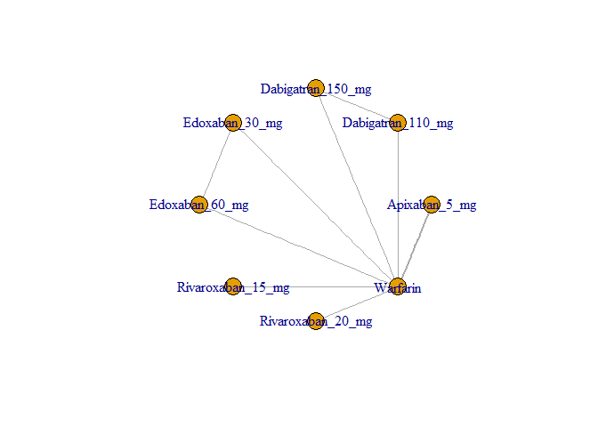 

Run the model using fixed-effects.


```r
M <- mtc.model(network, type="consistency", linearModel=effect)
runtime <- system.time(results <- mtc.run(M, n.adapt=nAdapt, n.iter=nIter, thin=thin))
```

# Summary

Head-to-head odds ratios and 95% confidence bounds are stored in
[mtcMIHTH.csv](mtcMIHTH.csv).


```r
hth <- combineResults()
hth[, .(label, result)]
```

```
##                                      label              result
##  1:     Dabigatran 110 mg vs Apixaban 5 mg   1.56 (1.01, 2.42)
##  2:     Dabigatran 150 mg vs Apixaban 5 mg   1.60 (1.03, 2.47)
##  3:        Edoxaban 30 mg vs Apixaban 5 mg   1.07 (0.74, 1.56)
##  4:        Edoxaban 60 mg vs Apixaban 5 mg   1.37 (0.96, 1.98)
##  5:     Rivaroxaban 15 mg vs Apixaban 5 mg 4.48 (0.46, 126.87)
##  6:     Rivaroxaban 20 mg vs Apixaban 5 mg   0.91 (0.61, 1.36)
##  7:              Warfarin vs Apixaban 5 mg   1.14 (0.86, 1.51)
##  8:     Apixaban 5 mg vs Dabigatran 110 mg   0.64 (0.41, 0.99)
##  9: Dabigatran 150 mg vs Dabigatran 110 mg   1.02 (0.75, 1.38)
## 10:    Edoxaban 30 mg vs Dabigatran 110 mg   0.69 (0.46, 1.03)
## 11:    Edoxaban 60 mg vs Dabigatran 110 mg   0.88 (0.59, 1.30)
## 12: Rivaroxaban 15 mg vs Dabigatran 110 mg  2.87 (0.29, 79.89)
## 13: Rivaroxaban 20 mg vs Dabigatran 110 mg   0.58 (0.38, 0.88)
## 14:          Warfarin vs Dabigatran 110 mg   0.73 (0.52, 1.01)
## 15:     Apixaban 5 mg vs Dabigatran 150 mg   0.63 (0.41, 0.97)
## 16: Dabigatran 110 mg vs Dabigatran 150 mg   0.98 (0.72, 1.32)
## 17:    Edoxaban 30 mg vs Dabigatran 150 mg   0.67 (0.45, 1.01)
## 18:    Edoxaban 60 mg vs Dabigatran 150 mg   0.86 (0.58, 1.26)
## 19: Rivaroxaban 15 mg vs Dabigatran 150 mg  2.78 (0.28, 82.20)
## 20: Rivaroxaban 20 mg vs Dabigatran 150 mg   0.57 (0.37, 0.87)
## 21:          Warfarin vs Dabigatran 150 mg   0.71 (0.52, 0.97)
## 22:        Apixaban 5 mg vs Edoxaban 30 mg   0.93 (0.64, 1.35)
## 23:    Dabigatran 110 mg vs Edoxaban 30 mg   1.45 (0.97, 2.18)
## 24:    Dabigatran 150 mg vs Edoxaban 30 mg   1.49 (0.99, 2.22)
## 25:       Edoxaban 60 mg vs Edoxaban 30 mg   1.28 (1.02, 1.61)
## 26:    Rivaroxaban 15 mg vs Edoxaban 30 mg 4.13 (0.43, 120.81)
## 27:    Rivaroxaban 20 mg vs Edoxaban 30 mg   0.85 (0.59, 1.22)
## 28:             Warfarin vs Edoxaban 30 mg   1.06 (0.83, 1.35)
## 29:        Apixaban 5 mg vs Edoxaban 60 mg   0.73 (0.51, 1.04)
## 30:    Dabigatran 110 mg vs Edoxaban 60 mg   1.13 (0.77, 1.70)
## 31:    Dabigatran 150 mg vs Edoxaban 60 mg   1.17 (0.80, 1.72)
## 32:       Edoxaban 30 mg vs Edoxaban 60 mg   0.78 (0.62, 0.98)
## 33:    Rivaroxaban 15 mg vs Edoxaban 60 mg  3.26 (0.33, 94.93)
## 34:    Rivaroxaban 20 mg vs Edoxaban 60 mg   0.67 (0.47, 0.94)
## 35:             Warfarin vs Edoxaban 60 mg   0.83 (0.66, 1.04)
## 36:     Apixaban 5 mg vs Rivaroxaban 20 mg   1.10 (0.74, 1.63)
## 37: Dabigatran 110 mg vs Rivaroxaban 20 mg   1.71 (1.13, 2.62)
## 38: Dabigatran 150 mg vs Rivaroxaban 20 mg   1.76 (1.15, 2.67)
## 39:    Edoxaban 30 mg vs Rivaroxaban 20 mg   1.18 (0.82, 1.70)
## 40:    Edoxaban 60 mg vs Rivaroxaban 20 mg   1.50 (1.06, 2.12)
## 41: Rivaroxaban 15 mg vs Rivaroxaban 20 mg 4.92 (0.51, 142.63)
## 42:          Warfarin vs Rivaroxaban 20 mg   1.25 (0.95, 1.64)
## 43:              Apixaban 5 mg vs Warfarin   0.88 (0.66, 1.17)
## 44:          Dabigatran 110 mg vs Warfarin   1.37 (0.99, 1.91)
## 45:          Dabigatran 150 mg vs Warfarin   1.41 (1.03, 1.93)
## 46:             Edoxaban 30 mg vs Warfarin   0.94 (0.74, 1.20)
## 47:             Edoxaban 60 mg vs Warfarin   1.20 (0.96, 1.51)
## 48:          Rivaroxaban 15 mg vs Warfarin 3.90 (0.40, 110.85)
## 49:          Rivaroxaban 20 mg vs Warfarin   0.80 (0.61, 1.05)
##                                      label              result
```

```r
write.csv(hth, file="mtcMIHTH.csv", row.names=FALSE)
```

# Diagnostics


```r
runtime
```

```
##    user  system elapsed 
##   11.17    0.00   11.26
```

```r
summary(results)
```

```
## $measure
## [1] "Log Odds Ratio"
## 
## $summaries
## 
## Iterations = 5010:25000
## Thinning interval = 10 
## Number of chains = 4 
## Sample size per chain = 2000 
## 
## 1. Empirical mean and standard deviation for each variable,
##    plus standard error of the mean:
## 
##                                  Mean     SD Naive SE Time-series SE
## d.Warfarin.Apixaban_5_mg     -0.13005 0.1462 0.001634       0.001634
## d.Warfarin.Dabigatran_110_mg  0.31540 0.1661 0.001857       0.002084
## d.Warfarin.Dabigatran_150_mg  0.33999 0.1627 0.001819       0.001883
## d.Warfarin.Edoxaban_30_mg    -0.05845 0.1229 0.001374       0.001712
## d.Warfarin.Edoxaban_60_mg     0.18549 0.1157 0.001293       0.001321
## d.Warfarin.Rivaroxaban_15_mg  1.50054 1.3914 0.015556       0.015776
## d.Warfarin.Rivaroxaban_20_mg -0.22313 0.1374 0.001536       0.001593
## 
## 2. Quantiles for each variable:
## 
##                                   2.5%     25%      50%      75%   97.5%
## d.Warfarin.Apixaban_5_mg     -0.413936 -0.2283 -0.12907 -0.03126 0.15309
## d.Warfarin.Dabigatran_110_mg -0.005683  0.2040  0.31274  0.42569 0.64516
## d.Warfarin.Dabigatran_150_mg  0.025798  0.2304  0.34076  0.44844 0.65913
## d.Warfarin.Edoxaban_30_mg    -0.300488 -0.1411 -0.05866  0.02575 0.18043
## d.Warfarin.Edoxaban_60_mg    -0.040202  0.1082  0.18520  0.26251 0.41271
## d.Warfarin.Rivaroxaban_15_mg -0.916046  0.5666  1.36203  2.31005 4.70816
## d.Warfarin.Rivaroxaban_20_mg -0.496202 -0.3152 -0.22170 -0.13180 0.04742
## 
## 
## $DIC
##     Dbar       pD      DIC 
## 12.42130 12.24432 24.66562 
## 
## attr(,"class")
## [1] "summary.mtc.result"
```

Sampler diagnostics.


```r
gelman.plot(results)
```

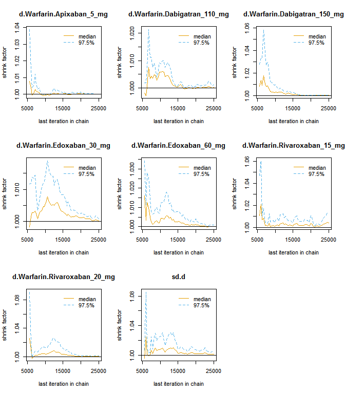 

```r
gelman.diag(results)
```

```
## Potential scale reduction factors:
## 
##                              Point est. Upper C.I.
## d.Warfarin.Apixaban_5_mg              1          1
## d.Warfarin.Dabigatran_110_mg          1          1
## d.Warfarin.Dabigatran_150_mg          1          1
## d.Warfarin.Edoxaban_30_mg             1          1
## d.Warfarin.Edoxaban_60_mg             1          1
## d.Warfarin.Rivaroxaban_15_mg          1          1
## d.Warfarin.Rivaroxaban_20_mg          1          1
## 
## Multivariate psrf
## 
## 1
```


```r
plot(results)
```

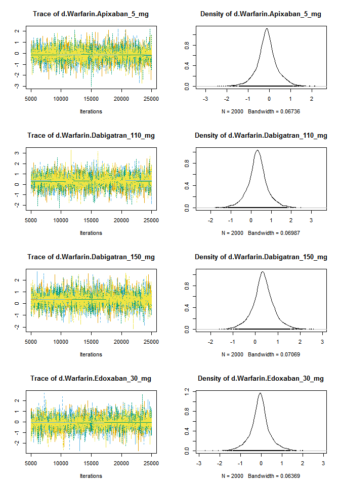 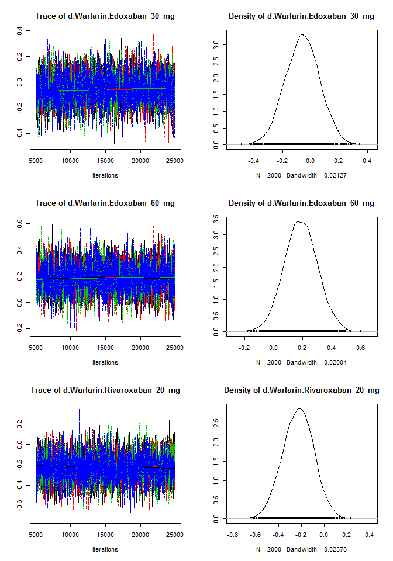 

Assess the degree of heterogeneity and inconsistency.


```r
anohe <- mtc.anohe(network, n.adapt=nAdapt, n.iter=nIter, thin=thin)
```


```r
summary(anohe)
```

```
## Analysis of heterogeneity
## =========================
## 
## Per-comparison I-squared:
## -------------------------
## 
##                  t1                t2 i2.pair i2.cons incons.p
## 1     Apixaban_5_mg          Warfarin       0       0       NA
## 2 Dabigatran_110_mg Dabigatran_150_mg      NA      NA       NA
## 3 Dabigatran_110_mg          Warfarin      NA      NA       NA
## 4 Dabigatran_150_mg          Warfarin      NA      NA       NA
## 5    Edoxaban_30_mg    Edoxaban_60_mg      NA      NA       NA
## 6    Edoxaban_30_mg          Warfarin      NA      NA       NA
## 7    Edoxaban_60_mg          Warfarin      NA      NA       NA
## 8 Rivaroxaban_15_mg          Warfarin      NA      NA       NA
## 9 Rivaroxaban_20_mg          Warfarin      NA      NA       NA
## 
## Global I-squared:
## -------------------------
## 
##   i2.pair i2.cons
## 1       0       0
```

```r
plot(anohe)
```

```
## Analysis of heterogeneity -- convergence plots
## Unrelated Study Effects (USE) model:
```

 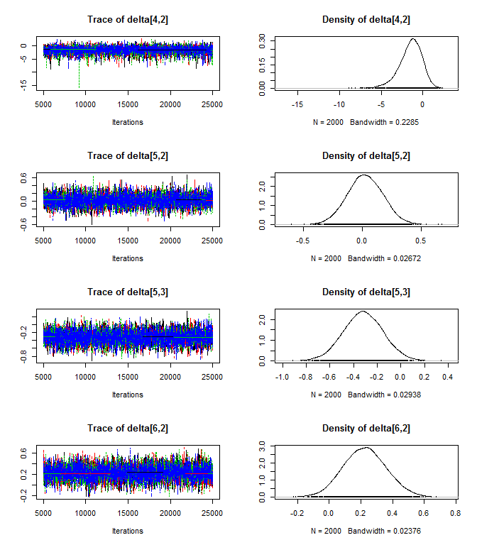 

```
## Unrelated Mean Effects (UME) model:
```

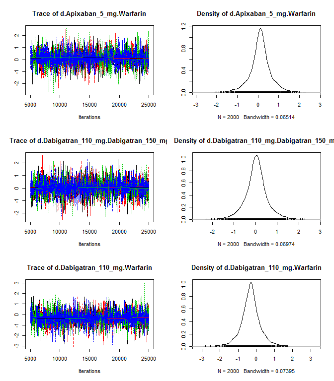 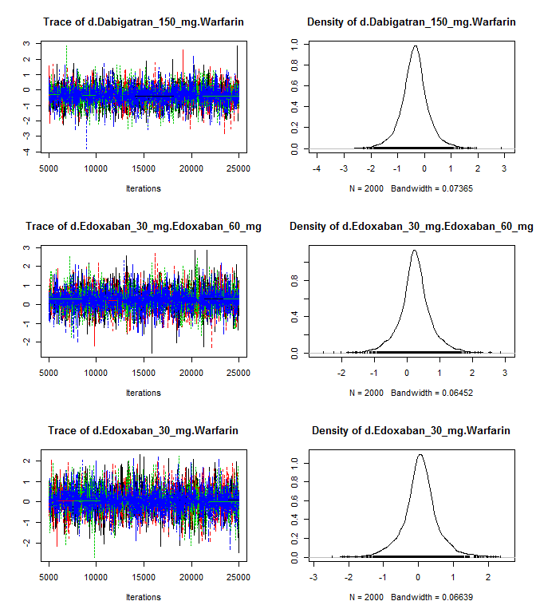 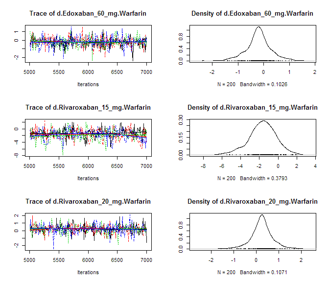 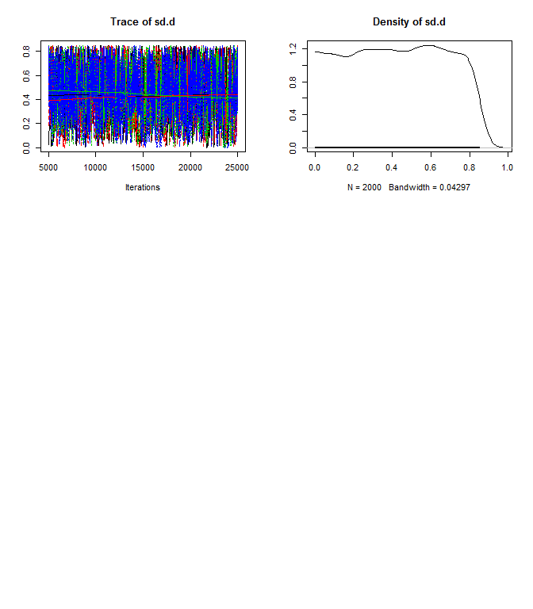 

```
## Consistency model:
```

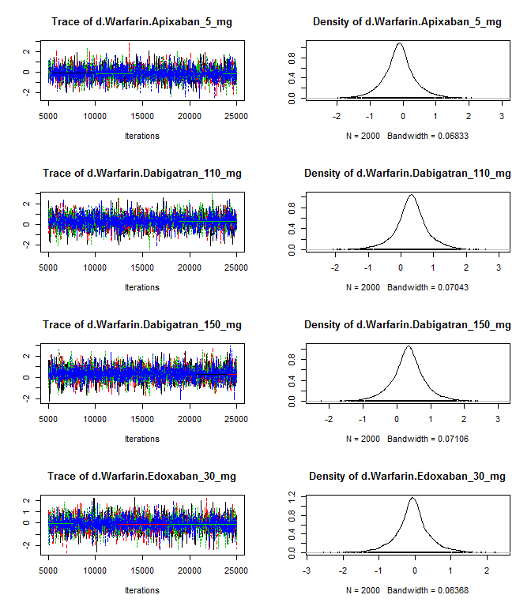 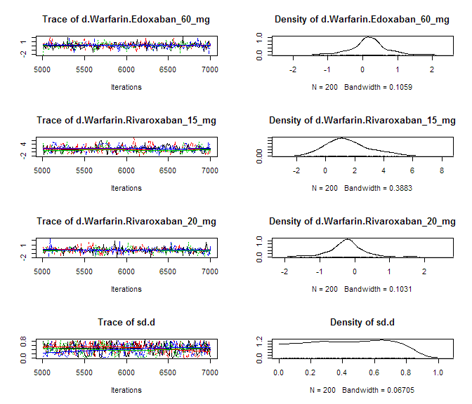 
