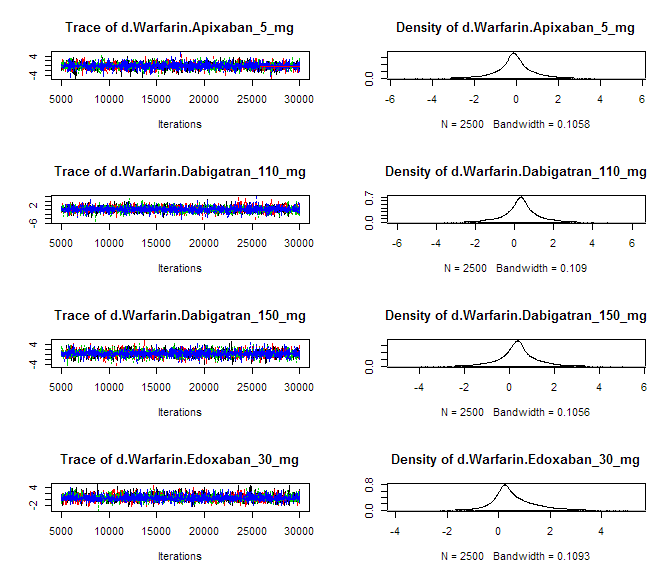

# NOAC network meta-analysis: MI
Benjamin Chan  
`r Sys.time()`  

[Back](README.md) to main page.

Read data.


```r
D <- readSheet("MI")
```

Tidy up the data.


```r
D <- tidyData(D)
D <- D[study != "ROCKET-AF"]
write.csv(D, file="mtcMIData.csv", row.names=FALSE)
print(xtable(D, digits=rep(0, 5)), type="html", include.rownames=FALSE)
```

<!-- html table generated in R 3.2.2 by xtable 1.7-4 package -->
<!-- Mon May 02 21:07:13 2016 -->
<table border=1>
<tr> <th> study </th> <th> treatment </th> <th> responders </th> <th> sampleSize </th>  </tr>
  <tr> <td> ARISTOTLE </td> <td> Apixaban_5_mg </td> <td align="right"> 90 </td> <td align="right"> 9120 </td> </tr>
  <tr> <td> ARISTOTLE </td> <td> Warfarin </td> <td align="right"> 102 </td> <td align="right"> 9081 </td> </tr>
  <tr> <td> ARISTOTLE-J </td> <td> Apixaban_5_mg </td> <td align="right"> 0 </td> <td align="right"> 74 </td> </tr>
  <tr> <td> ARISTOTLE-J </td> <td> Warfarin </td> <td align="right"> 0 </td> <td align="right"> 74 </td> </tr>
  <tr> <td> ENGAGE AF-TIMI </td> <td> Edoxaban_30_mg </td> <td align="right"> 169 </td> <td align="right"> 7034 </td> </tr>
  <tr> <td> ENGAGE AF-TIMI </td> <td> Edoxaban_60_mg </td> <td align="right"> 133 </td> <td align="right"> 7035 </td> </tr>
  <tr> <td> ENGAGE AF-TIMI </td> <td> Warfarin </td> <td align="right"> 141 </td> <td align="right"> 7036 </td> </tr>
  <tr> <td> J-ROCKET </td> <td> Rivaroxaban_15_mg </td> <td align="right"> 3 </td> <td align="right"> 637 </td> </tr>
  <tr> <td> J-ROCKET </td> <td> Warfarin </td> <td align="right"> 1 </td> <td align="right"> 637 </td> </tr>
  <tr> <td> PETRO </td> <td> Dabigatran_150_mg </td> <td align="right"> 0 </td> <td align="right"> 100 </td> </tr>
  <tr> <td> PETRO </td> <td> Warfarin </td> <td align="right"> 0 </td> <td align="right"> 70 </td> </tr>
  <tr> <td> RE-LY </td> <td> Dabigatran_110_mg </td> <td align="right"> 86 </td> <td align="right"> 6015 </td> </tr>
  <tr> <td> RE-LY </td> <td> Dabigatran_150_mg </td> <td align="right"> 89 </td> <td align="right"> 6076 </td> </tr>
  <tr> <td> RE-LY </td> <td> Warfarin </td> <td align="right"> 63 </td> <td align="right"> 6022 </td> </tr>
  <tr> <td> Weitz, 2010 </td> <td> Edoxaban_30_mg </td> <td align="right"> 2 </td> <td align="right"> 235 </td> </tr>
  <tr> <td> Weitz, 2010 </td> <td> Edoxaban_60_mg </td> <td align="right"> 2 </td> <td align="right"> 234 </td> </tr>
  <tr> <td> Weitz, 2010 </td> <td> Warfarin </td> <td align="right"> 0 </td> <td align="right"> 250 </td> </tr>
   </table>

```r
network <- mtc.network(D)
```

Run the model using fixed-effects.


```r
M <- mtc.model(network, type="consistency", linearModel=effect)
plot(M)
```

 

```r
results <- mtc.run(M, n.adapt=nAdapt, n.iter=nIter, thin=thin)
```

# Summary

Direct and indirect odds ratios and 95% confidence bounds are stored in
[mtcMIOddsRatios.csv](mtcMIOddsRatios.csv).


```r
or <- combineResults()
write.csv(or, file="mtcMIOddsRatios.csv", row.names=FALSE)
print(xtable(or), type="html", include.rownames=FALSE)
```

<!-- html table generated in R 3.2.2 by xtable 1.7-4 package -->
<!-- Mon May 02 21:07:28 2016 -->
<table border=1>
<tr> <th> treatment </th> <th> Apixaban 5 mg </th> <th> Dabigatran 110 mg </th> <th> Dabigatran 150 mg </th> <th> Edoxaban 30 mg </th> <th> Edoxaban 60 mg </th> <th> Rivaroxaban 15 mg </th> <th> Warfarin </th>  </tr>
  <tr> <td> Apixaban 5 mg vs </td> <td>  </td> <td> 0.63 (0.41, 0.99) </td> <td> 0.62 (0.40, 0.97) </td> <td> 0.72 (0.50, 1.03) </td> <td> 0.91 (0.63, 1.33) </td> <td> 0.23 (0.01, 2.07) </td> <td> 0.88 (0.66, 1.17) </td> </tr>
  <tr> <td> Dabigatran 110 mg vs </td> <td> 1.58 (1.01, 2.42) </td> <td>  </td> <td> 0.98 (0.72, 1.32) </td> <td> 1.12 (0.76, 1.69) </td> <td> 1.43 (0.96, 2.16) </td> <td> 0.36 (0.01, 3.27) </td> <td> 1.37 (0.99, 1.91) </td> </tr>
  <tr> <td> Dabigatran 150 mg vs </td> <td> 1.61 (1.03, 2.49) </td> <td> 1.02 (0.76, 1.39) </td> <td>  </td> <td> 1.15 (0.78, 1.74) </td> <td> 1.46 (0.98, 2.22) </td> <td> 0.37 (0.01, 3.36) </td> <td> 1.41 (1.02, 1.97) </td> </tr>
  <tr> <td> Edoxaban 30 mg vs </td> <td> 1.39 (0.97, 2.01) </td> <td> 0.89 (0.59, 1.32) </td> <td> 0.87 (0.57, 1.29) </td> <td>  </td> <td> 1.27 (1.02, 1.61) </td> <td> 0.32 (0.01, 2.95) </td> <td> 1.22 (0.98, 1.52) </td> </tr>
  <tr> <td> Edoxaban 60 mg vs </td> <td> 1.10 (0.75, 1.58) </td> <td> 0.70 (0.46, 1.04) </td> <td> 0.68 (0.45, 1.02) </td> <td> 0.79 (0.62, 0.98) </td> <td>  </td> <td> 0.25 (0.01, 2.31) </td> <td> 0.96 (0.76, 1.21) </td> </tr>
  <tr> <td> Rivaroxaban 15 mg vs </td> <td> 4.43 (0.48, 143.96) </td> <td> 2.79 (0.31, 90.48) </td> <td> 2.72 (0.30, 88.14) </td> <td> 3.15 (0.34, 99.92) </td> <td> 4.00 (0.43, 131.95) </td> <td>  </td> <td> 3.88 (0.43, 123.40) </td> </tr>
  <tr> <td> Warfarin vs </td> <td> 1.14 (0.85, 1.52) </td> <td> 0.73 (0.52, 1.01) </td> <td> 0.71 (0.51, 0.98) </td> <td> 0.82 (0.66, 1.02) </td> <td> 1.04 (0.82, 1.32) </td> <td> 0.26 (0.01, 2.34) </td> <td>  </td> </tr>
   </table>

# Forest plots, NOAC vs NOAC


```r
noac <- unique(D[treatment != "Warfarin", treatment])
for (i in 1:length(noac)) {
  forest(relative.effect(results, noac[i], noac[1:length(noac) != i]))
}
```

      

# Diagnostics


```r
summary(results)
```

```
## $measure
## [1] "Log Odds Ratio"
## 
## $summaries
## 
## Iterations = 5010:30000
## Thinning interval = 10 
## Number of chains = 4 
## Sample size per chain = 2500 
## 
## 1. Empirical mean and standard deviation for each variable,
##    plus standard error of the mean:
## 
##                                  Mean     SD Naive SE Time-series SE
## d.Warfarin.Apixaban_5_mg     -0.13257 0.1467 0.001467       0.001512
## d.Warfarin.Dabigatran_110_mg  0.31793 0.1687 0.001687       0.001938
## d.Warfarin.Dabigatran_150_mg  0.34250 0.1687 0.001687       0.001801
## d.Warfarin.Edoxaban_30_mg     0.19922 0.1140 0.001140       0.001237
## d.Warfarin.Edoxaban_60_mg    -0.04199 0.1215 0.001215       0.001249
## d.Warfarin.Rivaroxaban_15_mg  1.51193 1.4226 0.014226       0.014223
## 
## 2. Quantiles for each variable:
## 
##                                   2.5%     25%      50%      75%  97.5%
## d.Warfarin.Apixaban_5_mg     -0.421331 -0.2311 -0.13260 -0.03433 0.1579
## d.Warfarin.Dabigatran_110_mg -0.007615  0.2051  0.31758  0.43033 0.6496
## d.Warfarin.Dabigatran_150_mg  0.015675  0.2293  0.34194  0.45395 0.6772
## d.Warfarin.Edoxaban_30_mg    -0.024376  0.1222  0.19816  0.27761 0.4208
## d.Warfarin.Edoxaban_60_mg    -0.280495 -0.1244 -0.04146  0.04111 0.1938
## d.Warfarin.Rivaroxaban_15_mg -0.852222  0.5450  1.35647  2.29901 4.8155
## 
## 
## $DIC
##     Dbar       pD      DIC 
## 14.75531 11.32695 26.08226 
## 
## attr(,"class")
## [1] "summary.mtc.result"
```

Sampler diagnostics.


```r
gelman.plot(results)
```

 

```r
gelman.diag(results)
```

```
## Potential scale reduction factors:
## 
##                              Point est. Upper C.I.
## d.Warfarin.Apixaban_5_mg              1          1
## d.Warfarin.Dabigatran_110_mg          1          1
## d.Warfarin.Dabigatran_150_mg          1          1
## d.Warfarin.Edoxaban_30_mg             1          1
## d.Warfarin.Edoxaban_60_mg             1          1
## d.Warfarin.Rivaroxaban_15_mg          1          1
## 
## Multivariate psrf
## 
## 1
```


```r
plot(results)
```

  


```r
autocorr.plot(results$samples)
```

    

Assess the degree of heterogeneity and inconsistency.


```r
anohe <- mtc.anohe(network, n.adapt=nAdapt, n.iter=nIter, thin=thin)
```


```r
summary(anohe)
```

```
## Analysis of heterogeneity
## =========================
## 
## Per-comparison I-squared:
## -------------------------
## 
##                  t1                t2  i2.pair  i2.cons incons.p
## 1     Apixaban_5_mg          Warfarin  0.00000  0.00000       NA
## 2 Dabigatran_110_mg Dabigatran_150_mg       NA       NA       NA
## 3 Dabigatran_110_mg          Warfarin       NA       NA       NA
## 4 Dabigatran_150_mg          Warfarin  0.00000  0.00000       NA
## 5    Edoxaban_30_mg    Edoxaban_60_mg  0.00000  0.00000       NA
## 6    Edoxaban_30_mg          Warfarin 59.85519 72.07051       NA
## 7    Edoxaban_60_mg          Warfarin 64.95661 74.76442       NA
## 8 Rivaroxaban_15_mg          Warfarin       NA       NA       NA
## 
## Global I-squared:
## -------------------------
## 
##   i2.pair i2.cons
## 1       0       0
```

```r
plot(anohe)
```

```
## Analysis of heterogeneity -- convergence plots
## Unrelated Study Effects (USE) model:
```

    

```
## Unrelated Mean Effects (UME) model:
```

   

```
## Consistency model:
```

  
