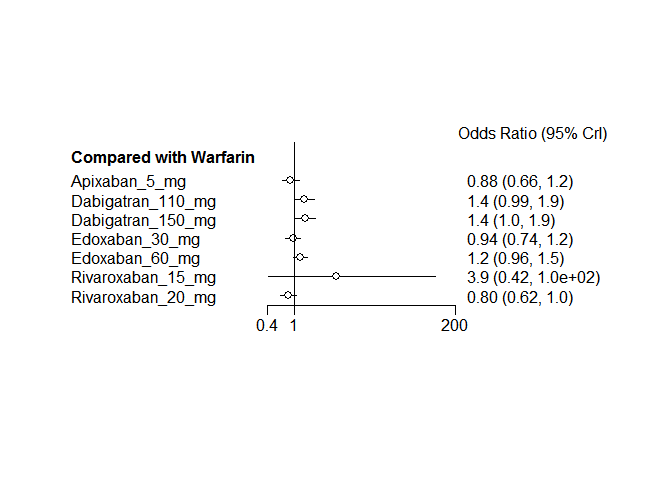

# Novel oral anticoagulants network meta-analysis: MI
Benjamin Chan  
`r Sys.time()`  


Clean up the data (do not show the code).


```
## Warning in `[.data.table`(D, , `:=`(study = NA_character_, noac =
## NA_character_)): Invalid .internal.selfref detected and fixed by taking
## a (shallow) copy of the data.table so that := can add this new column by
## reference. At an earlier point, this data.table has been copied by R (or
## been created manually using structure() or similar). Avoid key<-, names<-
## and attr<- which in R currently (and oddly) may copy the whole data.table.
## Use set* syntax instead to avoid copying: ?set, ?setnames and ?setattr.
## Also, in R<=v3.0.2, list(DT1,DT2) copied the entire DT1 and DT2 (R's list()
## used to copy named objects); please upgrade to R>v3.0.2 if that is biting.
## If this message doesn't help, please report to datatable-help so the root
## cause can be fixed.
```

```
##              study         treatment responders sampleSize
##  1:      ARISTOTLE     Apixaban_5_mg         90       9120
##  2:      ARISTOTLE          Warfarin        102       9081
##  3:    ARISTOTLE-J     Apixaban_5_mg          0         72
##  4:    ARISTOTLE-J          Warfarin          0         75
##  5: ENGAGE AF-TIMI    Edoxaban_30_mg        133       7034
##  6: ENGAGE AF-TIMI    Edoxaban_60_mg        169       7035
##  7: ENGAGE AF-TIMI          Warfarin        141       7036
##  8:       J-ROCKET Rivaroxaban_15_mg          3        639
##  9:       J-ROCKET          Warfarin          1        639
## 10:          RE-LY Dabigatran_110_mg         86       6015
## 11:          RE-LY Dabigatran_150_mg         89       6076
## 12:          RE-LY          Warfarin         63       6022
## 13:      ROCKET-AF Rivaroxaban_20_mg        101       7131
## 14:      ROCKET-AF          Warfarin        126       7133
```

# Network plot


```r
plot(network)
```

 

Run the model.


```r
M <- mtc.model(network, type="consistency", linearModel="random")
runtime <- system.time(results <- mtc.run(M, n.adapt=nAdapt, n.iter=nIter, thin=thin))
```

# Summary


```r
summary(results)
```

```
## $measure
## [1] "Log Odds Ratio"
## 
## $summaries
## 
## Iterations = 5010:25000
## Thinning interval = 10 
## Number of chains = 4 
## Sample size per chain = 2000 
## 
## 1. Empirical mean and standard deviation for each variable,
##    plus standard error of the mean:
## 
##                                  Mean     SD Naive SE Time-series SE
## d.Warfarin.Apixaban_5_mg     -0.11474 0.5090 0.005691       0.005833
## d.Warfarin.Dabigatran_110_mg  0.32445 0.5193 0.005805       0.005936
## d.Warfarin.Dabigatran_150_mg  0.35305 0.5108 0.005711       0.005721
## d.Warfarin.Edoxaban_30_mg    -0.05519 0.5023 0.005616       0.005751
## d.Warfarin.Edoxaban_60_mg     0.19590 0.5104 0.005706       0.005778
## d.Warfarin.Rivaroxaban_15_mg  1.39049 1.4247 0.015928       0.032711
## d.Warfarin.Rivaroxaban_20_mg -0.21274 0.5167 0.005777       0.005727
## sd.d                          0.42860 0.2422 0.002708       0.005567
## 
## 2. Quantiles for each variable:
## 
##                                  2.5%      25%      50%     75%  97.5%
## d.Warfarin.Apixaban_5_mg     -1.19353 -0.37497 -0.11926 0.13889 0.9542
## d.Warfarin.Dabigatran_110_mg -0.77010  0.05625  0.32399 0.58921 1.4201
## d.Warfarin.Dabigatran_150_mg -0.72265  0.08745  0.34534 0.62672 1.4396
## d.Warfarin.Edoxaban_30_mg    -1.12523 -0.30031 -0.05138 0.18555 1.0346
## d.Warfarin.Edoxaban_60_mg    -0.88001 -0.04564  0.19547 0.43606 1.3055
## d.Warfarin.Rivaroxaban_15_mg -1.09879  0.41291  1.26189 2.24123 4.4870
## d.Warfarin.Rivaroxaban_20_mg -1.32640 -0.47076 -0.21732 0.05141 0.9000
## sd.d                          0.02554  0.22085  0.42782 0.63776 0.8292
## 
## 
## $DIC
##     Dbar       pD      DIC 
## 12.33241 12.13520 24.46761 
## 
## attr(,"class")
## [1] "summary.mtc.result"
```

```r
forest(results)
```

 

# Diagnostics


```r
runtime
```

```
##    user  system elapsed 
##    9.01    0.02    9.39
```

Sampler diagnostics.


```r
gelman.plot(results)
```

 

```r
gelman.diag(results)
```

```
## Potential scale reduction factors:
## 
##                              Point est. Upper C.I.
## d.Warfarin.Apixaban_5_mg              1       1.00
## d.Warfarin.Dabigatran_110_mg          1       1.00
## d.Warfarin.Dabigatran_150_mg          1       1.00
## d.Warfarin.Edoxaban_30_mg             1       1.00
## d.Warfarin.Edoxaban_60_mg             1       1.00
## d.Warfarin.Rivaroxaban_15_mg          1       1.01
## d.Warfarin.Rivaroxaban_20_mg          1       1.00
## sd.d                                  1       1.00
## 
## Multivariate psrf
## 
## 1
```


```r
plot(results)
```

  

Assess the degree of heterogeneity and inconsistency.


```r
anohe <- mtc.anohe(network, n.adapt=nAdapt, n.iter=nIter, thin=thin)
```


```r
summary(anohe)
```

```
## Analysis of heterogeneity
## =========================
## 
## Per-comparison I-squared:
## -------------------------
## 
##                  t1                t2 i2.pair i2.cons incons.p
## 1     Apixaban_5_mg          Warfarin       0       0       NA
## 2 Dabigatran_110_mg Dabigatran_150_mg      NA      NA       NA
## 3 Dabigatran_110_mg          Warfarin      NA      NA       NA
## 4 Dabigatran_150_mg          Warfarin      NA      NA       NA
## 5    Edoxaban_30_mg    Edoxaban_60_mg      NA      NA       NA
## 6    Edoxaban_30_mg          Warfarin      NA      NA       NA
## 7    Edoxaban_60_mg          Warfarin      NA      NA       NA
## 8 Rivaroxaban_15_mg          Warfarin      NA      NA       NA
## 9 Rivaroxaban_20_mg          Warfarin      NA      NA       NA
## 
## Global I-squared:
## -------------------------
## 
##   i2.pair i2.cons
## 1       0       0
```

```r
plot(anohe)
```

```
## Analysis of heterogeneity -- convergence plots
## Unrelated Study Effects (USE) model:
```

  

```
## Unrelated Mean Effects (UME) model:
```

    

```
## Consistency model:
```

  
