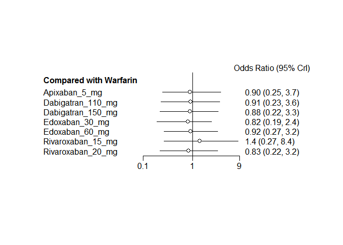
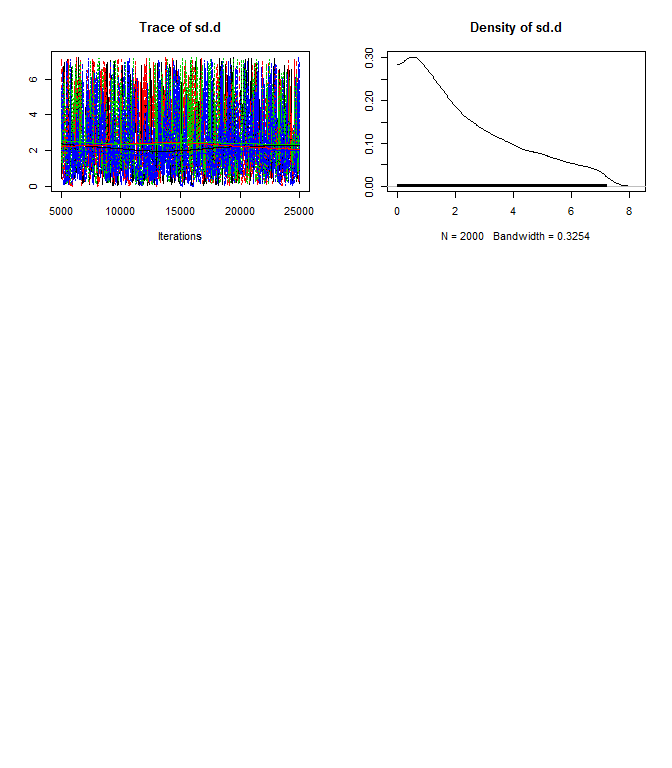
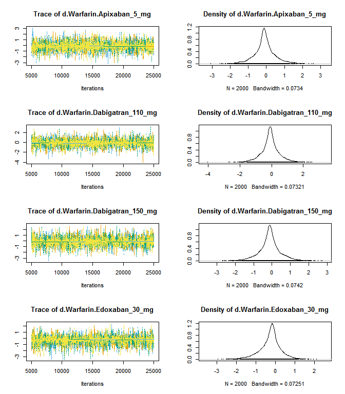
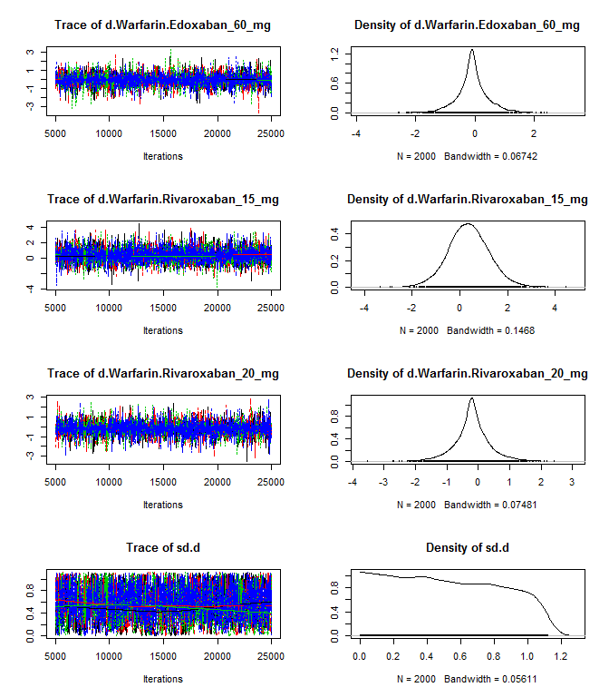

# Novel oral anticoagulants network meta-analysis: Mortality
Benjamin Chan  
`r Sys.time()`  


Clean up the data (do not show the code).


```
## Warning in `[.data.table`(D, , `:=`(study = NA_character_, noac =
## NA_character_)): Invalid .internal.selfref detected and fixed by taking
## a (shallow) copy of the data.table so that := can add this new column by
## reference. At an earlier point, this data.table has been copied by R (or
## been created manually using structure() or similar). Avoid key<-, names<-
## and attr<- which in R currently (and oddly) may copy the whole data.table.
## Use set* syntax instead to avoid copying: ?set, ?setnames and ?setattr.
## Also, in R<=v3.0.2, list(DT1,DT2) copied the entire DT1 and DT2 (R's list()
## used to copy named objects); please upgrade to R>v3.0.2 if that is biting.
## If this message doesn't help, please report to datatable-help so the root
## cause can be fixed.
```

```
##               study         treatment responders sampleSize
##  1:       ARISTOTLE     Apixaban_5_mg        603       9120
##  2:       ARISTOTLE          Warfarin        669       9081
##  3:     ARISTOTLE-J     Apixaban_5_mg          0         72
##  4:     ARISTOTLE-J          Warfarin          0         75
##  5:  ENGAGE AF-TIMI    Edoxaban_30_mg        737       7034
##  6:  ENGAGE AF-TIMI    Edoxaban_60_mg        773       7035
##  7:  ENGAGE AF-TIMI          Warfarin        839       7036
##  8:        J-ROCKET Rivaroxaban_15_mg          7        639
##  9:        J-ROCKET          Warfarin          5        639
## 10:           RE-LY Dabigatran_110_mg        446       6015
## 11:           RE-LY Dabigatran_150_mg        438       6076
## 12:           RE-LY          Warfarin        487       6022
## 13:       ROCKET-AF Rivaroxaban_20_mg        208       7131
## 14:       ROCKET-AF          Warfarin        250       7133
## 15: Yamashita, 2012    Edoxaban_30_mg          0        131
## 16: Yamashita, 2012    Edoxaban_60_mg          1        131
## 17: Yamashita, 2012          Warfarin          1        129
```

# Network plot


```r
plot(network)
```

 

Run the model.


```r
M <- mtc.model(network, type="consistency", linearModel="random")
runtime <- system.time(results <- mtc.run(M, n.adapt=nAdapt, n.iter=nIter, thin=thin))
```

# Summary


```r
summary(results)
```

```
## $measure
## [1] "Log Odds Ratio"
## 
## $summaries
## 
## Iterations = 5010:25000
## Thinning interval = 10 
## Number of chains = 4 
## Sample size per chain = 2000 
## 
## 1. Empirical mean and standard deviation for each variable,
##    plus standard error of the mean:
## 
##                                  Mean     SD Naive SE Time-series SE
## d.Warfarin.Apixaban_5_mg     -0.08895 0.6197 0.006929       0.007191
## d.Warfarin.Dabigatran_110_mg -0.08598 0.6208 0.006941       0.006887
## d.Warfarin.Dabigatran_150_mg -0.12620 0.6245 0.006982       0.007065
## d.Warfarin.Edoxaban_30_mg    -0.27732 0.5920 0.006619       0.007599
## d.Warfarin.Edoxaban_60_mg    -0.07342 0.5699 0.006372       0.006444
## d.Warfarin.Rivaroxaban_15_mg  0.35726 0.8621 0.009638       0.011639
## d.Warfarin.Rivaroxaban_20_mg -0.19071 0.6172 0.006900       0.006946
## sd.d                          0.53000 0.3225 0.003606       0.008999
## 
## 2. Quantiles for each variable:
## 
##                                  2.5%     25%      50%     75%  97.5%
## d.Warfarin.Apixaban_5_mg     -1.39838 -0.3620 -0.10740 0.18022 1.3195
## d.Warfarin.Dabigatran_110_mg -1.48003 -0.3555 -0.08989 0.18383 1.2706
## d.Warfarin.Dabigatran_150_mg -1.52716 -0.3928 -0.12220 0.15175 1.1882
## d.Warfarin.Edoxaban_30_mg    -1.66072 -0.5349 -0.20306 0.01142 0.8768
## d.Warfarin.Edoxaban_60_mg    -1.32200 -0.3347 -0.08609 0.18219 1.1680
## d.Warfarin.Rivaroxaban_15_mg -1.32396 -0.1992  0.34880 0.90724 2.1335
## d.Warfarin.Rivaroxaban_20_mg -1.52895 -0.4783 -0.18771 0.08956 1.1633
## sd.d                          0.02394  0.2472  0.51699 0.80054 1.0913
## 
## 
## $DIC
##     Dbar       pD      DIC 
## 14.72319 13.33811 28.06130 
## 
## attr(,"class")
## [1] "summary.mtc.result"
```

```r
forest(results)
```

 

# Diagnostics


```r
runtime
```

```
##    user  system elapsed 
##   10.87    0.06   12.49
```

Sampler diagnostics.


```r
gelman.plot(results)
```

 

```r
gelman.diag(results)
```

```
## Potential scale reduction factors:
## 
##                              Point est. Upper C.I.
## d.Warfarin.Apixaban_5_mg              1          1
## d.Warfarin.Dabigatran_110_mg          1          1
## d.Warfarin.Dabigatran_150_mg          1          1
## d.Warfarin.Edoxaban_30_mg             1          1
## d.Warfarin.Edoxaban_60_mg             1          1
## d.Warfarin.Rivaroxaban_15_mg          1          1
## d.Warfarin.Rivaroxaban_20_mg          1          1
## sd.d                                  1          1
## 
## Multivariate psrf
## 
## 1
```


```r
plot(results)
```

  

Assess the degree of heterogeneity and inconsistency.


```r
anohe <- mtc.anohe(network, n.adapt=nAdapt, n.iter=nIter, thin=thin)
```


```r
summary(anohe)
```

```
## Analysis of heterogeneity
## =========================
## 
## Per-comparison I-squared:
## -------------------------
## 
##                  t1                t2  i2.pair  i2.cons incons.p
## 1     Apixaban_5_mg          Warfarin  0.00000  0.00000       NA
## 2 Dabigatran_110_mg Dabigatran_150_mg       NA       NA       NA
## 3 Dabigatran_110_mg          Warfarin       NA       NA       NA
## 4 Dabigatran_150_mg          Warfarin       NA       NA       NA
## 5    Edoxaban_30_mg    Edoxaban_60_mg 74.19850 41.98531       NA
## 6    Edoxaban_30_mg          Warfarin 87.34399 43.61307       NA
## 7    Edoxaban_60_mg          Warfarin  0.00000  0.00000       NA
## 8 Rivaroxaban_15_mg          Warfarin       NA       NA       NA
## 9 Rivaroxaban_20_mg          Warfarin       NA       NA       NA
## 
## Global I-squared:
## -------------------------
## 
##    i2.pair i2.cons
## 1 2.248563       0
```

```r
plot(anohe)
```

```
## Analysis of heterogeneity -- convergence plots
## Unrelated Study Effects (USE) model:
```

    

```
## Unrelated Mean Effects (UME) model:
```

    

```
## Consistency model:
```

  
