# NOAC network meta-analysis: Mortality
Benjamin Chan  
`r Sys.time()`  


Clean up the data (do not show the code).


```
##              study         treatment responders sampleSize
##  1:          RE-LY Dabigatran_110_mg        446       6015
##  2:          RE-LY Dabigatran_150_mg        438       6076
##  3:          RE-LY          Warfarin        487       6022
##  4:      ARISTOTLE     Apixaban_5_mg        603       9120
##  5:      ARISTOTLE          Warfarin        669       9081
##  6:      ROCKET-AF Rivaroxaban_20_mg        208       7131
##  7:      ROCKET-AF          Warfarin        250       7133
##  8: ENGAGE AF-TIMI    Edoxaban_30_mg        737       7034
##  9: ENGAGE AF-TIMI    Edoxaban_60_mg        773       7035
## 10: ENGAGE AF-TIMI          Warfarin        839       7036
```

# Network plot


```r
plot(network)
```

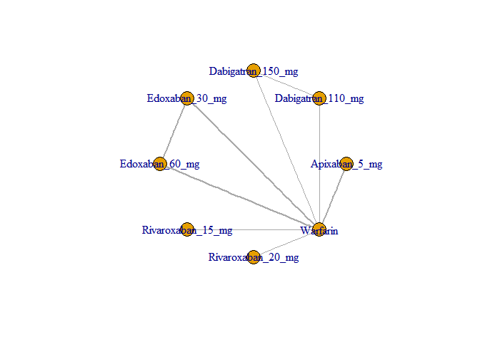 

Run the model using fixed-effects.


```r
M <- mtc.model(network, type="consistency", linearModel=effect)
runtime <- system.time(results <- mtc.run(M, n.adapt=nAdapt, n.iter=nIter, thin=thin))
```

# Summary


```r
pairwiseComparisons <- combineResults()
pairwiseComparisons[, .(label, result)]
```

```
##                                      label            result
##  1:     Dabigatran 110 mg vs Apixaban 5 mg 1.02 (0.86, 1.22)
##  2:     Dabigatran 150 mg vs Apixaban 5 mg 0.99 (0.83, 1.18)
##  3:        Edoxaban 30 mg vs Apixaban 5 mg 0.97 (0.83, 1.13)
##  4:        Edoxaban 60 mg vs Apixaban 5 mg 1.02 (0.88, 1.19)
##  5:     Rivaroxaban 20 mg vs Apixaban 5 mg 0.93 (0.75, 1.16)
##  6:              Warfarin vs Apixaban 5 mg 1.12 (1.00, 1.26)
##  7:     Apixaban 5 mg vs Dabigatran 110 mg 0.98 (0.82, 1.17)
##  8: Dabigatran 150 mg vs Dabigatran 110 mg 0.97 (0.84, 1.11)
##  9:    Edoxaban 30 mg vs Dabigatran 110 mg 0.95 (0.80, 1.13)
## 10:    Edoxaban 60 mg vs Dabigatran 110 mg 1.00 (0.84, 1.19)
## 11: Rivaroxaban 20 mg vs Dabigatran 110 mg 0.91 (0.72, 1.15)
## 12:          Warfarin vs Dabigatran 110 mg 1.10 (0.96, 1.26)
## 13:     Apixaban 5 mg vs Dabigatran 150 mg 1.01 (0.85, 1.20)
## 14: Dabigatran 110 mg vs Dabigatran 150 mg 1.03 (0.90, 1.18)
## 15:    Edoxaban 30 mg vs Dabigatran 150 mg 0.98 (0.83, 1.16)
## 16:    Edoxaban 60 mg vs Dabigatran 150 mg 1.03 (0.87, 1.22)
## 17: Rivaroxaban 20 mg vs Dabigatran 150 mg 0.94 (0.75, 1.18)
## 18:          Warfarin vs Dabigatran 150 mg 1.13 (0.99, 1.30)
## 19:        Apixaban 5 mg vs Edoxaban 30 mg 1.03 (0.89, 1.20)
## 20:    Dabigatran 110 mg vs Edoxaban 30 mg 1.05 (0.89, 1.25)
## 21:    Dabigatran 150 mg vs Edoxaban 30 mg 1.02 (0.86, 1.21)
## 22:       Edoxaban 60 mg vs Edoxaban 30 mg 1.05 (0.95, 1.17)
## 23:    Rivaroxaban 20 mg vs Edoxaban 30 mg 0.96 (0.78, 1.19)
## 24:             Warfarin vs Edoxaban 30 mg 1.16 (1.04, 1.28)
## 25:        Apixaban 5 mg vs Edoxaban 60 mg 0.98 (0.84, 1.14)
## 26:    Dabigatran 110 mg vs Edoxaban 60 mg 1.00 (0.84, 1.18)
## 27:    Dabigatran 150 mg vs Edoxaban 60 mg 0.97 (0.82, 1.15)
## 28:       Edoxaban 30 mg vs Edoxaban 60 mg 0.95 (0.85, 1.06)
## 29:    Rivaroxaban 20 mg vs Edoxaban 60 mg 0.91 (0.74, 1.13)
## 30:             Warfarin vs Edoxaban 60 mg 1.10 (0.99, 1.22)
## 31:     Apixaban 5 mg vs Rivaroxaban 20 mg 1.07 (0.86, 1.34)
## 32: Dabigatran 110 mg vs Rivaroxaban 20 mg 1.10 (0.87, 1.38)
## 33: Dabigatran 150 mg vs Rivaroxaban 20 mg 1.06 (0.85, 1.34)
## 34:    Edoxaban 30 mg vs Rivaroxaban 20 mg 1.04 (0.84, 1.29)
## 35:    Edoxaban 60 mg vs Rivaroxaban 20 mg 1.10 (0.88, 1.36)
## 36:          Warfarin vs Rivaroxaban 20 mg 1.20 (1.00, 1.45)
## 37:              Apixaban 5 mg vs Warfarin 0.89 (0.80, 1.00)
## 38:          Dabigatran 110 mg vs Warfarin 0.91 (0.79, 1.04)
## 39:          Dabigatran 150 mg vs Warfarin 0.88 (0.77, 1.01)
## 40:             Edoxaban 30 mg vs Warfarin 0.86 (0.78, 0.96)
## 41:             Edoxaban 60 mg vs Warfarin 0.91 (0.82, 1.01)
## 42:          Rivaroxaban 20 mg vs Warfarin 0.83 (0.69, 1.00)
##                                      label            result
```

```r
write.csv(pairwiseComparisons, file="mtcMortalityPairwiseComparisons.csv")
```

# Diagnostics


```r
runtime
```

```
##    user  system elapsed 
##    7.64    0.00    8.55
```

```r
summary(results)
```

```
## $measure
## [1] "Log Odds Ratio"
## 
## $summaries
## 
## Iterations = 5010:25000
## Thinning interval = 10 
## Number of chains = 4 
## Sample size per chain = 2000 
## 
## 1. Empirical mean and standard deviation for each variable,
##    plus standard error of the mean:
## 
##                                  Mean      SD  Naive SE Time-series SE
## d.Warfarin.Apixaban_5_mg     -0.11576 0.05799 0.0006484      0.0006693
## d.Warfarin.Dabigatran_110_mg -0.09335 0.06894 0.0007708      0.0008923
## d.Warfarin.Dabigatran_150_mg -0.12558 0.06866 0.0007677      0.0008004
## d.Warfarin.Edoxaban_30_mg    -0.14578 0.05302 0.0005928      0.0006960
## d.Warfarin.Edoxaban_60_mg    -0.09317 0.05303 0.0005929      0.0005994
## d.Warfarin.Rivaroxaban_20_mg -0.18626 0.09530 0.0010655      0.0010743
## 
## 2. Quantiles for each variable:
## 
##                                 2.5%     25%      50%      75%     97.5%
## d.Warfarin.Apixaban_5_mg     -0.2293 -0.1539 -0.11582 -0.07610 -0.002060
## d.Warfarin.Dabigatran_110_mg -0.2307 -0.1392 -0.09268 -0.04677  0.041388
## d.Warfarin.Dabigatran_150_mg -0.2626 -0.1723 -0.12528 -0.07957  0.011337
## d.Warfarin.Edoxaban_30_mg    -0.2481 -0.1812 -0.14615 -0.10990 -0.040562
## d.Warfarin.Edoxaban_60_mg    -0.1972 -0.1293 -0.09267 -0.05716  0.011027
## d.Warfarin.Rivaroxaban_20_mg -0.3723 -0.2513 -0.18630 -0.12185  0.004276
## 
## 
## $DIC
##      Dbar        pD       DIC 
##  9.942344  9.939321 19.881666 
## 
## attr(,"class")
## [1] "summary.mtc.result"
```

Sampler diagnostics.


```r
gelman.plot(results)
```

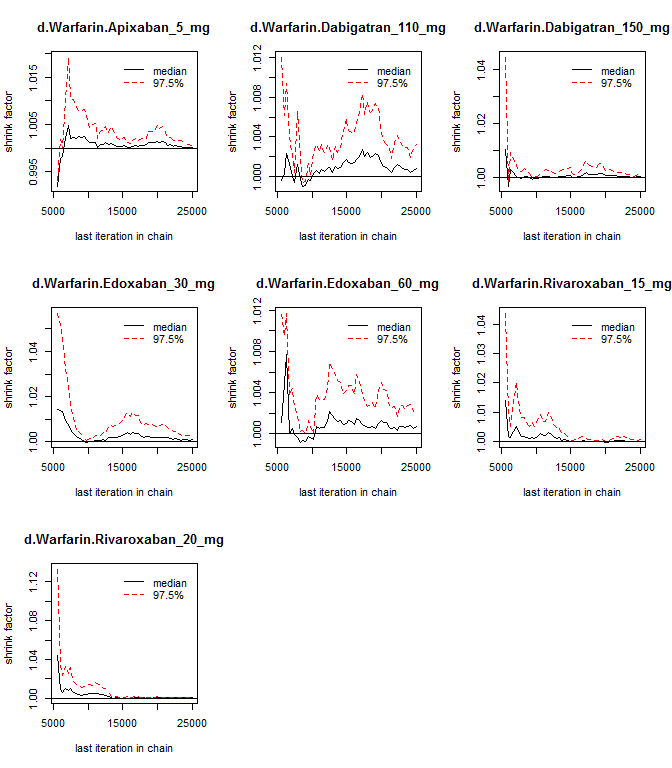 

```r
gelman.diag(results)
```

```
## Potential scale reduction factors:
## 
##                              Point est. Upper C.I.
## d.Warfarin.Apixaban_5_mg              1          1
## d.Warfarin.Dabigatran_110_mg          1          1
## d.Warfarin.Dabigatran_150_mg          1          1
## d.Warfarin.Edoxaban_30_mg             1          1
## d.Warfarin.Edoxaban_60_mg             1          1
## d.Warfarin.Rivaroxaban_20_mg          1          1
## 
## Multivariate psrf
## 
## 1
```


```r
plot(results)
```

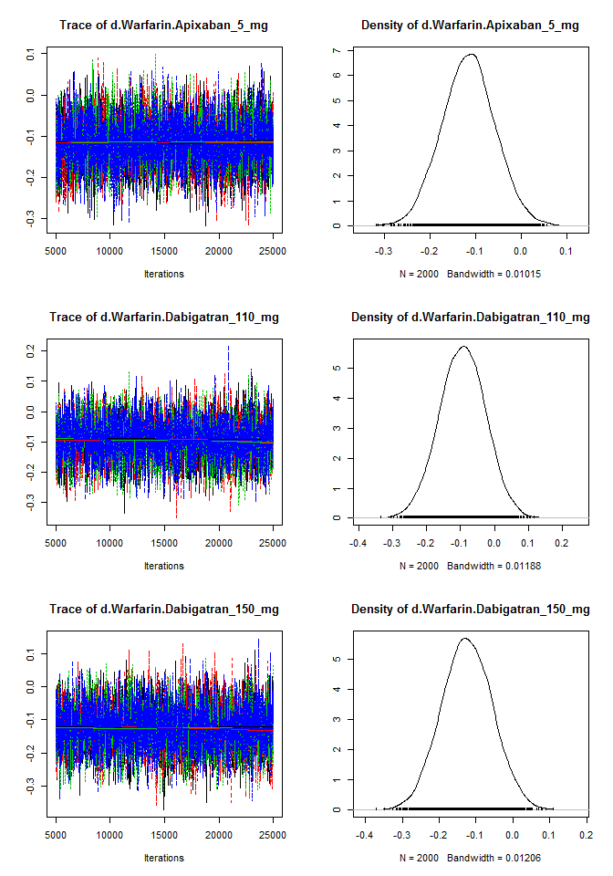 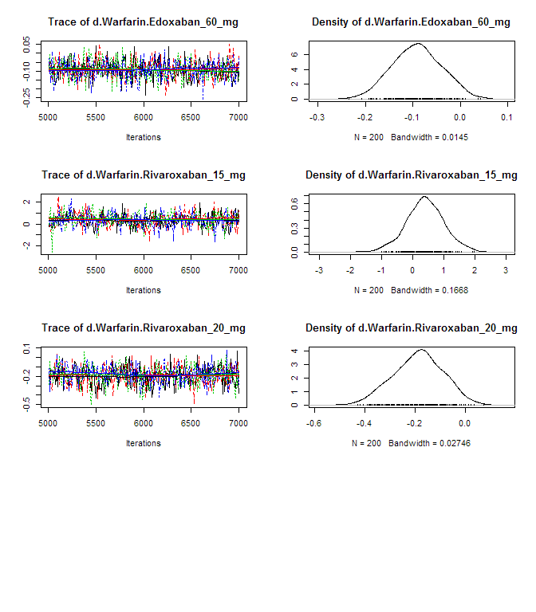 

Assess the degree of heterogeneity and inconsistency.


```r
anohe <- mtc.anohe(network, n.adapt=nAdapt, n.iter=nIter, thin=thin)
```


```r
summary(anohe)
```

```
## Analysis of heterogeneity
## =========================
## 
## Per-comparison I-squared:
## -------------------------
## 
##                  t1                t2 i2.pair i2.cons incons.p
## 1     Apixaban_5_mg          Warfarin      NA      NA       NA
## 2 Dabigatran_110_mg Dabigatran_150_mg      NA      NA       NA
## 3 Dabigatran_110_mg          Warfarin      NA      NA       NA
## 4 Dabigatran_150_mg          Warfarin      NA      NA       NA
## 5    Edoxaban_30_mg    Edoxaban_60_mg      NA      NA       NA
## 6    Edoxaban_30_mg          Warfarin      NA      NA       NA
## 7    Edoxaban_60_mg          Warfarin      NA      NA       NA
## 8 Rivaroxaban_20_mg          Warfarin      NA      NA       NA
## 
## Global I-squared:
## -------------------------
## 
##   i2.pair i2.cons
## 1       0       0
```

```r
plot(anohe)
```

```
## Analysis of heterogeneity -- convergence plots
## Unrelated Study Effects (USE) model:
```

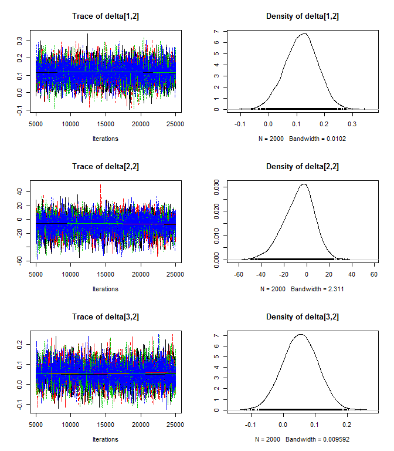 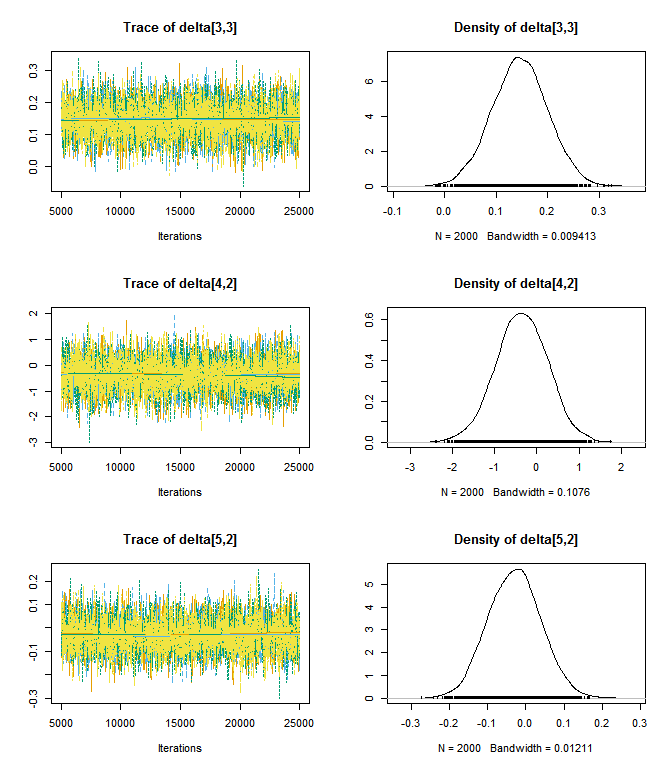 

```
## Unrelated Mean Effects (UME) model:
```

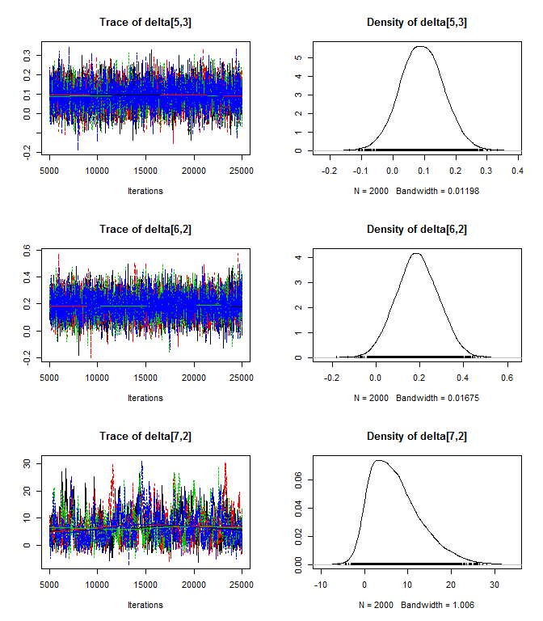 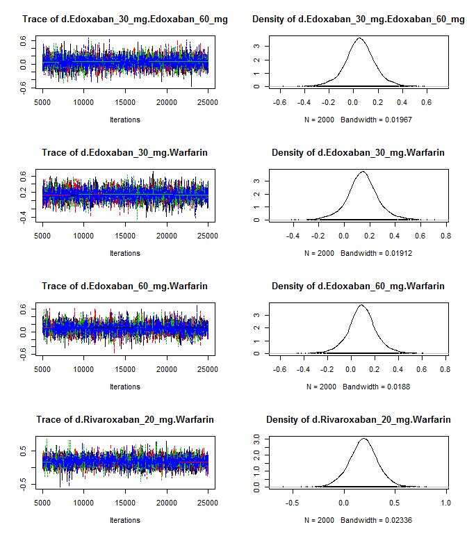 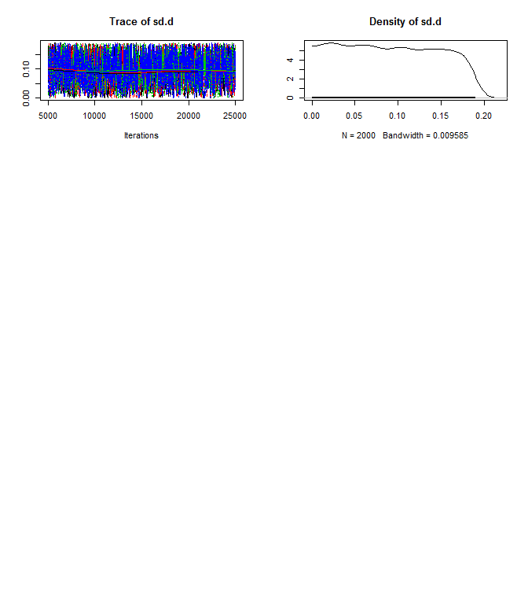 

```
## Consistency model:
```

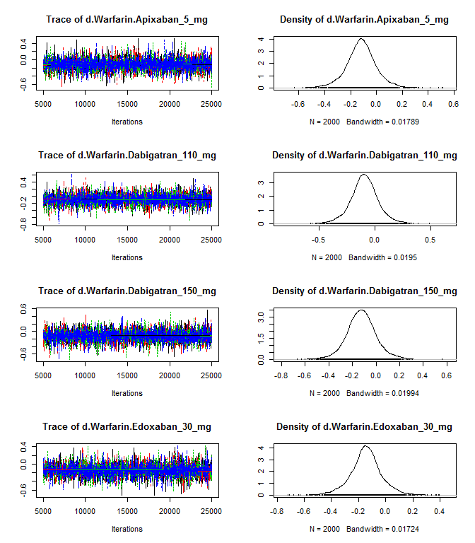 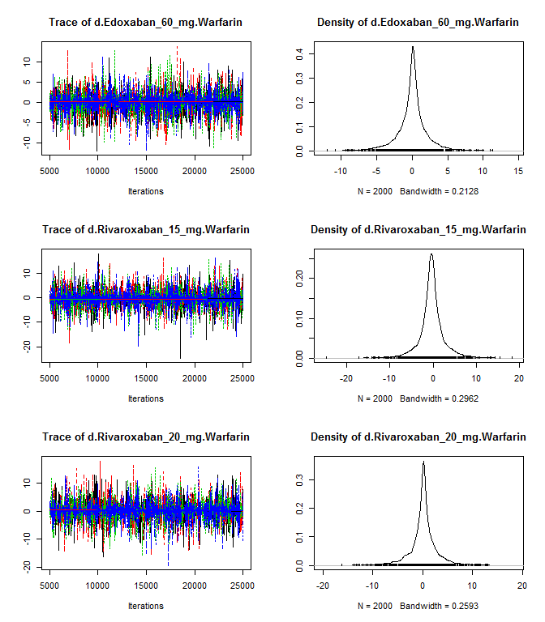 
