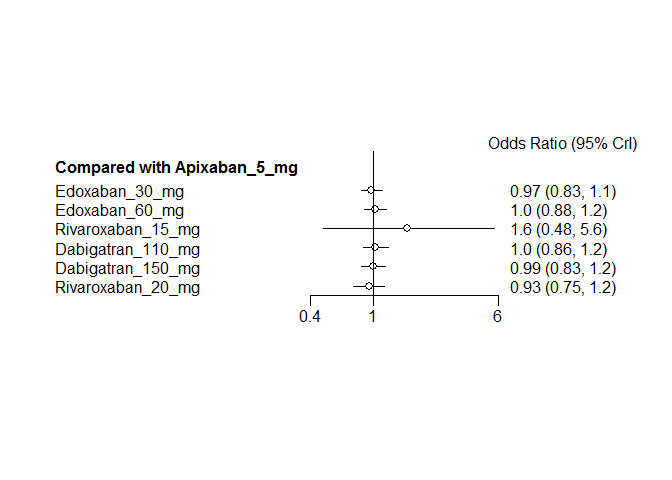
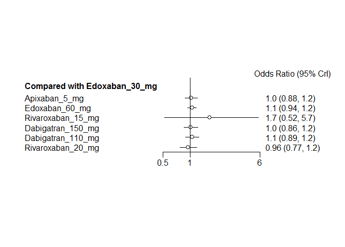
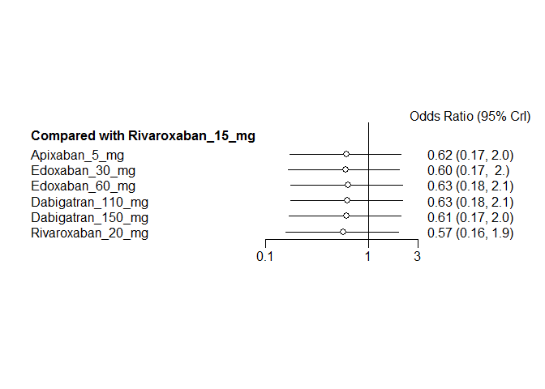
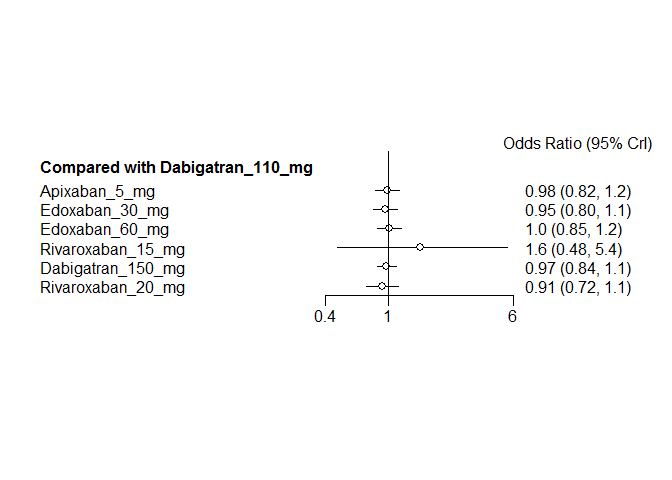
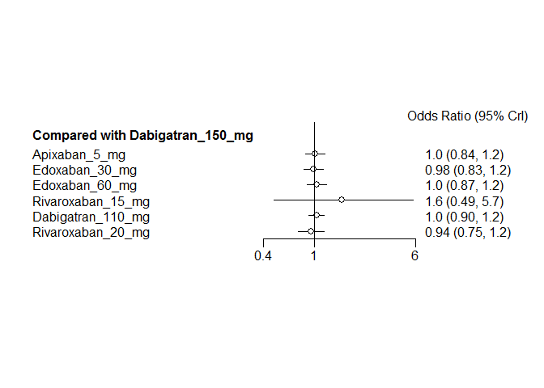
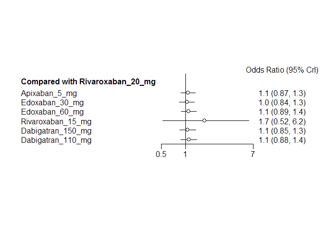
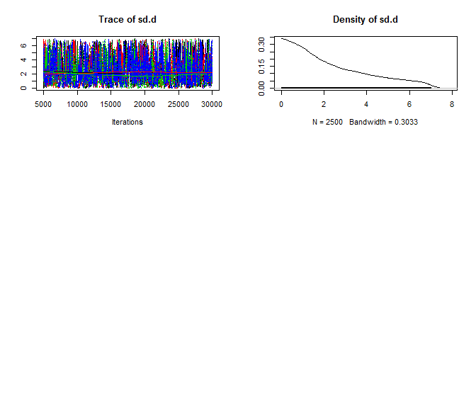
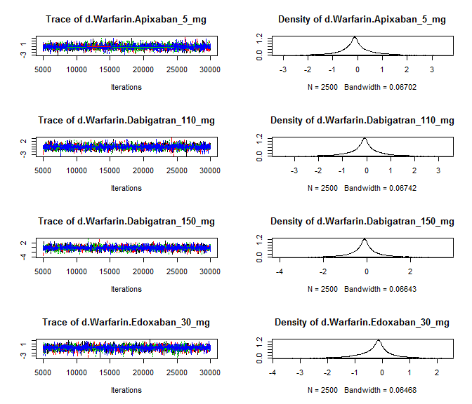

# NOAC network meta-analysis: Mortality
Benjamin Chan  
`r Sys.time()`  

[Back](README.md) to main page.

Read data.


```r
D <- readSheet("Mortality")
```

Tidy up the data and bias the warfarin arm of ROCKET-AF in favor of warfarin.


```r
D <- tidyData(D)
D <- biasROCKETAF()
write.csv(D, file="mtcMortalityData.csv", row.names=FALSE)
print(xtable(D, digits=rep(0, 5)), type="html", include.rownames=FALSE)
```

<!-- html table generated in R 3.2.2 by xtable 1.7-4 package -->
<!-- Thu Feb 18 10:56:36 2016 -->
<table border=1>
<tr> <th> study </th> <th> treatment </th> <th> responders </th> <th> sampleSize </th>  </tr>
  <tr> <td> ARISTOTLE </td> <td> Apixaban_5_mg </td> <td align="right"> 603 </td> <td align="right"> 9120 </td> </tr>
  <tr> <td> ARISTOTLE </td> <td> Warfarin </td> <td align="right"> 669 </td> <td align="right"> 9081 </td> </tr>
  <tr> <td> ARISTOTLE-J </td> <td> Apixaban_5_mg </td> <td align="right"> 0 </td> <td align="right"> 74 </td> </tr>
  <tr> <td> ARISTOTLE-J </td> <td> Warfarin </td> <td align="right"> 0 </td> <td align="right"> 74 </td> </tr>
  <tr> <td> ENGAGE AF-TIMI </td> <td> Edoxaban_30_mg </td> <td align="right"> 737 </td> <td align="right"> 7034 </td> </tr>
  <tr> <td> ENGAGE AF-TIMI </td> <td> Edoxaban_60_mg </td> <td align="right"> 773 </td> <td align="right"> 7035 </td> </tr>
  <tr> <td> ENGAGE AF-TIMI </td> <td> Warfarin </td> <td align="right"> 839 </td> <td align="right"> 7036 </td> </tr>
  <tr> <td> J-ROCKET </td> <td> Rivaroxaban_15_mg </td> <td align="right"> 7 </td> <td align="right"> 637 </td> </tr>
  <tr> <td> J-ROCKET </td> <td> Warfarin </td> <td align="right"> 5 </td> <td align="right"> 637 </td> </tr>
  <tr> <td> RE-LY </td> <td> Dabigatran_110_mg </td> <td align="right"> 446 </td> <td align="right"> 6015 </td> </tr>
  <tr> <td> RE-LY </td> <td> Dabigatran_150_mg </td> <td align="right"> 438 </td> <td align="right"> 6076 </td> </tr>
  <tr> <td> RE-LY </td> <td> Warfarin </td> <td align="right"> 487 </td> <td align="right"> 6022 </td> </tr>
  <tr> <td> ROCKET-AF </td> <td> Rivaroxaban_20_mg </td> <td align="right"> 208 </td> <td align="right"> 7061 </td> </tr>
  <tr> <td> ROCKET-AF </td> <td> Warfarin </td> <td align="right"> 225 </td> <td align="right"> 7062 </td> </tr>
  <tr> <td> Yamashita, 2012 </td> <td> Edoxaban_30_mg </td> <td align="right"> 0 </td> <td align="right"> 131 </td> </tr>
  <tr> <td> Yamashita, 2012 </td> <td> Edoxaban_60_mg </td> <td align="right"> 1 </td> <td align="right"> 131 </td> </tr>
  <tr> <td> Yamashita, 2012 </td> <td> Warfarin </td> <td align="right"> 1 </td> <td align="right"> 129 </td> </tr>
   </table>

```r
network <- mtc.network(D)
```

Run the model using fixed-effects.


```r
M <- mtc.model(network, type="consistency", linearModel=effect)
plot(M)
```

 

```r
results <- mtc.run(M, n.adapt=nAdapt, n.iter=nIter, thin=thin)
```

# Summary

Direct and indirect odds ratios and 95% confidence bounds are stored in
[mtcMortalityOddsRatios.csv](mtcMortalityOddsRatios.csv).


```r
or <- combineResults()
write.csv(or, file="mtcMortalityOddsRatios.csv", row.names=FALSE)
print(xtable(or), type="html", include.rownames=FALSE)
```

<!-- html table generated in R 3.2.2 by xtable 1.7-4 package -->
<!-- Thu Feb 18 10:56:55 2016 -->
<table border=1>
<tr> <th> treatment </th> <th> Apixaban 5 mg </th> <th> Dabigatran 110 mg </th> <th> Dabigatran 150 mg </th> <th> Edoxaban 30 mg </th> <th> Edoxaban 60 mg </th> <th> Rivaroxaban 15 mg </th> <th> Rivaroxaban 20 mg </th> <th> Warfarin </th>  </tr>
  <tr> <td> Apixaban 5 mg vs </td> <td>  </td> <td> 0.98 (0.82, 1.17) </td> <td> 1.01 (0.84, 1.20) </td> <td> 1.03 (0.88, 1.20) </td> <td> 0.98 (0.84, 1.14) </td> <td> 0.61 (0.18, 2.00) </td> <td> 0.96 (0.77, 1.21) </td> <td> 0.89 (0.79, 1.00) </td> </tr>
  <tr> <td> Dabigatran 110 mg vs </td> <td> 1.02 (0.86, 1.22) </td> <td>  </td> <td> 1.03 (0.90, 1.18) </td> <td> 1.05 (0.89, 1.25) </td> <td> 1.00 (0.84, 1.18) </td> <td> 0.62 (0.18, 2.05) </td> <td> 0.99 (0.78, 1.25) </td> <td> 0.91 (0.80, 1.04) </td> </tr>
  <tr> <td> Dabigatran 150 mg vs </td> <td> 0.99 (0.83, 1.18) </td> <td> 0.97 (0.85, 1.11) </td> <td>  </td> <td> 1.02 (0.86, 1.22) </td> <td> 0.97 (0.82, 1.15) </td> <td> 0.61 (0.18, 2.01) </td> <td> 0.96 (0.76, 1.21) </td> <td> 0.88 (0.77, 1.01) </td> </tr>
  <tr> <td> Edoxaban 30 mg vs </td> <td> 0.97 (0.83, 1.13) </td> <td> 0.95 (0.80, 1.12) </td> <td> 0.98 (0.82, 1.16) </td> <td>  </td> <td> 0.95 (0.85, 1.05) </td> <td> 0.59 (0.17, 1.92) </td> <td> 0.94 (0.75, 1.17) </td> <td> 0.86 (0.78, 0.96) </td> </tr>
  <tr> <td> Edoxaban 60 mg vs </td> <td> 1.02 (0.88, 1.19) </td> <td> 1.00 (0.85, 1.19) </td> <td> 1.03 (0.87, 1.23) </td> <td> 1.06 (0.95, 1.18) </td> <td>  </td> <td> 0.63 (0.19, 2.01) </td> <td> 0.99 (0.79, 1.24) </td> <td> 0.91 (0.82, 1.01) </td> </tr>
  <tr> <td> Rivaroxaban 15 mg vs </td> <td> 1.63 (0.50, 5.51) </td> <td> 1.60 (0.49, 5.50) </td> <td> 1.65 (0.50, 5.65) </td> <td> 1.68 (0.52, 5.73) </td> <td> 1.60 (0.50, 5.39) </td> <td>  </td> <td> 1.58 (0.48, 5.33) </td> <td> 1.45 (0.45, 4.95) </td> </tr>
  <tr> <td> Rivaroxaban 20 mg vs </td> <td> 1.04 (0.83, 1.30) </td> <td> 1.01 (0.80, 1.28) </td> <td> 1.04 (0.83, 1.32) </td> <td> 1.07 (0.86, 1.33) </td> <td> 1.01 (0.81, 1.26) </td> <td> 0.63 (0.19, 2.08) </td> <td>  </td> <td> 0.92 (0.76, 1.12) </td> </tr>
  <tr> <td> Warfarin vs </td> <td> 1.12 (1.00, 1.26) </td> <td> 1.10 (0.96, 1.26) </td> <td> 1.13 (0.99, 1.29) </td> <td> 1.16 (1.04, 1.29) </td> <td> 1.10 (0.99, 1.22) </td> <td> 0.69 (0.20, 2.22) </td> <td> 1.08 (0.89, 1.32) </td> <td>  </td> </tr>
   </table>

# Forest plots, NOAC vs NOAC


```r
noac <- unique(D[treatment != "Warfarin", treatment])
for (i in 1:length(noac)) {
  forest(relative.effect(results, noac[i], noac[1:length(noac) != i]))
}
```

       

# Diagnostics


```r
summary(results)
```

```
## $measure
## [1] "Log Odds Ratio"
## 
## $summaries
## 
## Iterations = 5010:30000
## Thinning interval = 10 
## Number of chains = 4 
## Sample size per chain = 2500 
## 
## 1. Empirical mean and standard deviation for each variable,
##    plus standard error of the mean:
## 
##                                  Mean      SD  Naive SE Time-series SE
## d.Warfarin.Apixaban_5_mg     -0.11648 0.05786 0.0005786      0.0005858
## d.Warfarin.Dabigatran_110_mg -0.09426 0.06920 0.0006920      0.0008005
## d.Warfarin.Dabigatran_150_mg -0.12469 0.06902 0.0006902      0.0007021
## d.Warfarin.Edoxaban_30_mg    -0.14706 0.05345 0.0005345      0.0006064
## d.Warfarin.Edoxaban_60_mg    -0.09188 0.05335 0.0005335      0.0005493
## d.Warfarin.Rivaroxaban_15_mg  0.37599 0.60890 0.0060890      0.0060898
## d.Warfarin.Rivaroxaban_20_mg -0.08069 0.09871 0.0009871      0.0009872
## 
## 2. Quantiles for each variable:
## 
##                                 2.5%      25%      50%      75%     97.5%
## d.Warfarin.Apixaban_5_mg     -0.2305 -0.15559 -0.11635 -0.07724 -0.003258
## d.Warfarin.Dabigatran_110_mg -0.2286 -0.14195 -0.09370 -0.04792  0.043860
## d.Warfarin.Dabigatran_150_mg -0.2571 -0.17089 -0.12517 -0.07811  0.010457
## d.Warfarin.Edoxaban_30_mg    -0.2546 -0.18321 -0.14690 -0.11081 -0.043600
## d.Warfarin.Edoxaban_60_mg    -0.1957 -0.12787 -0.09242 -0.05612  0.012096
## d.Warfarin.Rivaroxaban_15_mg -0.7997 -0.03827  0.37426  0.77959  1.599287
## d.Warfarin.Rivaroxaban_20_mg -0.2745 -0.14656 -0.08045 -0.01424  0.112580
## 
## 
## $DIC
##     Dbar       pD      DIC 
## 14.78821 13.16332 27.95153 
## 
## attr(,"class")
## [1] "summary.mtc.result"
```

Sampler diagnostics.


```r
gelman.plot(results)
```

 

```r
gelman.diag(results)
```

```
## Potential scale reduction factors:
## 
##                              Point est. Upper C.I.
## d.Warfarin.Apixaban_5_mg              1          1
## d.Warfarin.Dabigatran_110_mg          1          1
## d.Warfarin.Dabigatran_150_mg          1          1
## d.Warfarin.Edoxaban_30_mg             1          1
## d.Warfarin.Edoxaban_60_mg             1          1
## d.Warfarin.Rivaroxaban_15_mg          1          1
## d.Warfarin.Rivaroxaban_20_mg          1          1
## 
## Multivariate psrf
## 
## 1
```


```r
plot(results)
```

  


```r
autocorr.plot(results$samples)
```

    

Assess the degree of heterogeneity and inconsistency.


```r
anohe <- mtc.anohe(network, n.adapt=nAdapt, n.iter=nIter, thin=thin)
```


```r
summary(anohe)
```

```
## Analysis of heterogeneity
## =========================
## 
## Per-comparison I-squared:
## -------------------------
## 
##                  t1                t2  i2.pair  i2.cons incons.p
## 1     Apixaban_5_mg          Warfarin  0.00000  0.00000       NA
## 2 Dabigatran_110_mg Dabigatran_150_mg       NA       NA       NA
## 3 Dabigatran_110_mg          Warfarin       NA       NA       NA
## 4 Dabigatran_150_mg          Warfarin       NA       NA       NA
## 5    Edoxaban_30_mg    Edoxaban_60_mg 84.28650 30.53677       NA
## 6    Edoxaban_30_mg          Warfarin 85.29252 33.27377       NA
## 7    Edoxaban_60_mg          Warfarin  0.00000  0.00000       NA
## 8 Rivaroxaban_15_mg          Warfarin       NA       NA       NA
## 9 Rivaroxaban_20_mg          Warfarin       NA       NA       NA
## 
## Global I-squared:
## -------------------------
## 
##    i2.pair i2.cons
## 1 12.58355       0
```

```r
plot(anohe)
```

```
## Analysis of heterogeneity -- convergence plots
## Unrelated Study Effects (USE) model:
```

    

```
## Unrelated Mean Effects (UME) model:
```

    

```
## Consistency model:
```

  
