# NOAC network meta-analysis: Mortality
Benjamin Chan  
`r Sys.time()`  

[Back](README.md) to main page.

Clean up the data (do not show the code).


```
##              study         treatment responders sampleSize
##  1:          RE-LY Dabigatran_110_mg        446       6015
##  2:          RE-LY Dabigatran_150_mg        438       6076
##  3:          RE-LY          Warfarin        487       6022
##  4:      ARISTOTLE     Apixaban_5_mg        603       9120
##  5:      ARISTOTLE          Warfarin        669       9081
##  6:      ROCKET-AF Rivaroxaban_20_mg        208       7131
##  7:      ROCKET-AF          Warfarin        250       7133
##  8: ENGAGE AF-TIMI    Edoxaban_30_mg        737       7034
##  9: ENGAGE AF-TIMI    Edoxaban_60_mg        773       7035
## 10: ENGAGE AF-TIMI          Warfarin        839       7036
```

Run the model using fixed-effects.


```r
M <- mtc.model(network, type="consistency", linearModel=effect)
plot(M)
```

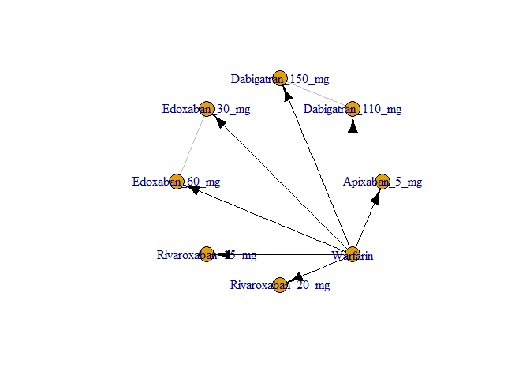 

```r
results <- mtc.run(M, n.adapt=nAdapt, n.iter=nIter, thin=thin)
```

# Summary

Direct and indirect odds ratios and 95% confidence bounds are stored in
[mtcMortalityOddsRatios.csv](mtcMortalityOddsRatios.csv).


```r
or <- combineResults()
write.csv(or, file="mtcMortalityOddsRatios.csv", row.names=FALSE)
show(or)
```

```
##               treatment     Apixaban 5 mg Dabigatran 110 mg
## 1:     Apixaban 5 mg vs                NA 0.98 (0.82, 1.16)
## 2: Dabigatran 110 mg vs 1.02 (0.86, 1.22)                NA
## 3: Dabigatran 150 mg vs 0.99 (0.83, 1.18) 0.97 (0.84, 1.11)
## 4:    Edoxaban 30 mg vs 0.97 (0.83, 1.13) 0.95 (0.80, 1.12)
## 5:    Edoxaban 60 mg vs 1.02 (0.88, 1.19) 1.00 (0.84, 1.18)
## 6: Rivaroxaban 20 mg vs 0.93 (0.75, 1.15) 0.91 (0.72, 1.15)
## 7:          Warfarin vs 1.12 (1.00, 1.26) 1.10 (0.96, 1.25)
##    Dabigatran 150 mg    Edoxaban 30 mg    Edoxaban 60 mg Rivaroxaban 20 mg
## 1: 1.01 (0.85, 1.20) 1.03 (0.88, 1.20) 0.98 (0.84, 1.14) 1.07 (0.87, 1.34)
## 2: 1.03 (0.90, 1.19) 1.05 (0.89, 1.25) 1.00 (0.85, 1.18) 1.10 (0.87, 1.39)
## 3:                NA 1.02 (0.86, 1.21) 0.97 (0.82, 1.15) 1.06 (0.85, 1.34)
## 4: 0.98 (0.82, 1.16)                NA 0.95 (0.85, 1.05) 1.04 (0.84, 1.29)
## 5: 1.03 (0.87, 1.22) 1.05 (0.95, 1.17)                NA 1.10 (0.89, 1.36)
## 6: 0.94 (0.74, 1.18) 0.96 (0.77, 1.19) 0.91 (0.74, 1.13)                NA
## 7: 1.13 (0.99, 1.30) 1.16 (1.04, 1.28) 1.10 (0.99, 1.22) 1.21 (1.00, 1.46)
##             Warfarin
## 1: 0.89 (0.80, 1.00)
## 2: 0.91 (0.80, 1.04)
## 3: 0.88 (0.77, 1.01)
## 4: 0.86 (0.78, 0.96)
## 5: 0.91 (0.82, 1.01)
## 6: 0.83 (0.69, 1.00)
## 7:                NA
```

# Diagnostics


```r
summary(results)
```

```
## $measure
## [1] "Log Odds Ratio"
## 
## $summaries
## 
## Iterations = 5010:30000
## Thinning interval = 10 
## Number of chains = 4 
## Sample size per chain = 2500 
## 
## 1. Empirical mean and standard deviation for each variable,
##    plus standard error of the mean:
## 
##                                  Mean      SD  Naive SE Time-series SE
## d.Warfarin.Apixaban_5_mg     -0.11530 0.05784 0.0005784      0.0005655
## d.Warfarin.Dabigatran_110_mg -0.09330 0.06809 0.0006809      0.0007607
## d.Warfarin.Dabigatran_150_mg -0.12611 0.06871 0.0006871      0.0007054
## d.Warfarin.Edoxaban_30_mg    -0.14576 0.05355 0.0005355      0.0006205
## d.Warfarin.Edoxaban_60_mg    -0.09331 0.05233 0.0005233      0.0005262
## d.Warfarin.Rivaroxaban_20_mg -0.18726 0.09502 0.0009502      0.0009535
## 
## 2. Quantiles for each variable:
## 
##                                 2.5%     25%      50%      75%     97.5%
## d.Warfarin.Apixaban_5_mg     -0.2293 -0.1543 -0.11510 -0.07649 -0.002051
## d.Warfarin.Dabigatran_110_mg -0.2249 -0.1396 -0.09382 -0.04738  0.041468
## d.Warfarin.Dabigatran_150_mg -0.2617 -0.1717 -0.12612 -0.08063  0.009039
## d.Warfarin.Edoxaban_30_mg    -0.2504 -0.1819 -0.14602 -0.10969 -0.040656
## d.Warfarin.Edoxaban_60_mg    -0.1955 -0.1277 -0.09319 -0.05882  0.011253
## d.Warfarin.Rivaroxaban_20_mg -0.3752 -0.2514 -0.18715 -0.12454 -0.001784
## 
## 
## $DIC
##      Dbar        pD       DIC 
##  9.926593  9.923058 19.849651 
## 
## attr(,"class")
## [1] "summary.mtc.result"
```

Sampler diagnostics.


```r
gelman.plot(results)
```

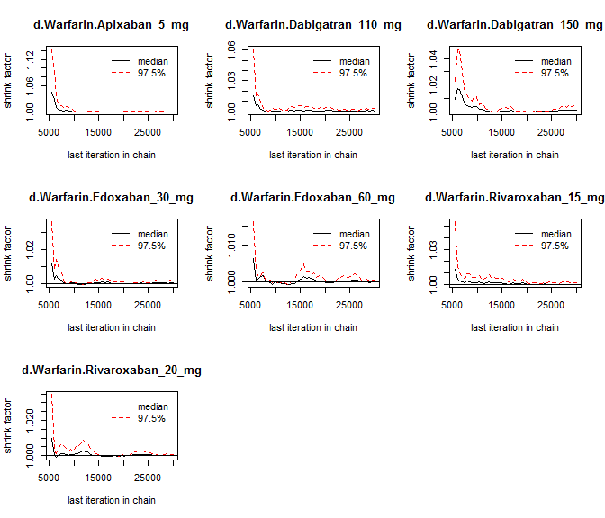 

```r
gelman.diag(results)
```

```
## Potential scale reduction factors:
## 
##                              Point est. Upper C.I.
## d.Warfarin.Apixaban_5_mg              1          1
## d.Warfarin.Dabigatran_110_mg          1          1
## d.Warfarin.Dabigatran_150_mg          1          1
## d.Warfarin.Edoxaban_30_mg             1          1
## d.Warfarin.Edoxaban_60_mg             1          1
## d.Warfarin.Rivaroxaban_20_mg          1          1
## 
## Multivariate psrf
## 
## 1
```


```r
plot(results)
```

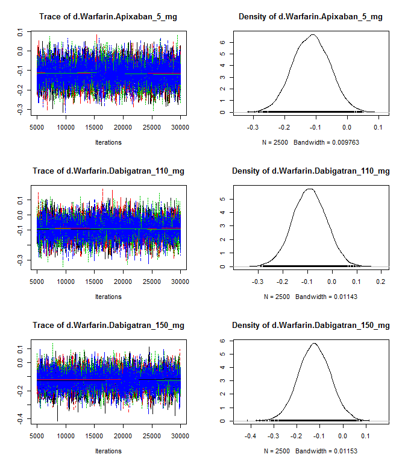 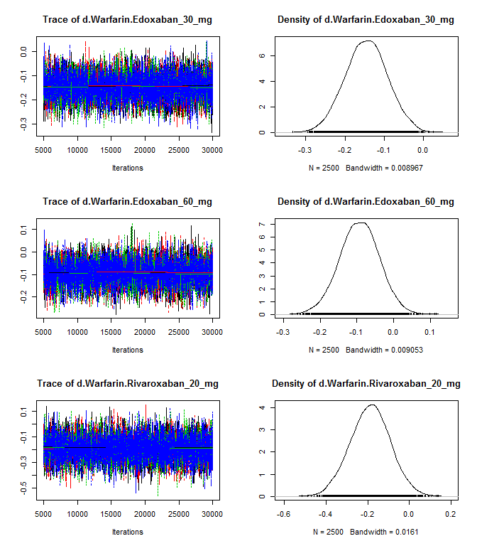 


```r
autocorr.plot(results$samples)
```

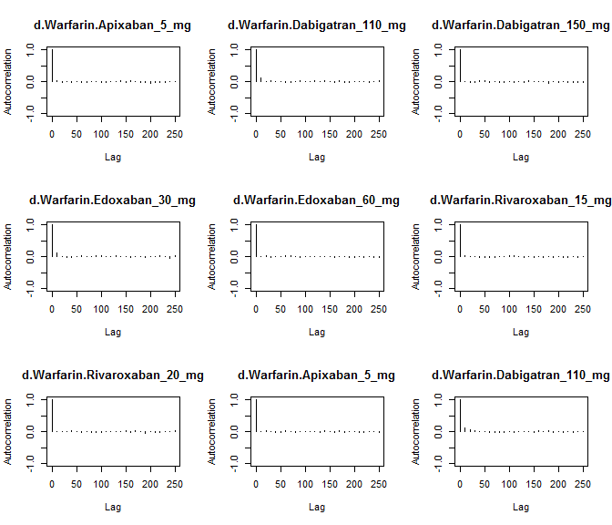 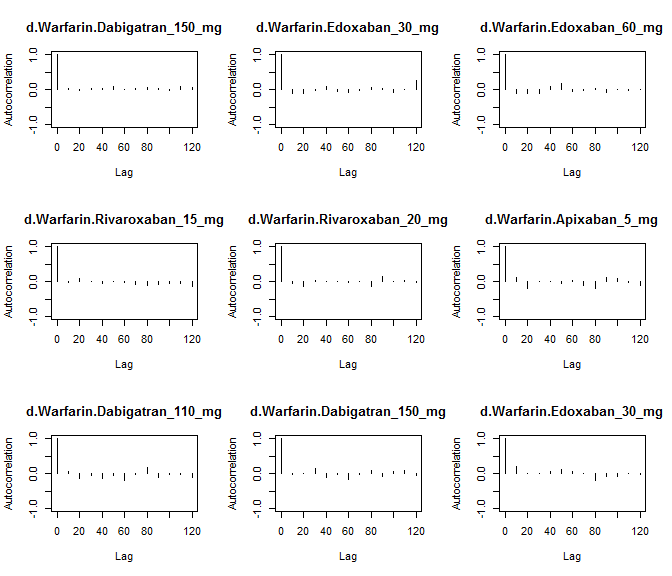 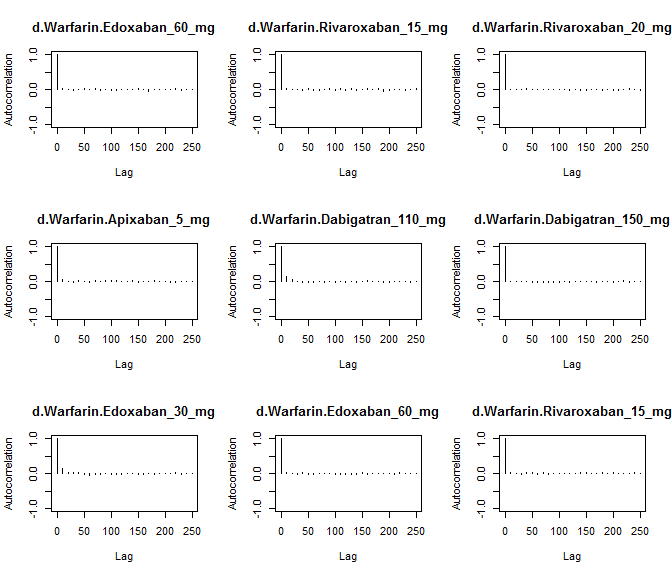 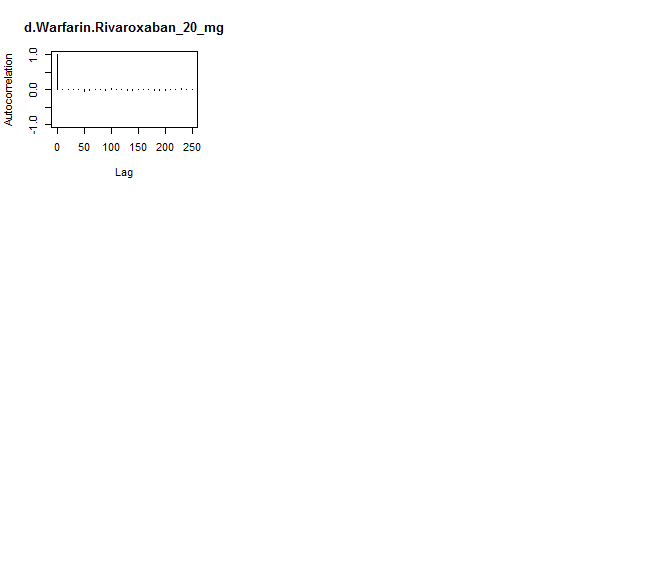 

Assess the degree of heterogeneity and inconsistency.


```r
anohe <- mtc.anohe(network, n.adapt=nAdapt, n.iter=nIter, thin=thin)
```


```r
summary(anohe)
```

```
## Analysis of heterogeneity
## =========================
## 
## Per-comparison I-squared:
## -------------------------
## 
##                  t1                t2 i2.pair i2.cons incons.p
## 1     Apixaban_5_mg          Warfarin      NA      NA       NA
## 2 Dabigatran_110_mg Dabigatran_150_mg      NA      NA       NA
## 3 Dabigatran_110_mg          Warfarin      NA      NA       NA
## 4 Dabigatran_150_mg          Warfarin      NA      NA       NA
## 5    Edoxaban_30_mg    Edoxaban_60_mg      NA      NA       NA
## 6    Edoxaban_30_mg          Warfarin      NA      NA       NA
## 7    Edoxaban_60_mg          Warfarin      NA      NA       NA
## 8 Rivaroxaban_20_mg          Warfarin      NA      NA       NA
## 
## Global I-squared:
## -------------------------
## 
##   i2.pair i2.cons
## 1       0       0
```

```r
plot(anohe)
```

```
## Analysis of heterogeneity -- convergence plots
## Unrelated Study Effects (USE) model:
```

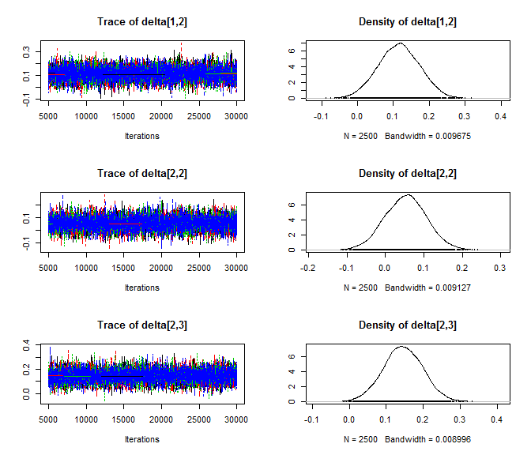 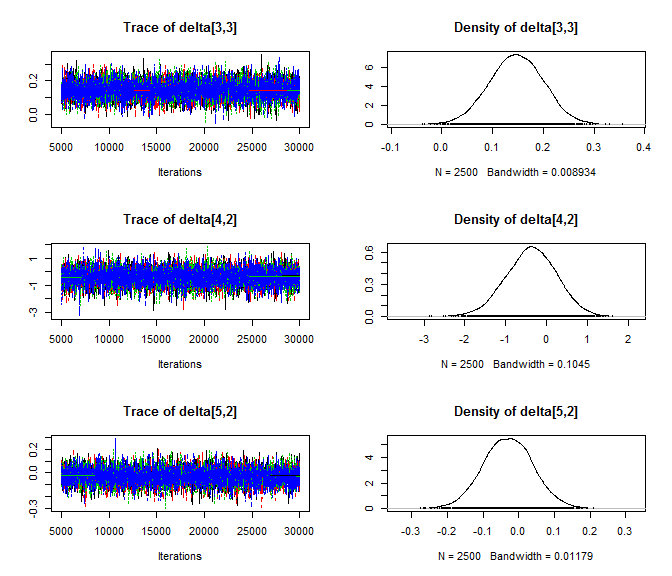 

```
## Unrelated Mean Effects (UME) model:
```

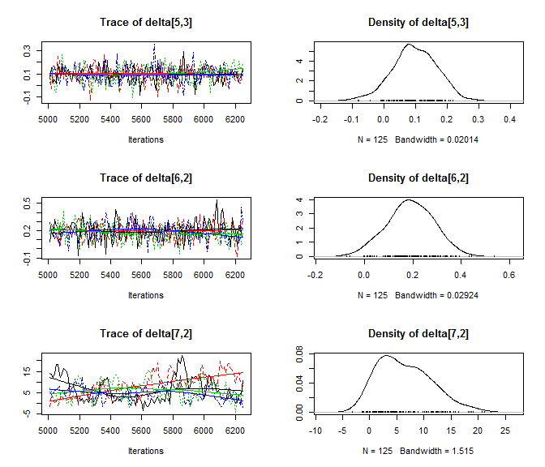 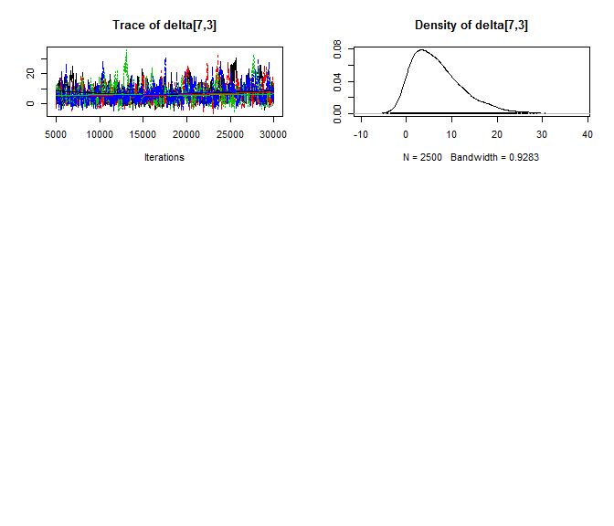 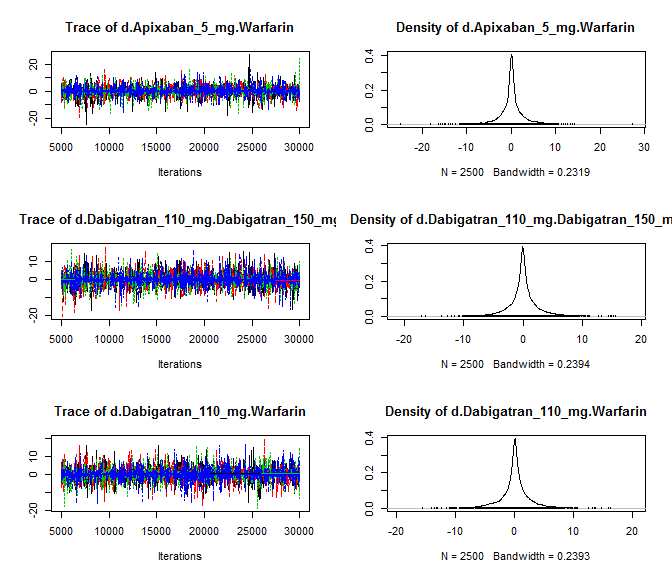 

```
## Consistency model:
```

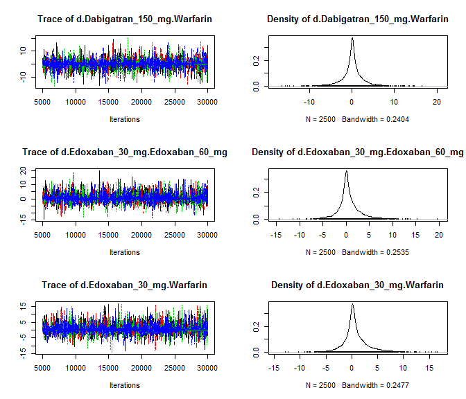 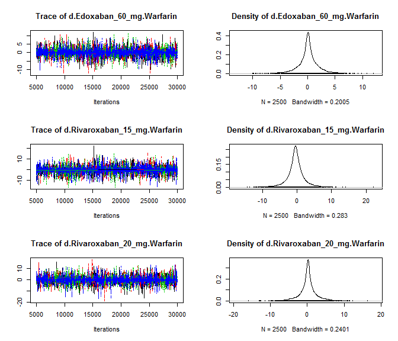 
