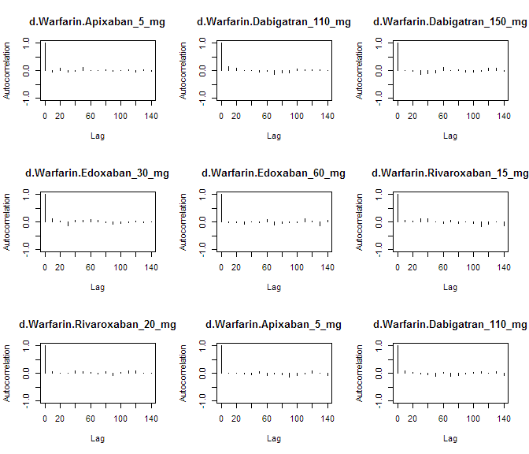
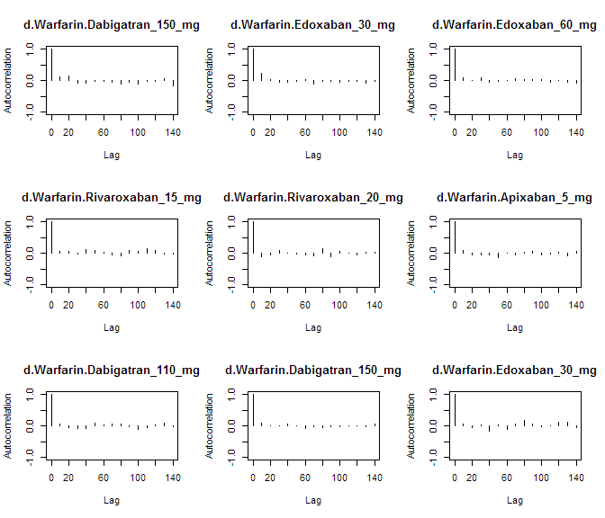
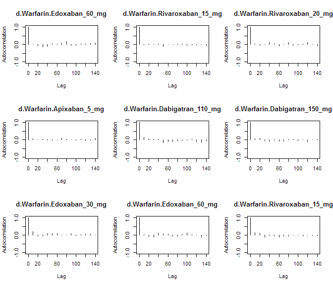
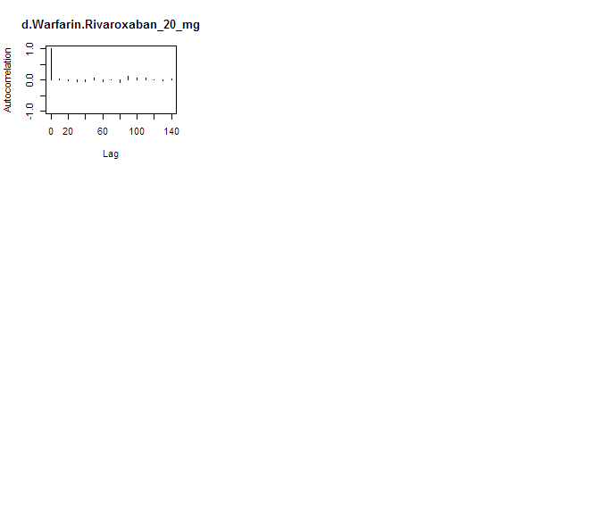

# NOAC network meta-analysis: Mortality
Benjamin Chan  
`r Sys.time()`  


Clean up the data (do not show the code).


```
##               study         treatment responders sampleSize
##  1:       ARISTOTLE     Apixaban_5_mg        603       9120
##  2:       ARISTOTLE          Warfarin        669       9081
##  3:     ARISTOTLE-J     Apixaban_5_mg          0         72
##  4:     ARISTOTLE-J          Warfarin          0         75
##  5:  ENGAGE AF-TIMI    Edoxaban_30_mg        737       7034
##  6:  ENGAGE AF-TIMI    Edoxaban_60_mg        773       7035
##  7:  ENGAGE AF-TIMI          Warfarin        839       7036
##  8:        J-ROCKET Rivaroxaban_15_mg          7        639
##  9:        J-ROCKET          Warfarin          5        639
## 10:           RE-LY Dabigatran_110_mg        446       6015
## 11:           RE-LY Dabigatran_150_mg        438       6076
## 12:           RE-LY          Warfarin        487       6022
## 13:       ROCKET-AF Rivaroxaban_20_mg        208       7131
## 14:       ROCKET-AF          Warfarin        250       7133
## 15: Yamashita, 2012    Edoxaban_30_mg          0        131
## 16: Yamashita, 2012    Edoxaban_60_mg          1        131
## 17: Yamashita, 2012          Warfarin          1        129
```

Run the model using fixed-effects.


```r
M <- mtc.model(network, type="consistency", linearModel=effect)
plot(M)
```

 

```r
results <- mtc.run(M, n.adapt=nAdapt, n.iter=nIter, thin=thin)
```

# Summary

Direct and indirect odds ratios and 95% confidence bounds are stored in
[mtcMortalityOddsRatios.csv](mtcMortalityOddsRatios.csv).


```r
or <- combineResults()
write.csv(or, file="mtcMortalityOddsRatios.csv", row.names=FALSE)
show(or)
```

```
##               treatment     Apixaban 5 mg Dabigatran 110 mg
## 1:     Apixaban 5 mg vs                NA 0.98 (0.83, 1.18)
## 2: Dabigatran 110 mg vs 1.02 (0.85, 1.20)                NA
## 3: Dabigatran 150 mg vs 0.99 (0.82, 1.16) 0.97 (0.84, 1.11)
## 4:    Edoxaban 30 mg vs 0.97 (0.84, 1.13) 0.95 (0.80, 1.13)
## 5:    Edoxaban 60 mg vs 1.02 (0.88, 1.19) 1.01 (0.85, 1.18)
## 6: Rivaroxaban 15 mg vs 1.66 (0.47, 5.60) 1.65 (0.44, 5.82)
## 7: Rivaroxaban 20 mg vs 0.93 (0.74, 1.15) 0.91 (0.72, 1.14)
## 8:          Warfarin vs 1.12 (1.00, 1.27) 1.10 (0.97, 1.25)
##    Dabigatran 150 mg    Edoxaban 30 mg    Edoxaban 60 mg Rivaroxaban 15 mg
## 1: 1.01 (0.86, 1.21) 1.03 (0.89, 1.19) 0.98 (0.84, 1.14) 0.60 (0.18, 2.13)
## 2: 1.03 (0.90, 1.19) 1.06 (0.88, 1.25) 0.99 (0.84, 1.18) 0.61 (0.17, 2.25)
## 3:                NA 1.02 (0.85, 1.21) 0.97 (0.81, 1.14) 0.60 (0.17, 2.12)
## 4: 0.98 (0.83, 1.17)                NA 0.95 (0.85, 1.05) 0.58 (0.17, 2.03)
## 5: 1.03 (0.88, 1.24) 1.06 (0.95, 1.17)                NA 0.62 (0.18, 2.15)
## 6: 1.67 (0.47, 5.91) 1.72 (0.49, 5.95) 1.62 (0.47, 5.52)                NA
## 7: 0.95 (0.74, 1.16) 0.97 (0.76, 1.18) 0.92 (0.72, 1.13) 0.55 (0.16, 1.91)
## 8: 1.13 (1.00, 1.31) 1.16 (1.04, 1.29) 1.10 (1.00, 1.21) 0.68 (0.19, 2.45)
##    Rivaroxaban 20 mg          Warfarin
## 1: 1.07 (0.87, 1.35) 0.89 (0.79, 1.00)
## 2: 1.10 (0.88, 1.40) 0.91 (0.80, 1.04)
## 3: 1.06 (0.86, 1.35) 0.88 (0.76, 1.00)
## 4: 1.04 (0.84, 1.31) 0.86 (0.78, 0.96)
## 5: 1.09 (0.89, 1.38) 0.91 (0.83, 1.00)
## 6: 1.80 (0.52, 6.45) 1.47 (0.41, 5.19)
## 7:                NA 0.83 (0.68, 0.99)
## 8: 1.20 (1.01, 1.46)                NA
```

# Diagnostics


```r
summary(results)
```

```
## $measure
## [1] "Log Odds Ratio"
## 
## $summaries
## 
## Iterations = 5010:7000
## Thinning interval = 10 
## Number of chains = 4 
## Sample size per chain = 200 
## 
## 1. Empirical mean and standard deviation for each variable,
##    plus standard error of the mean:
## 
##                                  Mean      SD Naive SE Time-series SE
## d.Warfarin.Apixaban_5_mg     -0.11477 0.05837 0.002064       0.002066
## d.Warfarin.Dabigatran_110_mg -0.09559 0.06863 0.002426       0.002712
## d.Warfarin.Dabigatran_150_mg -0.12617 0.06836 0.002417       0.002511
## d.Warfarin.Edoxaban_30_mg    -0.14722 0.05325 0.001883       0.002167
## d.Warfarin.Edoxaban_60_mg    -0.09202 0.05208 0.001841       0.001725
## d.Warfarin.Rivaroxaban_15_mg  0.39045 0.62383 0.022056       0.022590
## d.Warfarin.Rivaroxaban_20_mg -0.18868 0.09862 0.003487       0.003403
## 
## 2. Quantiles for each variable:
## 
##                                 2.5%       25%      50%      75%
## d.Warfarin.Apixaban_5_mg     -0.2378 -0.156070 -0.11610 -0.07601
## d.Warfarin.Dabigatran_110_mg -0.2216 -0.141740 -0.09645 -0.04809
## d.Warfarin.Dabigatran_150_mg -0.2681 -0.174899 -0.12445 -0.07459
## d.Warfarin.Edoxaban_30_mg    -0.2524 -0.180907 -0.14925 -0.11270
## d.Warfarin.Edoxaban_60_mg    -0.1918 -0.127762 -0.09194 -0.05656
## d.Warfarin.Rivaroxaban_15_mg -0.8958 -0.003213  0.38578  0.79955
## d.Warfarin.Rivaroxaban_20_mg -0.3817 -0.252966 -0.18073 -0.12055
##                                   97.5%
## d.Warfarin.Apixaban_5_mg     -0.0002771
## d.Warfarin.Dabigatran_110_mg  0.0347015
## d.Warfarin.Dabigatran_150_mg -0.0029839
## d.Warfarin.Edoxaban_30_mg    -0.0386266
## d.Warfarin.Edoxaban_60_mg     0.0049820
## d.Warfarin.Rivaroxaban_15_mg  1.6468353
## d.Warfarin.Rivaroxaban_20_mg -0.0077212
## 
## 
## $DIC
##     Dbar       pD      DIC 
## 14.53320 12.90706 27.44026 
## 
## attr(,"class")
## [1] "summary.mtc.result"
```

Sampler diagnostics.


```r
gelman.plot(results)
```

 

```r
gelman.diag(results)
```

```
## Potential scale reduction factors:
## 
##                              Point est. Upper C.I.
## d.Warfarin.Apixaban_5_mg          0.999      1.001
## d.Warfarin.Dabigatran_110_mg      1.000      1.001
## d.Warfarin.Dabigatran_150_mg      0.999      1.001
## d.Warfarin.Edoxaban_30_mg         1.001      1.007
## d.Warfarin.Edoxaban_60_mg         0.998      0.999
## d.Warfarin.Rivaroxaban_15_mg      1.005      1.016
## d.Warfarin.Rivaroxaban_20_mg      1.003      1.013
## 
## Multivariate psrf
## 
## 1
```


```r
plot(results)
```

  


```r
autocorr.plot(results$samples)
```

    

Assess the degree of heterogeneity and inconsistency.


```r
anohe <- mtc.anohe(network, n.adapt=nAdapt, n.iter=nIter, thin=thin)
```


```r
summary(anohe)
```

```
## Analysis of heterogeneity
## =========================
## 
## Per-comparison I-squared:
## -------------------------
## 
##                  t1                t2  i2.pair  i2.cons incons.p
## 1     Apixaban_5_mg          Warfarin  0.00000  0.00000       NA
## 2 Dabigatran_110_mg Dabigatran_150_mg       NA       NA       NA
## 3 Dabigatran_110_mg          Warfarin       NA       NA       NA
## 4 Dabigatran_150_mg          Warfarin       NA       NA       NA
## 5    Edoxaban_30_mg    Edoxaban_60_mg 64.61220 22.69629       NA
## 6    Edoxaban_30_mg          Warfarin 48.85498 36.13614       NA
## 7    Edoxaban_60_mg          Warfarin  0.00000  0.00000       NA
## 8 Rivaroxaban_15_mg          Warfarin       NA       NA       NA
## 9 Rivaroxaban_20_mg          Warfarin       NA       NA       NA
## 
## Global I-squared:
## -------------------------
## 
##   i2.pair i2.cons
## 1       0       0
```

```r
plot(anohe)
```

```
## Analysis of heterogeneity -- convergence plots
## Unrelated Study Effects (USE) model:
```

    

```
## Unrelated Mean Effects (UME) model:
```

    

```
## Consistency model:
```

  
