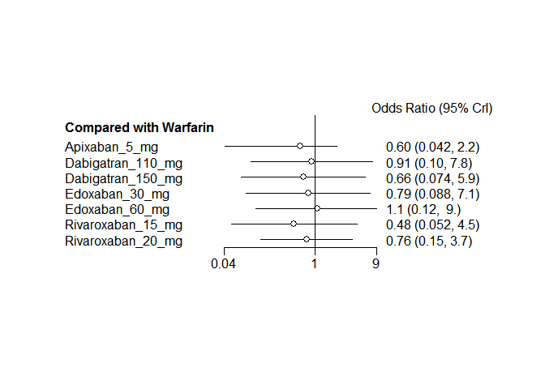

# Novel oral anticoagulants network meta-analysis: Stroke
Benjamin Chan  
`r Sys.time()`  


Clean up the data (do not show the code).


```
## Warning in `[.data.table`(D, , `:=`(study = NA_character_, noac =
## NA_character_)): Invalid .internal.selfref detected and fixed by taking
## a (shallow) copy of the data.table so that := can add this new column by
## reference. At an earlier point, this data.table has been copied by R (or
## been created manually using structure() or similar). Avoid key<-, names<-
## and attr<- which in R currently (and oddly) may copy the whole data.table.
## Use set* syntax instead to avoid copying: ?set, ?setnames and ?setattr.
## Also, in R<=v3.0.2, list(DT1,DT2) copied the entire DT1 and DT2 (R's list()
## used to copy named objects); please upgrade to R>v3.0.2 if that is biting.
## If this message doesn't help, please report to datatable-help so the root
## cause can be fixed.
```

```
##               study         treatment responders sampleSize
##  1:       ARISTOTLE     Apixaban_5_mg        212       9120
##  2:       ARISTOTLE          Warfarin        265       9081
##  3:     ARISTOTLE-J     Apixaban_5_mg          0         72
##  4:     ARISTOTLE-J          Warfarin          3         75
##  5:  ENGAGE AF-TIMI    Edoxaban_30_mg        182       7034
##  6:  ENGAGE AF-TIMI    Edoxaban_60_mg        253       7035
##  7:  ENGAGE AF-TIMI          Warfarin        232       7036
##  8:        J-ROCKET Rivaroxaban_15_mg         11        639
##  9:        J-ROCKET          Warfarin         22        639
## 10:       Mao, 2014 Rivaroxaban_20_mg          5        177
## 11:       Mao, 2014          Warfarin          7        176
## 12:           PETRO Dabigatran_150_mg          0        166
## 13:           PETRO          Warfarin          0         70
## 14:           RE-LY Dabigatran_110_mg        182       6015
## 15:           RE-LY Dabigatran_150_mg        134       6076
## 16:           RE-LY          Warfarin        199       6022
## 17:       ROCKET-AF Rivaroxaban_20_mg        188       7131
## 18:       ROCKET-AF          Warfarin        241       7133
## 19: Yamashita, 2012    Edoxaban_30_mg          0        131
## 20: Yamashita, 2012    Edoxaban_60_mg          0        131
## 21: Yamashita, 2012          Warfarin          0        129
##               study         treatment responders sampleSize
```

# Network plot


```r
plot(network)
```

 

Run the model.


```r
M <- mtc.model(network, type="consistency", linearModel="random")
runtime <- system.time(results <- mtc.run(M, n.adapt=nAdapt, n.iter=nIter, thin=thin))
```

# Summary


```r
summary(results)
```

```
## $measure
## [1] "Log Odds Ratio"
## 
## $summaries
## 
## Iterations = 5010:25000
## Thinning interval = 10 
## Number of chains = 4 
## Sample size per chain = 2000 
## 
## 1. Empirical mean and standard deviation for each variable,
##    plus standard error of the mean:
## 
##                                  Mean     SD Naive SE Time-series SE
## d.Warfarin.Apixaban_5_mg     -0.74384 0.9516 0.010639       0.016688
## d.Warfarin.Dabigatran_110_mg -0.09499 0.9883 0.011049       0.011259
## d.Warfarin.Dabigatran_150_mg -0.40758 0.9948 0.011122       0.011566
## d.Warfarin.Edoxaban_30_mg    -0.22558 0.9841 0.011003       0.012020
## d.Warfarin.Edoxaban_60_mg     0.07903 0.9678 0.010821       0.011126
## d.Warfarin.Rivaroxaban_15_mg -0.73992 1.0427 0.011658       0.012529
## d.Warfarin.Rivaroxaban_20_mg -0.28983 0.7510 0.008397       0.008247
## sd.d                          0.82866 0.5507 0.006157       0.016262
## 
## 2. Quantiles for each variable:
## 
##                                  2.5%     25%      50%      75%  97.5%
## d.Warfarin.Apixaban_5_mg     -3.17466 -1.1645 -0.51115 -0.19284 0.7688
## d.Warfarin.Dabigatran_110_mg -2.27195 -0.5048 -0.09738  0.31973 2.0489
## d.Warfarin.Dabigatran_150_mg -2.60627 -0.8116 -0.40949  0.00456 1.7701
## d.Warfarin.Edoxaban_30_mg    -2.43253 -0.6266 -0.23384  0.16188 1.9611
## d.Warfarin.Edoxaban_60_mg    -2.08451 -0.3173  0.08945  0.48605 2.1922
## d.Warfarin.Rivaroxaban_15_mg -2.95684 -1.2612 -0.74343 -0.22087 1.4936
## d.Warfarin.Rivaroxaban_20_mg -1.92321 -0.6280 -0.28044  0.04083 1.3171
## sd.d                          0.03681  0.3506  0.75577  1.27757 1.8780
## 
## 
## $DIC
##     Dbar       pD      DIC 
## 16.98191 14.86570 31.84761 
## 
## attr(,"class")
## [1] "summary.mtc.result"
```

```r
forest(results)
```

 

# Diagnostics


```r
runtime
```

```
##    user  system elapsed 
##   12.94    0.04   15.14
```

Sampler diagnostics.


```r
gelman.plot(results)
```

 

```r
gelman.diag(results)
```

```
## Potential scale reduction factors:
## 
##                              Point est. Upper C.I.
## d.Warfarin.Apixaban_5_mg              1       1.01
## d.Warfarin.Dabigatran_110_mg          1       1.00
## d.Warfarin.Dabigatran_150_mg          1       1.00
## d.Warfarin.Edoxaban_30_mg             1       1.00
## d.Warfarin.Edoxaban_60_mg             1       1.00
## d.Warfarin.Rivaroxaban_15_mg          1       1.00
## d.Warfarin.Rivaroxaban_20_mg          1       1.00
## sd.d                                  1       1.01
## 
## Multivariate psrf
## 
## 1
```


```r
plot(results)
```

  

Assess the degree of heterogeneity and inconsistency.


```r
anohe <- mtc.anohe(network, n.adapt=nAdapt, n.iter=nIter, thin=thin)
```


```r
summary(anohe)
```

```
## Analysis of heterogeneity
## =========================
## 
## Per-comparison I-squared:
## -------------------------
## 
##                  t1                t2  i2.pair  i2.cons incons.p
## 1     Apixaban_5_mg          Warfarin 98.66512 90.17567       NA
## 2 Dabigatran_110_mg Dabigatran_150_mg       NA       NA       NA
## 3 Dabigatran_110_mg          Warfarin       NA       NA       NA
## 4 Dabigatran_150_mg          Warfarin  0.00000  0.00000       NA
## 5    Edoxaban_30_mg    Edoxaban_60_mg  0.00000  0.00000       NA
## 6    Edoxaban_30_mg          Warfarin  0.00000  0.00000       NA
## 7    Edoxaban_60_mg          Warfarin  0.00000  0.00000       NA
## 8 Rivaroxaban_15_mg          Warfarin       NA       NA       NA
## 9 Rivaroxaban_20_mg          Warfarin  0.00000  0.00000       NA
## 
## Global I-squared:
## -------------------------
## 
##   i2.pair i2.cons
## 1 81.6021       0
```

```r
plot(anohe)
```

```
## Analysis of heterogeneity -- convergence plots
## Unrelated Study Effects (USE) model:
```

    

```
## Unrelated Mean Effects (UME) model:
```

    

```
## Consistency model:
```

  
