# NOAC network meta-analysis: Stroke
Benjamin Chan  
`r Sys.time()`  

[Back](README.md) to main page.

Clean up the data (do not show the code).


```
##               study         treatment responders sampleSize
##  1:       ARISTOTLE     Apixaban_5_mg        212       9120
##  2:       ARISTOTLE          Warfarin        265       9081
##  3:     ARISTOTLE-J     Apixaban_5_mg          0         72
##  4:     ARISTOTLE-J          Warfarin          3         75
##  5:  ENGAGE AF-TIMI    Edoxaban_30_mg        182       7034
##  6:  ENGAGE AF-TIMI    Edoxaban_60_mg        253       7035
##  7:  ENGAGE AF-TIMI          Warfarin        232       7036
##  8:        J-ROCKET Rivaroxaban_15_mg         11        639
##  9:        J-ROCKET          Warfarin         22        639
## 10:       Mao, 2014 Rivaroxaban_20_mg          5        177
## 11:       Mao, 2014          Warfarin          7        176
## 12:           PETRO Dabigatran_150_mg          0        166
## 13:           PETRO          Warfarin          0         70
## 14:           RE-LY Dabigatran_110_mg        182       6015
## 15:           RE-LY Dabigatran_150_mg        134       6076
## 16:           RE-LY          Warfarin        199       6022
## 17:       ROCKET-AF Rivaroxaban_20_mg        188       7131
## 18:       ROCKET-AF          Warfarin        241       7133
## 19: Yamashita, 2012    Edoxaban_30_mg          0        131
## 20: Yamashita, 2012    Edoxaban_60_mg          0        131
## 21: Yamashita, 2012          Warfarin          0        129
##               study         treatment responders sampleSize
```

Run the model using fixed-effects.


```r
M <- mtc.model(network, type="consistency", linearModel=effect)
plot(M)
```

 

```r
results <- mtc.run(M, n.adapt=nAdapt, n.iter=nIter, thin=thin)
```

# Summary

Direct and indirect odds ratios and 95% confidence bounds are stored in
[mtcStrokeOddsRatios.csv](mtcStrokeOddsRatios.csv).


```r
or <- combineResults()
write.csv(or, file="mtcStrokeOddsRatios.csv", row.names=FALSE)
show(or)
```

```
##               treatment     Apixaban 5 mg Dabigatran 110 mg
## 1:     Apixaban 5 mg vs                NA 0.85 (0.67, 1.11)
## 2: Dabigatran 110 mg vs 1.17 (0.90, 1.49)                NA
## 3: Dabigatran 150 mg vs 0.84 (0.60, 1.12) 0.71 (0.55, 0.91)
## 4:    Edoxaban 30 mg vs 1.00 (0.75, 1.30) 0.85 (0.63, 1.11)
## 5:    Edoxaban 60 mg vs 1.40 (1.06, 1.84) 1.20 (0.88, 1.54)
## 6: Rivaroxaban 15 mg vs 0.57 (0.28, 1.27) 0.49 (0.23, 1.08)
## 7: Rivaroxaban 20 mg vs 0.99 (0.76, 1.29) 0.83 (0.65, 1.11)
## 8:          Warfarin vs 1.28 (1.07, 1.54) 1.09 (0.89, 1.32)
##    Dabigatran 150 mg    Edoxaban 30 mg    Edoxaban 60 mg Rivaroxaban 15 mg
## 1: 1.20 (0.89, 1.66) 1.00 (0.77, 1.33) 0.71 (0.54, 0.94) 1.74 (0.79, 3.55)
## 2: 1.41 (1.10, 1.81) 1.17 (0.90, 1.59) 0.83 (0.65, 1.13) 2.03 (0.93, 4.29)
## 3:                NA 0.84 (0.61, 1.12) 0.60 (0.45, 0.81) 1.44 (0.65, 3.10)
## 4: 1.19 (0.90, 1.63)                NA 0.71 (0.58, 0.88) 1.73 (0.76, 3.65)
## 5: 1.67 (1.24, 2.21) 1.40 (1.14, 1.72)                NA 2.41 (1.04, 5.05)
## 6: 0.69 (0.32, 1.54) 0.58 (0.27, 1.32) 0.42 (0.20, 0.96)                NA
## 7: 1.18 (0.88, 1.63) 1.00 (0.76, 1.32) 0.70 (0.54, 0.94) 1.70 (0.75, 3.53)
## 8: 1.52 (1.22, 1.96) 1.28 (1.05, 1.57) 0.91 (0.76, 1.10) 2.20 (1.02, 4.53)
##    Rivaroxaban 20 mg          Warfarin
## 1: 1.01 (0.78, 1.32) 0.78 (0.65, 0.94)
## 2: 1.20 (0.90, 1.54) 0.92 (0.76, 1.12)
## 3: 0.84 (0.61, 1.13) 0.66 (0.51, 0.82)
## 4: 1.00 (0.76, 1.32) 0.78 (0.64, 0.95)
## 5: 1.42 (1.07, 1.84) 1.09 (0.91, 1.31)
## 6: 0.59 (0.28, 1.34) 0.46 (0.22, 0.98)
## 7:                NA 0.78 (0.64, 0.94)
## 8: 1.29 (1.07, 1.57)                NA
```

# Diagnostics


```r
summary(results)
```

```
## $measure
## [1] "Log Odds Ratio"
## 
## $summaries
## 
## Iterations = 5010:6250
## Thinning interval = 10 
## Number of chains = 4 
## Sample size per chain = 125 
## 
## 1. Empirical mean and standard deviation for each variable,
##    plus standard error of the mean:
## 
##                                  Mean      SD Naive SE Time-series SE
## d.Warfarin.Apixaban_5_mg     -0.24359 0.09448 0.004225       0.004216
## d.Warfarin.Dabigatran_110_mg -0.08588 0.10386 0.004645       0.004912
## d.Warfarin.Dabigatran_150_mg -0.42372 0.12271 0.005488       0.005901
## d.Warfarin.Edoxaban_30_mg    -0.24874 0.10286 0.004600       0.005905
## d.Warfarin.Edoxaban_60_mg     0.09048 0.09717 0.004346       0.004710
## d.Warfarin.Rivaroxaban_15_mg -0.76662 0.37956 0.016974       0.018260
## d.Warfarin.Rivaroxaban_20_mg -0.25533 0.09752 0.004361       0.004362
## 
## 2. Quantiles for each variable:
## 
##                                  2.5%     25%      50%     75%    97.5%
## d.Warfarin.Apixaban_5_mg     -0.43205 -0.3093 -0.24375 -0.1806 -0.06407
## d.Warfarin.Dabigatran_110_mg -0.27926 -0.1587 -0.08655 -0.0192  0.11701
## d.Warfarin.Dabigatran_150_mg -0.67246 -0.5060 -0.42150 -0.3373 -0.19984
## d.Warfarin.Edoxaban_30_mg    -0.45180 -0.3209 -0.24592 -0.1792 -0.05088
## d.Warfarin.Edoxaban_60_mg    -0.09653  0.0283  0.08949  0.1602  0.26979
## d.Warfarin.Rivaroxaban_15_mg -1.51109 -1.0205 -0.78730 -0.5183 -0.02397
## d.Warfarin.Rivaroxaban_20_mg -0.45251 -0.3198 -0.25128 -0.1950 -0.06652
## 
## 
## $DIC
##     Dbar       pD      DIC 
## 18.11485 14.51410 32.62895 
## 
## attr(,"class")
## [1] "summary.mtc.result"
```

Sampler diagnostics.


```r
gelman.plot(results)
```

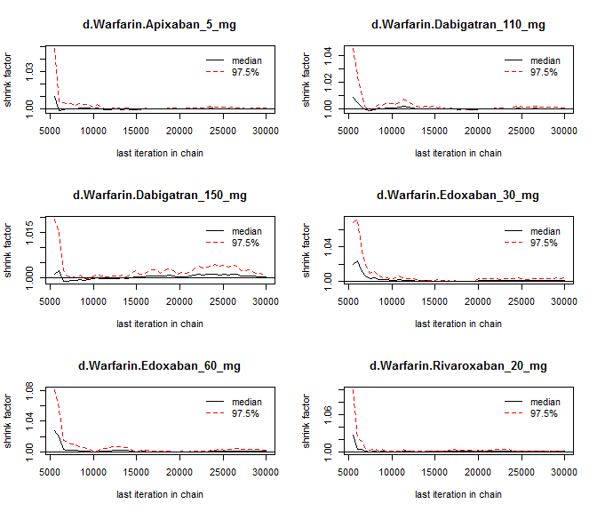 

```r
gelman.diag(results)
```

```
## Potential scale reduction factors:
## 
##                              Point est. Upper C.I.
## d.Warfarin.Apixaban_5_mg           1.01       1.02
## d.Warfarin.Dabigatran_110_mg       1.00       1.01
## d.Warfarin.Dabigatran_150_mg       1.00       1.00
## d.Warfarin.Edoxaban_30_mg          1.01       1.04
## d.Warfarin.Edoxaban_60_mg          1.01       1.02
## d.Warfarin.Rivaroxaban_15_mg       1.02       1.07
## d.Warfarin.Rivaroxaban_20_mg       1.00       1.01
## 
## Multivariate psrf
## 
## 1.02
```


```r
plot(results)
```

 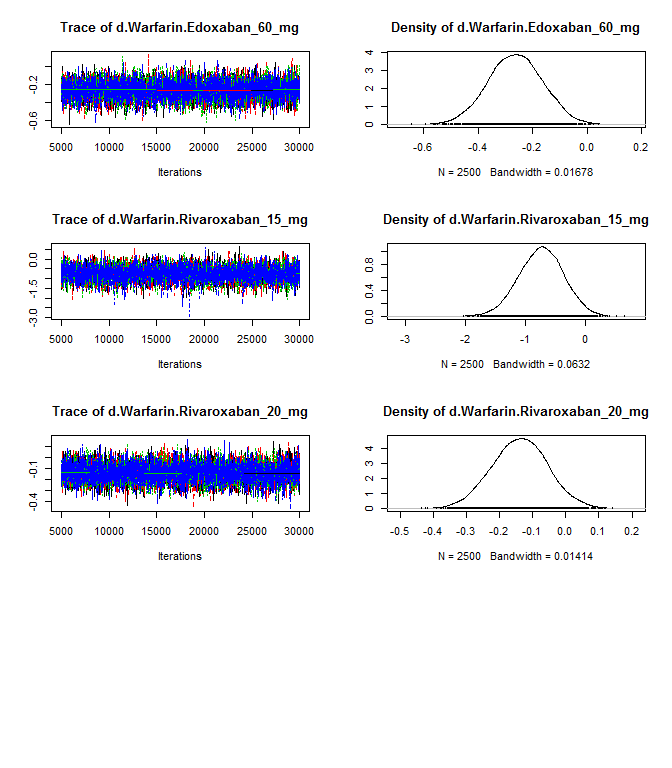 


```r
autocorr.plot(results$samples)
```

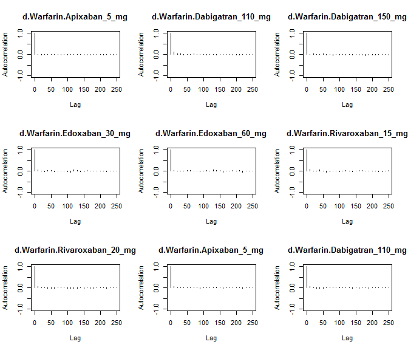 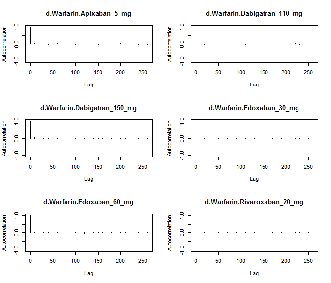 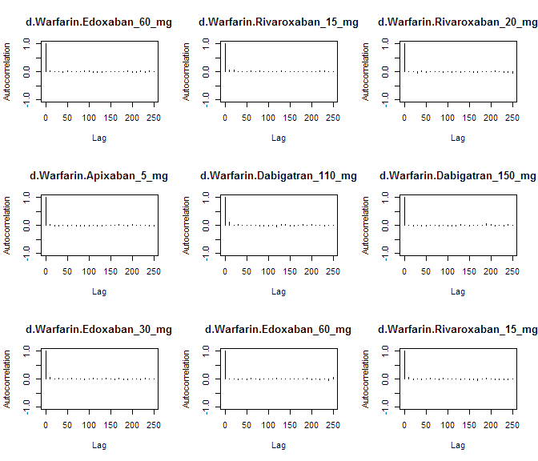 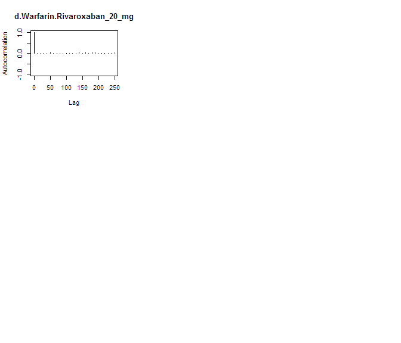 

Assess the degree of heterogeneity and inconsistency.


```r
anohe <- mtc.anohe(network, n.adapt=nAdapt, n.iter=nIter, thin=thin)
```


```r
summary(anohe)
```

```
## Analysis of heterogeneity
## =========================
## 
## Per-comparison I-squared:
## -------------------------
## 
##                  t1                t2  i2.pair  i2.cons incons.p
## 1     Apixaban_5_mg          Warfarin 95.47858 84.56688       NA
## 2 Dabigatran_110_mg Dabigatran_150_mg       NA       NA       NA
## 3 Dabigatran_110_mg          Warfarin       NA       NA       NA
## 4 Dabigatran_150_mg          Warfarin  0.00000  0.00000       NA
## 5    Edoxaban_30_mg    Edoxaban_60_mg  0.00000  0.00000       NA
## 6    Edoxaban_30_mg          Warfarin  0.00000  0.00000       NA
## 7    Edoxaban_60_mg          Warfarin  0.00000  0.00000       NA
## 8 Rivaroxaban_15_mg          Warfarin       NA       NA       NA
## 9 Rivaroxaban_20_mg          Warfarin  0.00000  0.00000       NA
## 
## Global I-squared:
## -------------------------
## 
##    i2.pair i2.cons
## 1 41.30961       0
```

```r
plot(anohe)
```

```
## Analysis of heterogeneity -- convergence plots
## Unrelated Study Effects (USE) model:
```

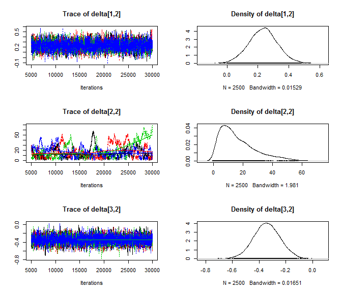 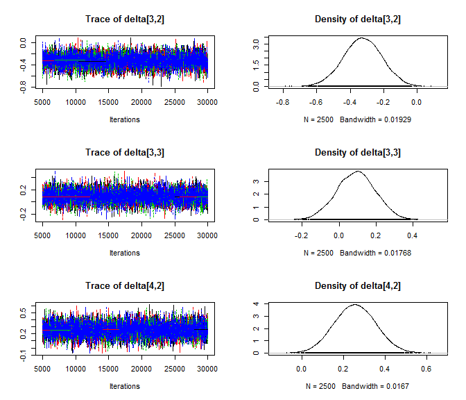  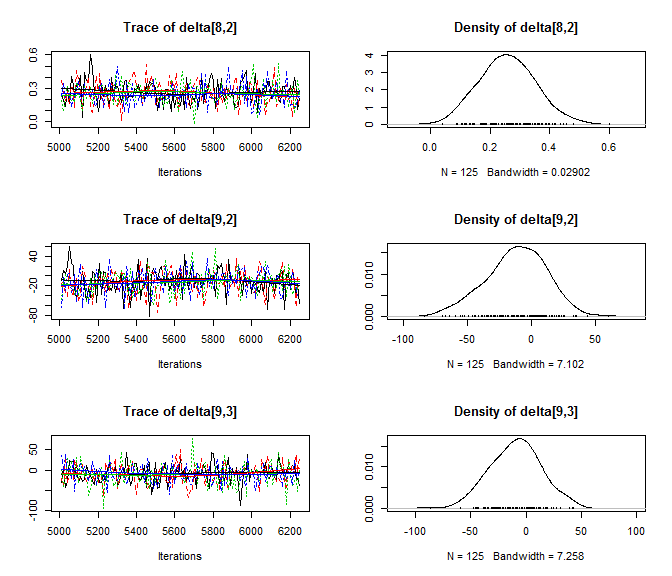 

```
## Unrelated Mean Effects (UME) model:
```

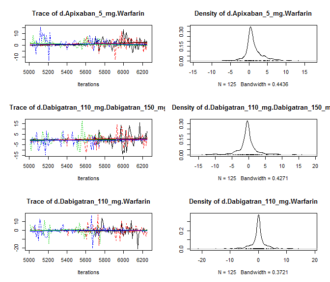 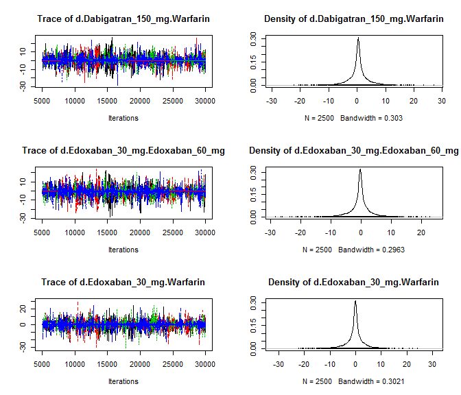 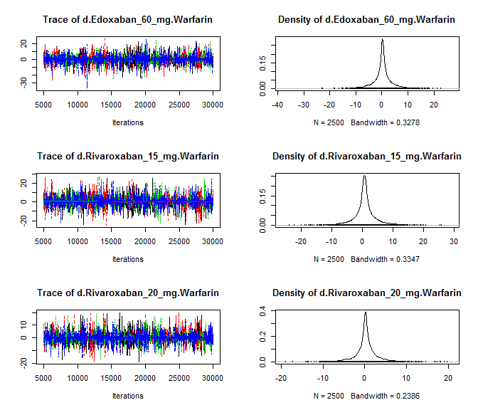 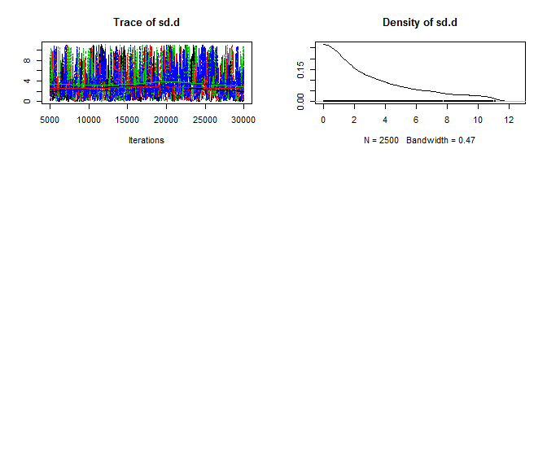 

```
## Consistency model:
```

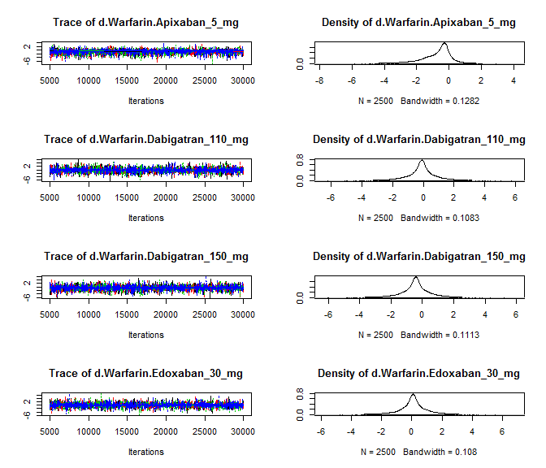 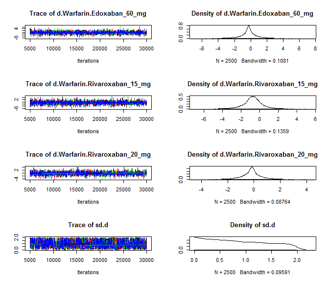 
