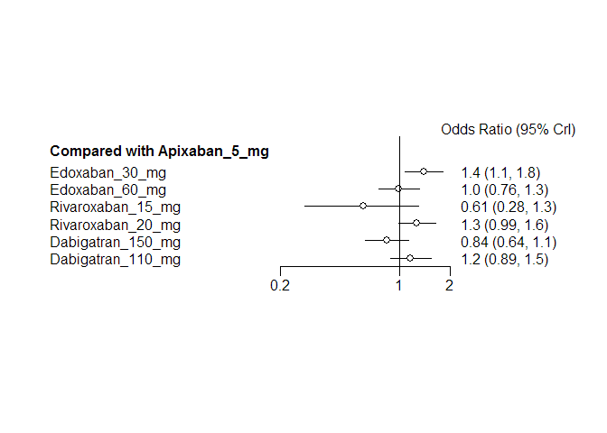
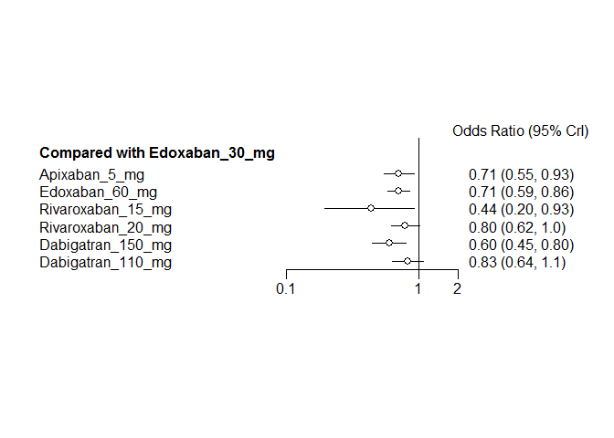
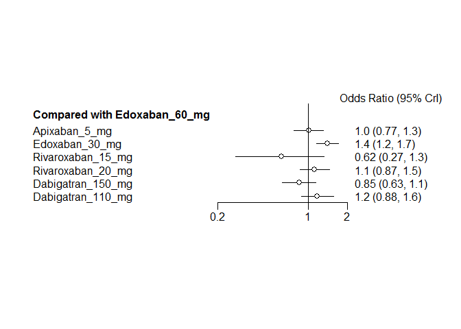
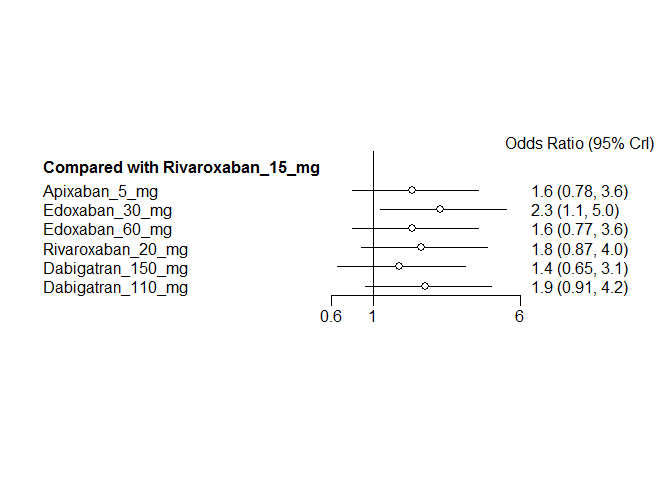
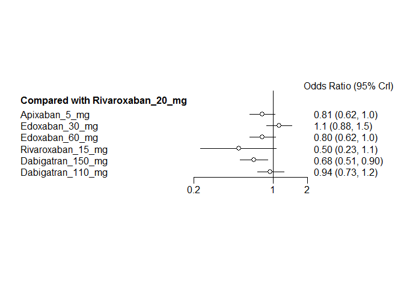
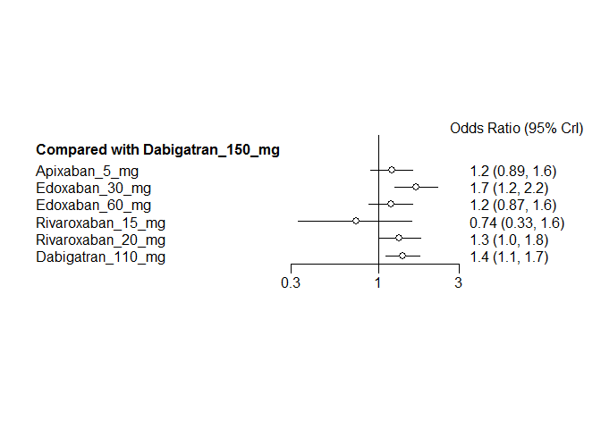
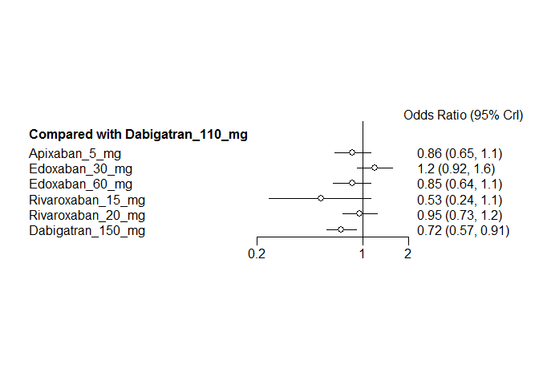

# NOAC network meta-analysis: Stroke
Benjamin Chan  
`r Sys.time()`  

[Back](README.md) to main page.

Read data.


```r
D <- readSheet("Strokeembolism")
```

Tidy up the data and bias the warfarin arm of ROCKET-AF in favor of warfarin.


```r
D <- tidyData(D)
write.csv(D, file="mtcStrokeData.csv", row.names=FALSE)
print(xtable(D, digits=rep(0, 5)), type="html", include.rownames=FALSE)
```

<!-- html table generated in R 3.2.2 by xtable 1.7-4 package -->
<!-- Wed Feb 24 10:54:57 2016 -->
<table border=1>
<tr> <th> study </th> <th> treatment </th> <th> responders </th> <th> sampleSize </th>  </tr>
  <tr> <td> ARISTOTLE </td> <td> Apixaban_5_mg </td> <td align="right"> 212 </td> <td align="right"> 9120 </td> </tr>
  <tr> <td> ARISTOTLE </td> <td> Warfarin </td> <td align="right"> 265 </td> <td align="right"> 9081 </td> </tr>
  <tr> <td> ARISTOTLE-J </td> <td> Apixaban_5_mg </td> <td align="right"> 0 </td> <td align="right"> 74 </td> </tr>
  <tr> <td> ARISTOTLE-J </td> <td> Warfarin </td> <td align="right"> 3 </td> <td align="right"> 74 </td> </tr>
  <tr> <td> ENGAGE AF-TIMI </td> <td> Edoxaban_30_mg </td> <td align="right"> 253 </td> <td align="right"> 7002 </td> </tr>
  <tr> <td> ENGAGE AF-TIMI </td> <td> Edoxaban_60_mg </td> <td align="right"> 182 </td> <td align="right"> 7012 </td> </tr>
  <tr> <td> ENGAGE AF-TIMI </td> <td> Warfarin </td> <td align="right"> 232 </td> <td align="right"> 7012 </td> </tr>
  <tr> <td> J-ROCKET </td> <td> Rivaroxaban_15_mg </td> <td align="right"> 11 </td> <td align="right"> 637 </td> </tr>
  <tr> <td> J-ROCKET </td> <td> Warfarin </td> <td align="right"> 22 </td> <td align="right"> 637 </td> </tr>
  <tr> <td> Mao, 2014 </td> <td> Rivaroxaban_20_mg </td> <td align="right"> 5 </td> <td align="right"> 177 </td> </tr>
  <tr> <td> Mao, 2014 </td> <td> Warfarin </td> <td align="right"> 7 </td> <td align="right"> 176 </td> </tr>
  <tr> <td> PETRO </td> <td> Dabigatran_150_mg </td> <td align="right"> 0 </td> <td align="right"> 166 </td> </tr>
  <tr> <td> PETRO </td> <td> Warfarin </td> <td align="right"> 0 </td> <td align="right"> 70 </td> </tr>
  <tr> <td> RE-LY </td> <td> Dabigatran_110_mg </td> <td align="right"> 182 </td> <td align="right"> 6015 </td> </tr>
  <tr> <td> RE-LY </td> <td> Dabigatran_150_mg </td> <td align="right"> 134 </td> <td align="right"> 6076 </td> </tr>
  <tr> <td> RE-LY </td> <td> Warfarin </td> <td align="right"> 199 </td> <td align="right"> 6022 </td> </tr>
  <tr> <td> ROCKET-AF </td> <td> Rivaroxaban_20_mg </td> <td align="right"> 269 </td> <td align="right"> 7081 </td> </tr>
  <tr> <td> ROCKET-AF </td> <td> Warfarin </td> <td align="right"> 306 </td> <td align="right"> 7090 </td> </tr>
  <tr> <td> Yamashita, 2012 </td> <td> Edoxaban_30_mg </td> <td align="right"> 0 </td> <td align="right"> 131 </td> </tr>
  <tr> <td> Yamashita, 2012 </td> <td> Edoxaban_60_mg </td> <td align="right"> 0 </td> <td align="right"> 131 </td> </tr>
  <tr> <td> Yamashita, 2012 </td> <td> Warfarin </td> <td align="right"> 0 </td> <td align="right"> 129 </td> </tr>
   </table>

```r
network <- mtc.network(D)
```

Run the model using fixed-effects.


```r
M <- mtc.model(network, type="consistency", linearModel=effect)
plot(M)
```

 

```r
results <- mtc.run(M, n.adapt=nAdapt, n.iter=nIter, thin=thin)
```

# Summary

Direct and indirect odds ratios and 95% confidence bounds are stored in
[mtcStrokeOddsRatios.csv](mtcStrokeOddsRatios.csv).


```r
or <- combineResults()
write.csv(or, file="mtcStrokeOddsRatios.csv", row.names=FALSE)
print(xtable(or), type="html", include.rownames=FALSE)
```

<!-- html table generated in R 3.2.2 by xtable 1.7-4 package -->
<!-- Wed Feb 24 10:55:18 2016 -->
<table border=1>
<tr> <th> treatment </th> <th> Apixaban 5 mg </th> <th> Dabigatran 110 mg </th> <th> Dabigatran 150 mg </th> <th> Edoxaban 30 mg </th> <th> Edoxaban 60 mg </th> <th> Rivaroxaban 15 mg </th> <th> Rivaroxaban 20 mg </th> <th> Warfarin </th>  </tr>
  <tr> <td> Apixaban 5 mg vs </td> <td>  </td> <td> 0.86 (0.65, 1.13) </td> <td> 1.18 (0.89, 1.58) </td> <td> 0.71 (0.55, 0.92) </td> <td> 1.00 (0.77, 1.31) </td> <td> 1.62 (0.78, 3.60) </td> <td> 0.90 (0.71, 1.15) </td> <td> 0.78 (0.66, 0.94) </td> </tr>
  <tr> <td> Dabigatran 110 mg vs </td> <td> 1.16 (0.89, 1.55) </td> <td>  </td> <td> 1.38 (1.10, 1.74) </td> <td> 0.83 (0.63, 1.09) </td> <td> 1.17 (0.88, 1.56) </td> <td> 1.88 (0.91, 4.23) </td> <td> 1.05 (0.81, 1.37) </td> <td> 0.91 (0.74, 1.12) </td> </tr>
  <tr> <td> Dabigatran 150 mg vs </td> <td> 0.84 (0.63, 1.12) </td> <td> 0.72 (0.57, 0.91) </td> <td>  </td> <td> 0.60 (0.45, 0.81) </td> <td> 0.85 (0.63, 1.14) </td> <td> 1.37 (0.65, 3.07) </td> <td> 0.76 (0.57, 1.01) </td> <td> 0.66 (0.53, 0.83) </td> </tr>
  <tr> <td> Edoxaban 30 mg vs </td> <td> 1.40 (1.08, 1.80) </td> <td> 1.20 (0.91, 1.58) </td> <td> 1.66 (1.24, 2.21) </td> <td>  </td> <td> 1.41 (1.17, 1.71) </td> <td> 2.27 (1.09, 5.03) </td> <td> 1.26 (0.99, 1.60) </td> <td> 1.10 (0.92, 1.31) </td> </tr>
  <tr> <td> Edoxaban 60 mg vs </td> <td> 1.00 (0.76, 1.30) </td> <td> 0.85 (0.64, 1.13) </td> <td> 1.18 (0.87, 1.59) </td> <td> 0.71 (0.58, 0.86) </td> <td>  </td> <td> 1.61 (0.77, 3.60) </td> <td> 0.90 (0.69, 1.15) </td> <td> 0.78 (0.64, 0.95) </td> </tr>
  <tr> <td> Rivaroxaban 15 mg vs </td> <td> 0.62 (0.28, 1.29) </td> <td> 0.53 (0.24, 1.10) </td> <td> 0.73 (0.33, 1.54) </td> <td> 0.44 (0.20, 0.92) </td> <td> 0.62 (0.28, 1.29) </td> <td>  </td> <td> 0.56 (0.25, 1.15) </td> <td> 0.49 (0.22, 0.98) </td> </tr>
  <tr> <td> Rivaroxaban 20 mg vs </td> <td> 1.12 (0.87, 1.41) </td> <td> 0.95 (0.73, 1.24) </td> <td> 1.32 (0.99, 1.74) </td> <td> 0.80 (0.63, 1.01) </td> <td> 1.12 (0.87, 1.44) </td> <td> 1.80 (0.87, 4.02) </td> <td>  </td> <td> 0.87 (0.74, 1.02) </td> </tr>
  <tr> <td> Warfarin vs </td> <td> 1.28 (1.06, 1.53) </td> <td> 1.10 (0.89, 1.34) </td> <td> 1.51 (1.21, 1.90) </td> <td> 0.91 (0.76, 1.09) </td> <td> 1.28 (1.06, 1.56) </td> <td> 2.06 (1.02, 4.55) </td> <td> 1.15 (0.98, 1.36) </td> <td>  </td> </tr>
   </table>

# Forest plots, NOAC vs NOAC


```r
noac <- unique(D[treatment != "Warfarin", treatment])
for (i in 1:length(noac)) {
  forest(relative.effect(results, noac[i], noac[1:length(noac) != i]))
}
```

       

# Diagnostics


```r
summary(results)
```

```
## $measure
## [1] "Log Odds Ratio"
## 
## $summaries
## 
## Iterations = 5010:30000
## Thinning interval = 10 
## Number of chains = 4 
## Sample size per chain = 2500 
## 
## 1. Empirical mean and standard deviation for each variable,
##    plus standard error of the mean:
## 
##                                  Mean      SD  Naive SE Time-series SE
## d.Warfarin.Apixaban_5_mg     -0.24491 0.09271 0.0009271      0.0009666
## d.Warfarin.Dabigatran_110_mg -0.08989 0.10523 0.0010523      0.0011213
## d.Warfarin.Dabigatran_150_mg -0.41452 0.11493 0.0011493      0.0011531
## d.Warfarin.Edoxaban_30_mg     0.09174 0.09123 0.0009123      0.0010064
## d.Warfarin.Edoxaban_60_mg    -0.24994 0.09973 0.0009973      0.0010254
## d.Warfarin.Rivaroxaban_15_mg -0.73528 0.38182 0.0038182      0.0040474
## d.Warfarin.Rivaroxaban_20_mg -0.13830 0.08384 0.0008384      0.0008490
## 
## 2. Quantiles for each variable:
## 
##                                  2.5%     25%      50%      75%    97.5%
## d.Warfarin.Apixaban_5_mg     -0.42280 -0.3088 -0.24500 -0.18349 -0.05965
## d.Warfarin.Dabigatran_110_mg -0.29458 -0.1618 -0.09138 -0.01823  0.11596
## d.Warfarin.Dabigatran_150_mg -0.64207 -0.4915 -0.41425 -0.33709 -0.19035
## d.Warfarin.Edoxaban_30_mg    -0.08511  0.0301  0.09217  0.15238  0.27014
## d.Warfarin.Edoxaban_60_mg    -0.44339 -0.3172 -0.24932 -0.18308 -0.05392
## d.Warfarin.Rivaroxaban_15_mg -1.51440 -0.9828 -0.72327 -0.47687 -0.02166
## d.Warfarin.Rivaroxaban_20_mg -0.30455 -0.1944 -0.13828 -0.08111  0.02329
## 
## 
## $DIC
##     Dbar       pD      DIC 
## 17.90268 14.08546 31.98814 
## 
## attr(,"class")
## [1] "summary.mtc.result"
```

Sampler diagnostics.


```r
gelman.plot(results)
```

 

```r
gelman.diag(results)
```

```
## Potential scale reduction factors:
## 
##                              Point est. Upper C.I.
## d.Warfarin.Apixaban_5_mg              1          1
## d.Warfarin.Dabigatran_110_mg          1          1
## d.Warfarin.Dabigatran_150_mg          1          1
## d.Warfarin.Edoxaban_30_mg             1          1
## d.Warfarin.Edoxaban_60_mg             1          1
## d.Warfarin.Rivaroxaban_15_mg          1          1
## d.Warfarin.Rivaroxaban_20_mg          1          1
## 
## Multivariate psrf
## 
## 1
```


```r
plot(results)
```

  


```r
autocorr.plot(results$samples)
```

    

Assess the degree of heterogeneity and inconsistency.


```r
anohe <- mtc.anohe(network, n.adapt=nAdapt, n.iter=nIter, thin=thin)
```


```r
summary(anohe)
```

```
## Analysis of heterogeneity
## =========================
## 
## Per-comparison I-squared:
## -------------------------
## 
##                  t1                t2  i2.pair i2.cons incons.p
## 1     Apixaban_5_mg          Warfarin 99.10379  92.473       NA
## 2 Dabigatran_110_mg Dabigatran_150_mg       NA      NA       NA
## 3 Dabigatran_110_mg          Warfarin       NA      NA       NA
## 4 Dabigatran_150_mg          Warfarin  0.00000   0.000       NA
## 5    Edoxaban_30_mg    Edoxaban_60_mg  0.00000   0.000       NA
## 6    Edoxaban_30_mg          Warfarin  0.00000   0.000       NA
## 7    Edoxaban_60_mg          Warfarin  0.00000   0.000       NA
## 8 Rivaroxaban_15_mg          Warfarin       NA      NA       NA
## 9 Rivaroxaban_20_mg          Warfarin  0.00000   0.000       NA
## 
## Global I-squared:
## -------------------------
## 
##    i2.pair  i2.cons
## 1 87.64026 1.857992
```

```r
plot(anohe)
```

```
## Analysis of heterogeneity -- convergence plots
## Unrelated Study Effects (USE) model:
```

    

```
## Unrelated Mean Effects (UME) model:
```

    

```
## Consistency model:
```

  
