# NOAC network meta-analysis: Stroke
Benjamin Chan  
`r Sys.time()`  


Clean up the data (do not show the code).


```
##               study         treatment responders sampleSize
##  1:       ARISTOTLE     Apixaban_5_mg        212       9120
##  2:       ARISTOTLE          Warfarin        265       9081
##  3:     ARISTOTLE-J     Apixaban_5_mg          0         72
##  4:     ARISTOTLE-J          Warfarin          3         75
##  5:  ENGAGE AF-TIMI    Edoxaban_30_mg        182       7034
##  6:  ENGAGE AF-TIMI    Edoxaban_60_mg        253       7035
##  7:  ENGAGE AF-TIMI          Warfarin        232       7036
##  8:        J-ROCKET Rivaroxaban_15_mg         11        639
##  9:        J-ROCKET          Warfarin         22        639
## 10:       Mao, 2014 Rivaroxaban_20_mg          5        177
## 11:       Mao, 2014          Warfarin          7        176
## 12:           PETRO Dabigatran_150_mg          0        166
## 13:           PETRO          Warfarin          0         70
## 14:           RE-LY Dabigatran_110_mg        182       6015
## 15:           RE-LY Dabigatran_150_mg        134       6076
## 16:           RE-LY          Warfarin        199       6022
## 17:       ROCKET-AF Rivaroxaban_20_mg        188       7131
## 18:       ROCKET-AF          Warfarin        241       7133
## 19: Yamashita, 2012    Edoxaban_30_mg          0        131
## 20: Yamashita, 2012    Edoxaban_60_mg          0        131
## 21: Yamashita, 2012          Warfarin          0        129
##               study         treatment responders sampleSize
```

Run the model using fixed-effects.


```r
M <- mtc.model(network, type="consistency", linearModel=effect)
plot(M)
```

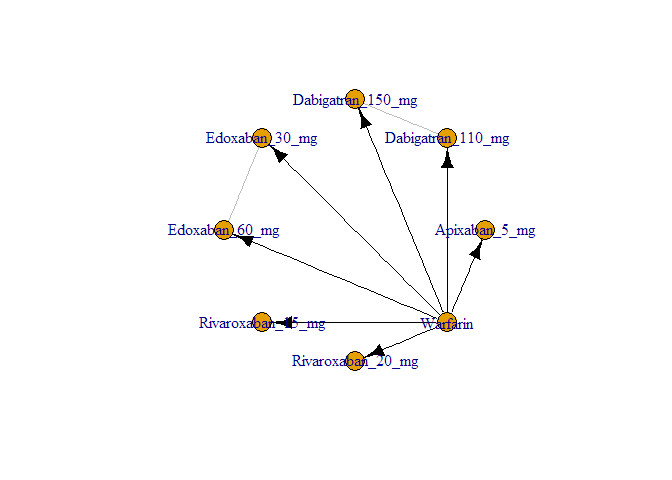 

```r
results <- mtc.run(M, n.adapt=nAdapt, n.iter=nIter, thin=thin)
```

# Summary

Direct and indirect odds ratios and 95% confidence bounds are stored in
[mtcStrokeOddsRatios.csv](mtcStrokeOddsRatios.csv).


```r
or <- combineResults()
write.csv(or, file="mtcStrokeOddsRatios.csv", row.names=FALSE)
show(or)
```

```
##               treatment     Apixaban 5 mg Dabigatran 110 mg
## 1:     Apixaban 5 mg vs                NA 0.86 (0.66, 1.14)
## 2: Dabigatran 110 mg vs 1.16 (0.88, 1.51)                NA
## 3: Dabigatran 150 mg vs 0.85 (0.64, 1.12) 0.73 (0.59, 0.93)
## 4:    Edoxaban 30 mg vs 1.00 (0.75, 1.30) 0.86 (0.64, 1.16)
## 5:    Edoxaban 60 mg vs 1.40 (1.07, 1.81) 1.21 (0.93, 1.60)
## 6: Rivaroxaban 15 mg vs 0.62 (0.29, 1.36) 0.53 (0.24, 1.18)
## 7: Rivaroxaban 20 mg vs 0.98 (0.75, 1.25) 0.84 (0.63, 1.11)
## 8:          Warfarin vs 1.28 (1.06, 1.52) 1.10 (0.92, 1.37)
##    Dabigatran 150 mg    Edoxaban 30 mg    Edoxaban 60 mg Rivaroxaban 15 mg
## 1: 1.18 (0.89, 1.55) 1.00 (0.77, 1.34) 0.72 (0.55, 0.94) 1.62 (0.74, 3.46)
## 2: 1.37 (1.07, 1.71) 1.17 (0.86, 1.57) 0.83 (0.63, 1.08) 1.90 (0.85, 4.15)
## 3:                NA 0.85 (0.63, 1.15) 0.61 (0.46, 0.81) 1.38 (0.62, 3.14)
## 4: 1.18 (0.87, 1.59)                NA 0.71 (0.58, 0.86) 1.63 (0.76, 3.60)
## 5: 1.65 (1.24, 2.16) 1.40 (1.17, 1.71)                NA 2.29 (1.03, 4.93)
## 6: 0.73 (0.32, 1.62) 0.62 (0.28, 1.32) 0.44 (0.20, 0.97)                NA
## 7: 1.16 (0.84, 1.52) 0.98 (0.74, 1.31) 0.70 (0.54, 0.93) 1.58 (0.76, 3.43)
## 8: 1.50 (1.21, 1.86) 1.28 (1.06, 1.57) 0.91 (0.76, 1.09) 2.06 (0.96, 4.46)
##    Rivaroxaban 20 mg          Warfarin
## 1: 1.02 (0.80, 1.33) 0.78 (0.66, 0.94)
## 2: 1.19 (0.90, 1.59) 0.91 (0.73, 1.09)
## 3: 0.86 (0.66, 1.20) 0.67 (0.54, 0.82)
## 4: 1.02 (0.76, 1.34) 0.78 (0.64, 0.95)
## 5: 1.42 (1.07, 1.86) 1.09 (0.92, 1.32)
## 6: 0.63 (0.29, 1.32) 0.49 (0.22, 1.04)
## 7:                NA 0.77 (0.63, 0.92)
## 8: 1.31 (1.09, 1.59)                NA
```

# Diagnostics


```r
summary(results)
```

```
## $measure
## [1] "Log Odds Ratio"
## 
## $summaries
## 
## Iterations = 5010:7000
## Thinning interval = 10 
## Number of chains = 4 
## Sample size per chain = 200 
## 
## 1. Empirical mean and standard deviation for each variable,
##    plus standard error of the mean:
## 
##                                  Mean      SD Naive SE Time-series SE
## d.Warfarin.Apixaban_5_mg     -0.24198 0.09202 0.003254       0.003176
## d.Warfarin.Dabigatran_110_mg -0.09494 0.10249 0.003623       0.004952
## d.Warfarin.Dabigatran_150_mg -0.40986 0.11259 0.003981       0.003844
## d.Warfarin.Edoxaban_30_mg    -0.24569 0.10389 0.003673       0.004191
## d.Warfarin.Edoxaban_60_mg     0.09015 0.09041 0.003196       0.003237
## d.Warfarin.Rivaroxaban_15_mg -0.73938 0.38335 0.013553       0.014603
## d.Warfarin.Rivaroxaban_20_mg -0.26702 0.09823 0.003473       0.003544
## 
## 2. Quantiles for each variable:
## 
##                                  2.5%      25%      50%      75%    97.5%
## d.Warfarin.Apixaban_5_mg     -0.42105 -0.30654 -0.24357 -0.17974 -0.05755
## d.Warfarin.Dabigatran_110_mg -0.31146 -0.15543 -0.09391 -0.02547  0.08809
## d.Warfarin.Dabigatran_150_mg -0.62186 -0.49164 -0.40789 -0.33695 -0.19324
## d.Warfarin.Edoxaban_30_mg    -0.44920 -0.31166 -0.24959 -0.17594 -0.05453
## d.Warfarin.Edoxaban_60_mg    -0.08312  0.03094  0.09022  0.14744  0.27724
## d.Warfarin.Rivaroxaban_15_mg -1.49586 -1.00195 -0.72259 -0.47944  0.03802
## d.Warfarin.Rivaroxaban_20_mg -0.46514 -0.33077 -0.26714 -0.19838 -0.08268
## 
## 
## $DIC
##     Dbar       pD      DIC 
## 17.72572 14.10399 31.82970 
## 
## attr(,"class")
## [1] "summary.mtc.result"
```

Sampler diagnostics.


```r
gelman.plot(results)
```

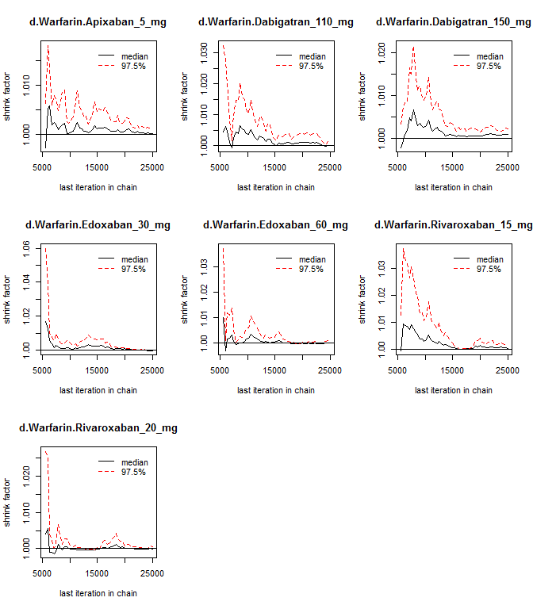 

```r
gelman.diag(results)
```

```
## Potential scale reduction factors:
## 
##                              Point est. Upper C.I.
## d.Warfarin.Apixaban_5_mg           1.00       1.01
## d.Warfarin.Dabigatran_110_mg       1.00       1.01
## d.Warfarin.Dabigatran_150_mg       1.00       1.00
## d.Warfarin.Edoxaban_30_mg          1.00       1.00
## d.Warfarin.Edoxaban_60_mg          1.00       1.01
## d.Warfarin.Rivaroxaban_15_mg       1.00       1.01
## d.Warfarin.Rivaroxaban_20_mg       1.01       1.03
## 
## Multivariate psrf
## 
## 1.01
```


```r
plot(results)
```

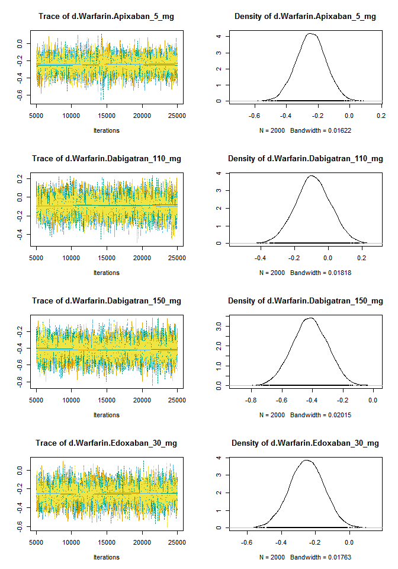 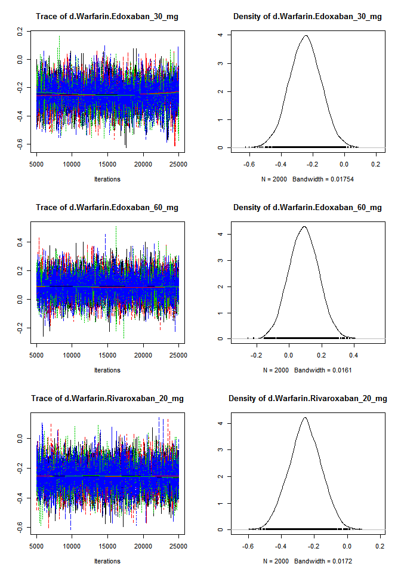 


```r
autocorr.plot(results$samples)
```

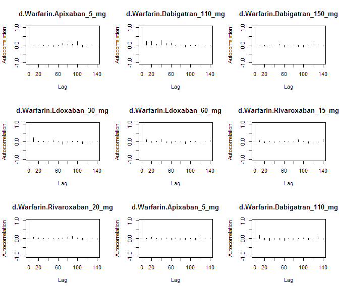 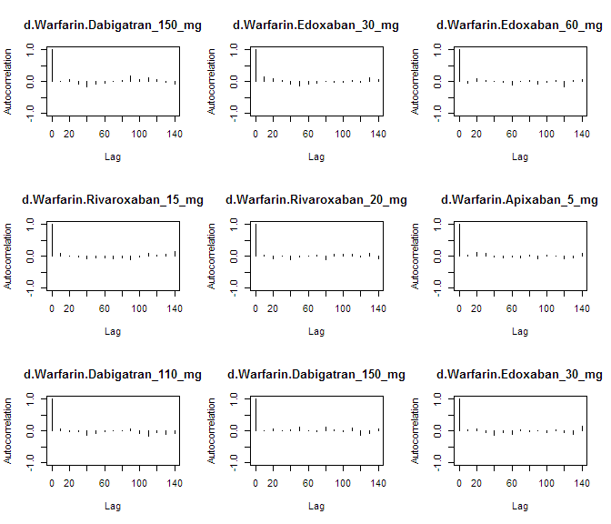 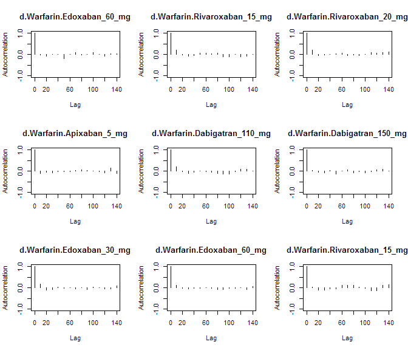 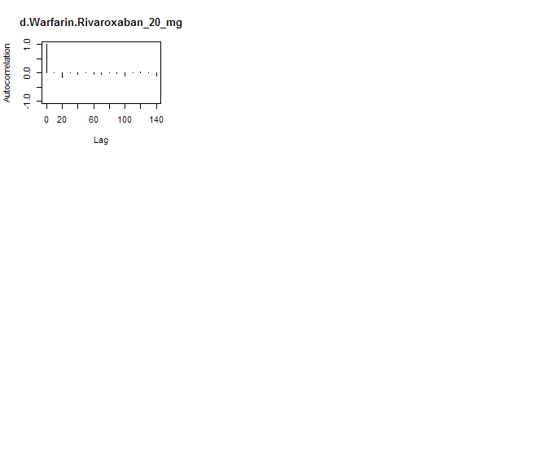 

Assess the degree of heterogeneity and inconsistency.


```r
anohe <- mtc.anohe(network, n.adapt=nAdapt, n.iter=nIter, thin=thin)
```


```r
summary(anohe)
```

```
## Analysis of heterogeneity
## =========================
## 
## Per-comparison I-squared:
## -------------------------
## 
##                  t1                t2  i2.pair  i2.cons incons.p
## 1     Apixaban_5_mg          Warfarin 98.60244 92.37678       NA
## 2 Dabigatran_110_mg Dabigatran_150_mg       NA       NA       NA
## 3 Dabigatran_110_mg          Warfarin       NA       NA       NA
## 4 Dabigatran_150_mg          Warfarin  0.00000  0.00000       NA
## 5    Edoxaban_30_mg    Edoxaban_60_mg  0.00000  0.00000       NA
## 6    Edoxaban_30_mg          Warfarin  0.00000  0.00000       NA
## 7    Edoxaban_60_mg          Warfarin  0.00000  0.00000       NA
## 8 Rivaroxaban_15_mg          Warfarin       NA       NA       NA
## 9 Rivaroxaban_20_mg          Warfarin  0.00000  0.00000       NA
## 
## Global I-squared:
## -------------------------
## 
##    i2.pair   i2.cons
## 1 80.75511 0.8378434
```

```r
plot(anohe)
```

```
## Analysis of heterogeneity -- convergence plots
## Unrelated Study Effects (USE) model:
```

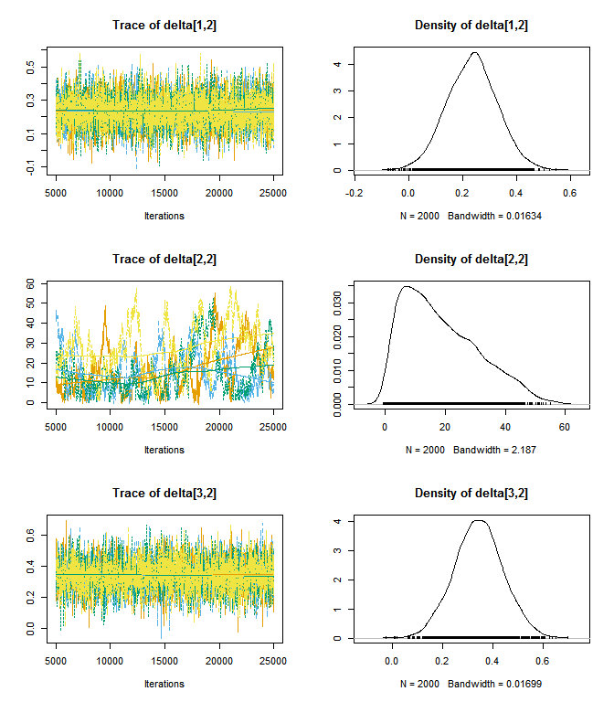 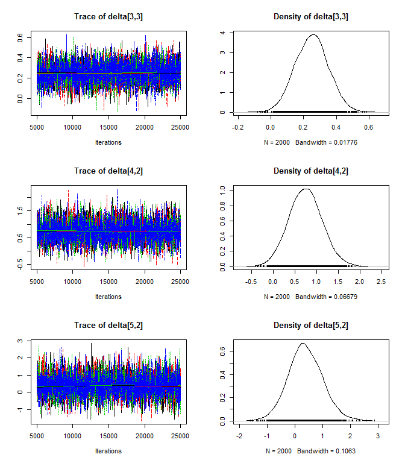 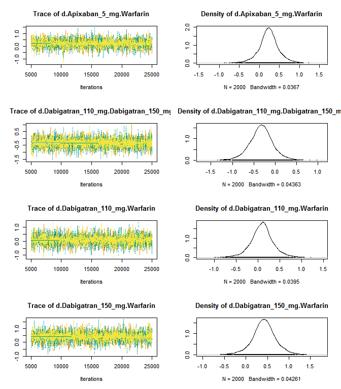 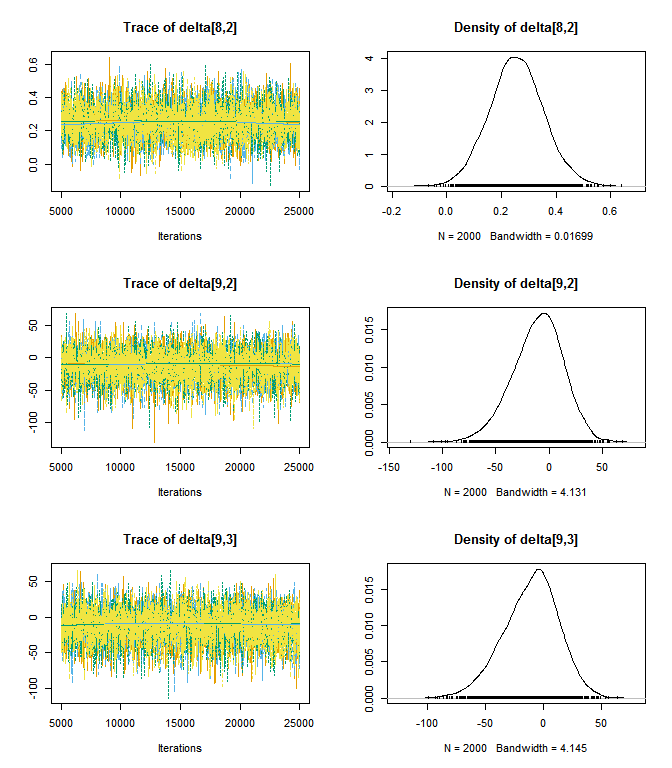 

```
## Unrelated Mean Effects (UME) model:
```

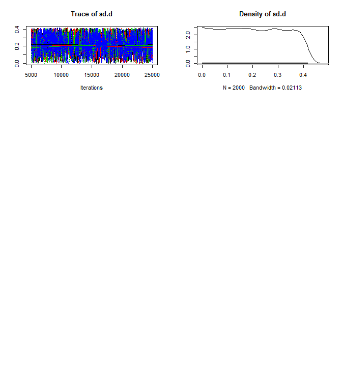 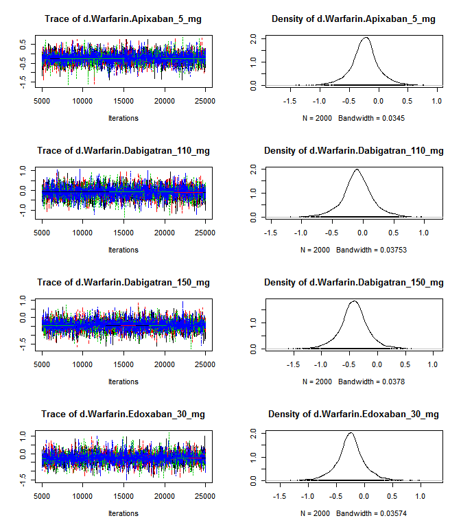  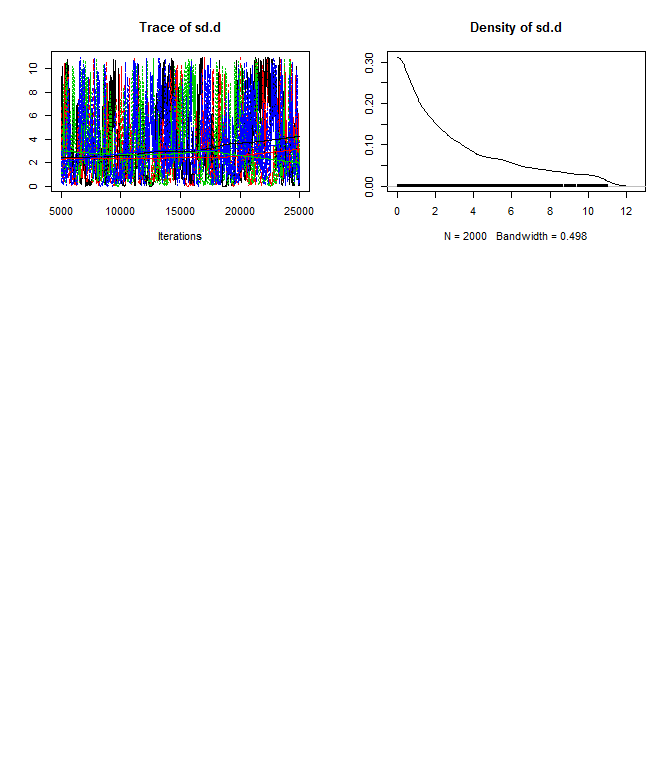 

```
## Consistency model:
```

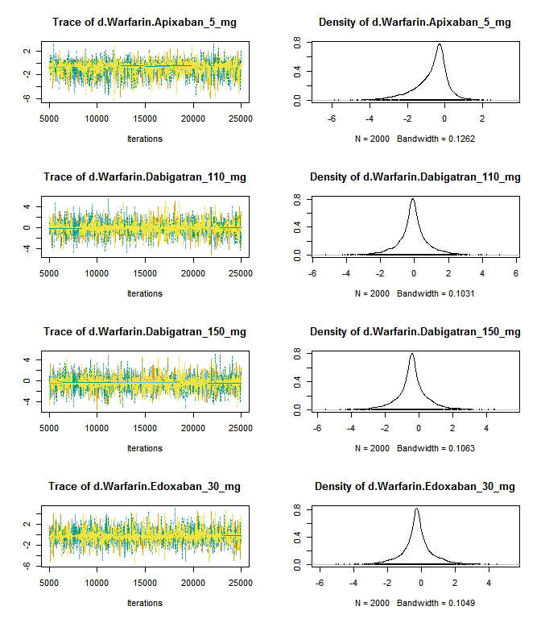 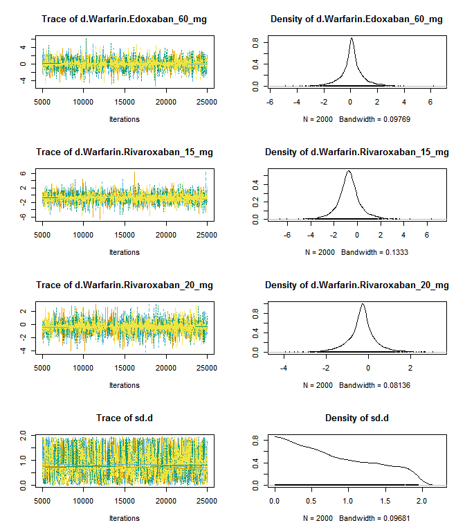 
